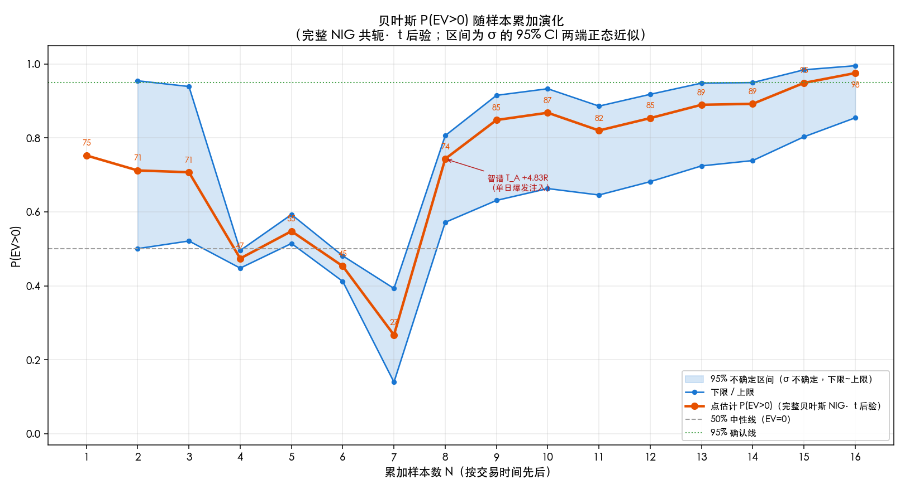

# 2026-07-21 全量交易复盘(16 个 T)

> 复盘范围:`signals/` 目录下所有已平仓交易,共 **16 个 T**(港股 12 + 美股 4)。本文档整合当日复盘的全部内容:样本与口径、终局统计、逐笔点评、多层评估、教训、样本量规划,以及贝叶斯 P(EV>0) 随样本累加的演化。
>
> **可复现**:输入数据见 `2026-07-21-trades-hk.csv` / `2026-07-21-trades-us.csv`,统计脚本为 `.claude/skills/trade/scripts/review.py`,累加贝叶斯与折线图口径与该脚本完全一致。

## TL;DR

- 16 个 T(港股 12 + 美股 4),**信号参考盈亏合计约 +HK$120,608**(非真实账户资金)。
- 港股 EV **+1.42R**(胜率 75%);美股 EV **−0.34R**(胜率 25%)。
- 贝叶斯 P(EV>0):港股 98.9%、美股 25.9%,但样本太小(σ 不确定区间跨度 >5pp),**只取方向、不作加仓/改策略决策**。
- 最确定的两点 actionable:① **杠杆 ETF 做空是当前最稳定的亏损源**;② **锁利纪律与入场质量(决策违规率 38%)是最该收紧的两环**。
- 大盈利约六成来自 07-17 智谱单日爆发(单标的、单行情),**含较大运气成分,不代表稳定盈利能力**。

---

## 一、口径与样本范围(先说清边界)

按 trade skill 样本定义:**每次平仓/了结事件 = 一个 T**。`signals/` 下所有开仓都已被了结(持仓不过夜纪律 + 无主动 🔴 即被 🟡 止损单被动平),**不存在未平仓样本**。

- **纳入 16 个 T**:港股 12 + 美股 4。
- **不计 T**:2026-07-21 中芯第二笔开仓失败(实测价 76.1 = 止损价,新规下开仓失败、无开仓无止损单、仍空仓),按 skill 不计样本。
- **盈亏性质(重要)**:07-07/08/10 为**模拟盘**;07-15 起为**信号模式假设成交**(用户手动执行,实际以 App 为准)。**全部盈亏是"信号参考盈亏"、非真实账户 P&L**。
- **成交价口径不统一**:早期(07-07/15)用平仓参考价/触发价(模拟盘实触发,相对可靠);07-17 智谱起用"响铃时刻实测预估价";07-21 起用新规(参考价 ± 0.5R 判成交)。

---

## 二、16 个 T 全景

| # | 日期 | 市场 | 标的 | 向 | 开→平 | 股 | M | P | R | 定性 |
|--|--|--|--|--|--|--|--|--|--|--|
|1|07-07|HK|美团|多|77.70→78.00|3300|990|+990|+1.00|✅胜|
|2|07-07|HK|美团|多|78.30→78.25|2500|1000|−125|−0.13|❌败|
|3|07-15|HK|07709|多|77.90→79.48|200|880|+316|+0.36|✅胜|
|4|07-15|HK|07709|多|78.90→77.30|200|680|−320|−0.47|❌败|
|5|07-17|HK|智谱|空|1328.5→1215|400|9400|+45400|+4.83|✅胜|
|6|07-17|HK|智谱|空|1269→1195|300|9300|+22200|+2.39|✅胜|
|7|07-17|HK|智谱|空|1160→1147|400|10000|+5200|+0.52|✅胜|
|8|07-17|HK|智谱|空|1136→1145|400|3600|−3600|−1.00|❌败|
|9|07-20|HK|07709|多|51.42→53.52|3000|5760|+6300|+1.09|✅胜|
|10|07-20|HK|07709|多|52.36→52.64|3000|8580|+840|+0.10|✅胜|
|11|07-21|HK|07709|多|57.10→59.62|7500|4500|+18900|+4.20|✅胜|
|12|07-21|HK|中芯|空|73.85→75.30|12500|4375|+18125|+4.14|✅胜|
|13|07-08|US|SOXL|空|162.84→162.84|39|128|0|0.00|—平|
|14|07-10|US|SOXL|空|186.8→191|30|126|−126|−1.00|❌败|
|15|07-16|US|SOXL|空|146→152|20|100|−120|−1.20|❌败|
|16|07-17|US|MU|多|855→865|106|1272|+1060|+0.83|✅胜|

> 智谱 #5 = 09:55 开 2 手 + 10:23 加仓 2 手 → 10:53 一次平 4 手,合并为 1 个 T(均价 1328.5)。#6 平仓为事后补录(盘中误判重开"失败"未发平仓信号);#7 为假设用户挂了移动止损单的被动平仓;#13/14 为模拟盘止损单被动平仓。这些不确定性在第四章详述。

---

## 三、终局统计(港美分组 + 稳健性)

| 子集 | N | 胜/败/平 | 胜率 | R_W | R_L | EV | 合计 |
|--|--|--|--|--|--|--|--|
|**港股**|12|9/3/0|75%|+2.07|−0.53|**+1.420R**|+HK$114,226|
|**美股**|4|1/2/1|25%|+0.83|−1.10|**−0.342R**|+HK$6,382|
|全口径|16|10/5/1|62%|+1.95|−0.76|+0.979R|+HK$120,608|
|剔智谱|12|7/4/1|58%|+1.68|−0.70|+0.744R|+HK$51,408|
|剔智谱·纯港股|8|6/2/0|75%|+1.82|−0.30|+1.287R|+HK$45,026|
|近两日(07-20/21)|4|4/0/0|100%|+2.38|—|+2.384R|+HK$44,165|

**贝叶斯 P(EV>0)**(完整 NIG、t 后验,带 σ 不确定区间):
- 港股 12T:**98.9%(85.2%~99.9%)**——跨度 15pp > 5pp,**只取方向(偏正),不作加仓/改策略决策**。
- 美股 4T:**25.9%(10.8%~46.2%)**——方向偏负(样本仅 4,不可确认)。

**频率派 EV 95% CI**:港股 [+0.295, +2.545](全正);美股 [−1.266, +0.582](跨 0,不足判断)。

**过程指标(MAE/MFE/回吐/η)**:本次 CSV 未填持仓期间 high/low,跳过。可按开/平仓时间戳回拉富途分钟 K 补算(留作后续)。

---

## 四、口径与样本警示(重中之重,先于结论)

1. **N 远不够**:港股 12 / 美股 4 均处"不可确认"区间(skill:N=4~10 不可确认、20~30 边界、50+ 才有确认价值)。EV 正、胜率 62~75% 是**苗头偏正,不是定论**。
2. **智谱 4T 不独立**:全在 07-17 同一天、同一标的、同一单日暴跌 9.8% 行情,本质是"一次行情机会的连续操作",不是 4 个独立样本。**它贡献了港股 +HK$69,200,占港股总盈利的 61%**。剔掉智谱后港股 EV 仍 +1.29R、胜率 75%——正期望有底、不全靠这一天;但大盈利高度集中在单日单标的,**含较大运气成分**。
3. **标的极度集中**:16T 实质只有 6 个标的,且 07709(5T)+ 智谱(4T)占 9T。样本独立性弱。
4. **美股样本太薄**:仅 4T、EV 负,且 3 笔是 SOXL(杠杆 ETF 做空系统性弱项)。
5. **成交价口径不一**:见第一章。早期模拟盘 + 后期预估价混合,R 值有 ±0.1~0.3 级别的不确定性。

---

## 五、逐笔点评(依据站不站得住)

按 skill"事后结果不反推决策对错"原则,评**当时依据**。

**盈利单的共性 = 顺势 + 回踩企稳/突破回踩(合格入场)+ 及时锁利:**
- ✅ 美团#1:回踩 77.50 支撑企稳做多(合格入场①)+ 移动止损锁利。决策对。
- ⚠️ 07709(07-15)#1:**逆势反弹追高**(77.9 非企稳位、赔率到第一止盈不足 1),靠盘中拉升 + 及时锁利保住微利。入场平庸、纪律救场。
- ✅ 智谱#5:下降趋势顺势做空 + 资金流出货 + 破位回踩,浮盈加仓 + 锁利。方向决策对(但含流程漏洞,见第七章)。
- ✅ 07709(07-20)#1:回踩支撑企稳 + super 大单吸筹 + 动能衰竭主动锁利。决策对。
- ⚠️ 07709(07-20)#2:回踩企稳做多,但**实测赔率 1.27 < 1.5 门槛**(成交价漂移致),严格说违反开仓基准,靠午休前锁利保微利。
- ✅ 07709(07-21)、中芯(07-21):突破/支撑回踩不破做多 + 阻力遇阻锁利。R=4.2/4.14 大胜,决策对。
- ⚠️ MU:回踩 VWAP 企稳做多(合格入场、方向对),但**留单不锁利致 +$5194 回吐到 +$1060**。决策方向对、锁利执行差(已固化为"加速赶极端即平"新规)。

**亏损单的共性 = 逆势/赌突破/无量企稳/杠杆 ETF 做空反弹:**
- ❌ 美团#2:**赌突破**(78.50 已六次不过仍硬赌)。决策错,已固化"阻力三次不过不赌突破"。
- ❌ 07709(07-15)#2:**无量假企稳**(量比 1.12)做多,4 分钟即止损。决策错,已固化"无量企稳不可信"。
- ❌ 智谱#8:区间震荡市做空,1145 阻力第五次被破止损;且浮盈曾达 +20400 未设移动止损锁利、大幅回吐。决策错(震荡市无脑做空)+ 锁利缺失。
- ❌ SOXL(07-16):**逆超跌反弹动能做空** + 3x 急涨滑点超损(−1.2R > 预算)。决策错,已固化"强反弹不做空反弹 + 3x 止损 3-5%"。
- ⚠️ SOXL(07-10):模拟盘做空 186.8、止损 191(距 2.2% **偏近**)。SOXL 大趋势下跌,若被反弹扫则同 07-13"方向对、3x 止损太近"教训;**实际走势待核实**(模拟盘跨日、无平仓记录)。

**SOXL 三笔(07-08 保本 / 07-10 亏 / 07-16 亏)= 杠杆 ETF 做空系统性弱项**,叠加历史 07-13 两单,是当前最稳定的亏损来源。

---

## 六、多层评估(样本不足时榨干每笔)

按 skill 多层框架,除终局统计外补充:

- **决策过程审计(违规率)**:16T 中明确决策违规/瑕疵 6 笔(美团#2 赌突破、07709-15#2 无量企稳、07709-15#1 追高、07709-20#2 赔率不足、智谱#8 震荡市做空、SOXL-16 逆反弹)≈ **38%**。**决策违规率比胜率更早暴露问题**——盈利单里也有入场瑕疵(靠纪律救),说明纪律执行(及时锁利)目前在补偿入场质量的不稳定。
- **反事实基准(定性)**:智谱#5 做空 1343→1215,反向(做多)会亏、买入持有会亏,做空方向正确 ✅;MU 做多方向对但锁利远逊于"开仓即锁利"基准;07709/中芯做多回踩企稳,方向均与后续涨幅一致。**未见"反向更赚"的系统性方向错误**(SOXL 做空除外,那是杠杆 ETF 反弹问题而非方向系统性反了)。
- **置信度校准**:绝大多数开仓标 🟢 高置信,实际胜率约 70%,尚可;但样本太少无法严格校准。
- **过程指标**:待回拉富途分钟 K 补 MAE/MFE/回吐/η,可把"锁利能力差"从 MU/智谱#8 两笔显形量化。

---

## 七、教训提炼(可泛化)

1. **入场质量是根本**:胜在顺势 + 回踩企稳/突破回踩(已发生事实);败在赌突破/无量企稳/逆势追高(预测)。已固化多条,但违规率仍 38% → **入场纪律执行仍需收紧**。
2. **杠杆 ETF 做空是当前最稳定的亏损源**(SOXL 三笔 + 历史):逆反弹做空、3x 止损太近被扫、急涨滑点。建议**杠杆 ETF 默认只做超跌反弹做多、慎做空**,或做空必须 3-5% 止损 + 等破位确认。
3. **锁利纪律决定盈利保护上限**:及时移动止损锁利的单子都保住了利润;锁利差的单子(MU、智谱#8)浮盈大幅回吐。**浮盈大时必须上移到盈利区、不只保本**。
4. **流程漏洞(非策略问题,但同样亏钱)**:① 响铃后延迟取样(MU 8 分钟);② 假设成交的仓未持续管理到平仓/到点(智谱#6 重开仓"以为失败"、12:00 未发平仓,只能事后补录);③ 被动平仓假设用户挂了移动止损单(智谱#7)。**这些都是执行 bug,已部分沉淀为 memory,需在流程上堵死**。
5. **大盈利的运气成分要清醒**:智谱单日 +HK$69,200 靠罕见暴跌行情 + max_loss 从 1000 提到 10000 的重仓。剔掉仍正 EV 是好消息,但**不能把单日爆发外推成稳定盈利能力**。

---

## 八、样本量规划(代入当前 s)

港股 s=1.988:胜率 ±5% 需 **384 笔**;EV ±0.2R 需 **380 笔**;确认 EV>0(80% 把握、真实 EV=0.2R)需 **611 笔**。

→ **现有 16T 离"确认策略正期望"还差一两个数量级**。当前结论只能是"方向偏正(港股)/偏负(美股)、有苗头",不能据此加仓或断言稳定。

---

## 九、贝叶斯 P(EV>0) 随样本累加演化

### 方法

- **累加顺序**:16 个 T 按**交易真实时间先后**(美股按夏令时换算到北京 CST 统一时间轴)。
- **点估计**:完整贝叶斯 NIG 共轭(μ 与 σ² 联合估)、μ 边缘 t 后验,与 `review.py` 口径完全一致。
- **下限/上限**:σ 取 95% 卡方 CI 的两端,各算一次固定 σ 的正态后验 P(EV>0),取小/大。N=1 无法估 σ,无区间。

### 累加表

| N | 新增样本 | R | 累计均值R | 点估计 P(EV>0) | 下限 | 上限 | 跨度 |
|--|--|--|--|--|--|--|--|
|1|07-07 美团#1|+1.000|+1.000|75.2%|—|—|—|
|2|07-07 美团#2|−0.125|+0.438|71.2%|50%|95%|45pp|
|3|07-08 SOXL|0.000|+0.292|70.7%|52%|94%|42pp|
|4|07-10 SOXL|−1.000|−0.031|**47.4%**|45%|50%|5pp|
|5|07-15 07709#1|+0.359|+0.047|54.8%|51%|59%|8pp|
|6|07-15 07709#2|−0.471|−0.040|45.3%|41%|48%|7pp|
|7|07-16 SOXL|−1.200|−0.205|**26.7%**|14%|39%|25pp|
|8|07-17 智谱 T_A|+4.830|+0.424|**74.3%**|57%|81%|23pp|
|9|07-17 智谱 T_B|+2.387|+0.642|84.8%|63%|92%|28pp|
|10|07-17 智谱 T_C|+0.520|+0.630|86.8%|66%|93%|27pp|
|11|07-17 智谱 T_D|−1.000|+0.482|82.0%|65%|89%|24pp|
|12|07-17 MU|+0.833|+0.511|85.4%|68%|92%|24pp|
|13|07-20 07709#1|+1.094|+0.556|89.0%|72%|95%|22pp|
|14|07-20 07709#2|+0.098|+0.523|89.2%|74%|95%|21pp|
|15|07-21 07709|+4.200|+0.768|94.9%|80%|98%|18pp|
|16|07-21 中芯|+4.143|+0.979|**97.5%**|85%|100%|14pp|

### 折线图

> 橙线 = 点估计、蓝带 = 下限~上限 95% 不确定区间、灰虚线 = 50% 中性、绿点线 = 95% 确认。

### 解读(三个阶段)

1. **N=1~7 探底震荡(偏负)**:前 7 笔以 SOXL 做空 + 美团赌突破的亏损为主,P(EV>0) 在 45%~75% 反复,第 7 笔 SOXL −1.2R 把累计均值压到 −0.205R、**P 跌到 26.7%(下限 14%)——全程最低点,EV 信念一度偏负**。
2. **N=8 智谱 T_A 一笔注入跳升**:单笔 +4.83R 把累计均值从 −0.205R 拉到 +0.424R,P 从 26.7% 跃到 74.3%——**全程最大的单笔转折,完全由 07-17 智谱单日暴跌 9.8% 的爆发驱动**。
3. **N=8~16 高位收敛**:P 维持 74%~97.5%,区间跨度从 28pp 逐步收窄到 14pp(σ 估计渐稳)。N=16 收在 97.5%(85%~100%)。

### 关键警示(图的诚实判读)

- **整条曲线的形状高度依赖样本到达顺序**:智谱爆发恰好落在第 8 笔,才有 N=8 的跳升。**若把智谱 4 笔挪到最末、或亏损笔后到,曲线会平缓得多甚至长时间偏负**——这恰恰说明小样本下贝叶斯后验对样本构成/顺序极敏感,是"小样本不可确认"的直观证据。
- **全程跨度均 >5pp(最小 14pp)**,按 skill 判读纪律:N=16 也只能取"方向偏正",不取数值、不作加仓/改策略决策。
- **下限到 85% 看似乐观,但它建立在智谱注入之上**;剔智谱后 EV 仍正但更薄(+0.74R)——真实 edge 可能在"偏正但远没有点估计 97.5% 那么乐观"的位置。

---

## 结论

16 个 T 合计信号参考盈亏约 **+HK$120,608**,港股 EV +1.42R(胜率 75%)、美股 EV −0.34R(胜率 25%);但样本太小、智谱单日爆发占六成盈利、标的集中,**这只是"偏正苗头"而非"已验证的正期望"**。最确定的两个 actionable 结论:① **杠杆 ETF 做空是稳定亏源、需设硬约束**;② **锁利纪律和入场质量(违规率 38%)是当前最该收紧的两环**。
