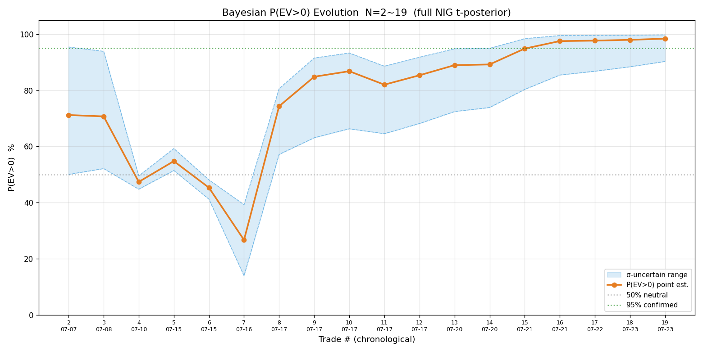
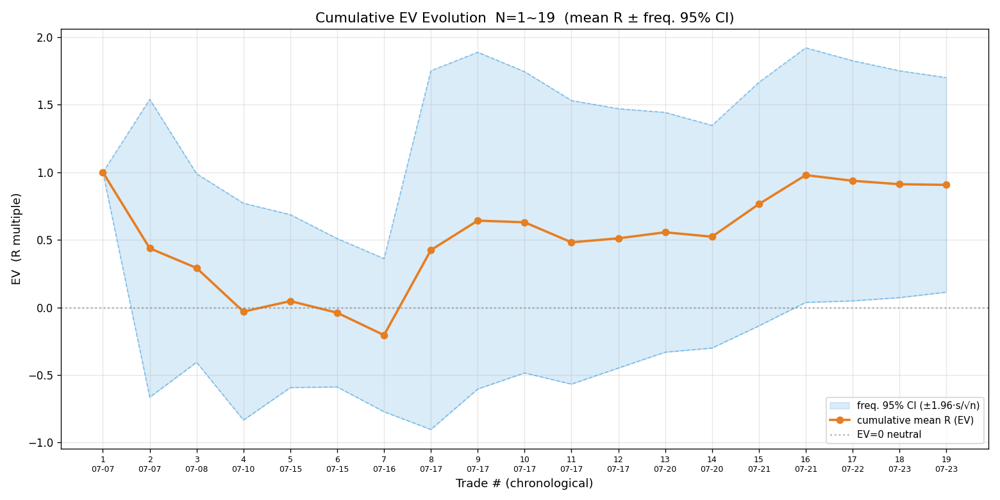

# 2026-07-23 港股复盘

## 数据源

`signals/2026-07-23-HKT-signals.md`（2 笔做空，均盈利）。盈亏按响铃实测价算（非参考价），持仓期间 high/low 从 10 秒级采样估算（精度足够暴露问题，非精确历史）。

## 一、样本明细 + 终局统计（review.py 实算）

| # | 标的 | 向 | entry→exit | P | max_loss | R=P/M |
|---|---|---|---|---|---|---|
| 1 | HK.09988 阿里 | 空 | 114.2→113.3 | +6750 | 8250 | +0.818 |
| 2 | HK.00981 中芯 | 空 | 70.75→70.15 | +4500 | 9375 | +0.480 |

- **N=2，胜率 100%（2/2），败率 0**
- **胜赔率 R_W=0.649R**（平均盈利 R）；败赔率 N/A（无亏损单）
- **EV=+0.649R（EV%=+64.9%）**；平均每单盈利 **+5625 HKD**
- R 样本标准差 s=0.239（小，因两笔都盈利且 R 接近）

## 二、过程指标（盈利单）

| 子集 | MAE（防守）| MFE（进攻）| 回吐（出场）| 锁利效率 η |
|---|---|---|---|---|
| 盈利单 W(n=2) | −0.211R | 0.815R | 0.165R | 0.783 |

- **MAE −0.211R**：防守好（浮亏峰值小，入场点扎实）。
- **MFE 0.815R**：行情给的机会（峰值浮盈）。
- **回吐 0.165R + η=78%**：只兑现了 78% 的峰值浮盈——**出场偏早，没让利润奔跑到 MFE**。

## 三、贝叶斯 P(EV>0) + 样本量

- 完整贝叶斯 NIG（t 后验）：**P(EV>0)=80.9%（σ 不确定下 50.9%~100%）**
- σ 的 95% CI 跨 **71.5 倍**（[0.107, 7.631]）——小样本 σ 极不确定
- **判读**：跨度 49pp（>5pp）→ 小样本，**只取方向（略偏正），不作加仓/改策略决策**
- 频率派 EV 95% CI=[+0.318, +0.981]（全正，但 N=2 可靠性低）
- **样本量规划**（s=0.239，低估——无亏损样本）：确认 EV>0（80% 把握）真实 EV=0.20R 需 9 笔、0.10R 需 35 笔；EV±0.2R 需 5 笔

> ⚠️ s=0.239 是基于 2 笔全盈利估的，严重低估（没亏损样本拉高 s）。真实 s 会更大，样本量需求随之上升。N=2 远不足以判断策略正负。

## 四、逐笔点评

### T1 阿里（做空 114.2→113.3，+0.82R）
- **依据**：箱顶 114.7 六次不过 + 总资金净流出 1.671 亿 + 买卖比 −36 卖压 + 缩量。**成立**（多维偏空一致）。
- **入场**：反抽箱顶 114.3 做空，符合「阻力反抽遇阻」。合理。
- **止损/止盈**：止损 115.3（箱顶上方）、止盈 112.0（VWAP 下方）。合理。
- **问题**：**平仓偏早**——开仓仅 16 分钟（10:03→10:19），浮盈 +1.0 时因无量反弹破警戒 113.8 + 买卖比转正主动平 +0.2。平后价跌到 113.3（踏空）。MFE 0.91R（到 113.2）只兑现 0.82R——平仓点 113.3 其实接近 MFE，回吐小（0.09R）；**真正的损失是初始赔率 2.3R 没兑现**（平在 0.82R，远未到止盈 112.0 的 2R+）。
- **教训**：震荡市无量反弹到成本区，"情况不对"判断须叠加「真破成本 + 放量」才动手，无量反弹宜多容忍。

### T2 中芯（做空 70.75→70.15，+0.48R）
- **依据**：破前低 71.4 后反抽 71 遇阻 + 无量 + 买卖比衰竭 + 资金流 −3.73 亿（super −1.625 亿）。**成立**。
- **入场**：反抽 71.05 遇阻做空，符合「破位回抽不过」。合理（赔率 3.21）。
- **止损/止盈**：止损 72.0、止盈 68.0。合理。
- **问题**：**缩量铁底主动锁利**——70.15 破位后 69.85 铁底 18 次不破，向 68 加速无望，主动平 +0.5。MFE 0.72R（到 69.85）只兑现 0.48R（平 70.15），回吐 0.24R。
- **判断**：中芯这次平仓比阿里务实（缩量铁底 + 午休前必平，落袋合理）；但同样没让利润到 MFE。

## 五、共性问题与改进

**共性：两笔都"利润没奔跑到止盈"**——初始预估赔率 2.3R/3.21R，实际兑现 0.82R/0.48R。η=78%。

但要注意：两笔平仓都有当时依据（阿里防无量假反弹、中芯防缩量铁底），不是无脑平早。改进方向不是"死扛到止盈"，而是：
1. **判断"假反弹/铁底"更准**：阿里无量反弹到成本区，应叠加真破成本+放量才平（已立教训）；
2. **MFE 兑现率**：浮盈中用移动止损锁利而非主动平，让利润有空间到 MFE（中芯浮盈 +0.8 时若移损锁利而非后续主动平 +0.5，可能吃到更多）；
3. **样本积累**：N=2 不可确认，持续按纪律执行攒样本。

## 六、错过的机会

- **长飞光纤破 125.7（14:24）**：放弃做空（反抽过前低到 126.7，形态受挑战）。事后长飞区间震荡到收盘，**放弃合理**。
- **午市缩量日**：换了中芯阿里→长飞建滔（含海力士 ETF/智谱确认），均区间横盘无流畅突破，**无清晰机会**。

## 七、今日立的规矩（已写入 SKILL.md）

1. **后台采样不间断**（停采样=事实上暂停盯盘）；
2. **停盯总结必列三阶段赔率**（初始预期/修正预期/实际落地）；
3. **标的不值得密盯时优先换标的而非降频**。

## 八、序贯贝叶斯 P(EV>0) 演变（历史 19 笔，含本项目全部已平仓交易）

按交易时间顺序逐笔累积，每加一笔重算完整贝叶斯 NIG 后验的 P(EV>0)（点估计 + σ 不确定下区间）。

> 橙线 = 点估计、蓝带 = σ 不确定区间（下界~上界）、灰虚 = 50% 中性、绿点 = 95% 确认阈值。

| N | 交易 | 本笔 R | 累计均值 | P(EV>0) | 区间 |
|---|---|---|---|---|---|
| 2 | 07-07 美团#2 | −0.13 | +0.44 | 71.2% | 50~95% |
| 4 | 07-10 SOXL | −1.00 | −0.03 | 47.4% | 45~50% |
| 7 | 07-16 SOXL | −1.20 | −0.21 | **26.7%** | 14~39% |
| 8 | 07-17 智谱T_A | +4.83 | +0.42 | 74.3% | 57~81% |
| 12 | 07-17 MU | +0.83 | +0.51 | 85.4% | 68~92% |
| 16 | 07-21 中芯 | +4.20 | +0.98 | 97.5% | 85~100% |
| 17 | 07-22 MU | +0.27 | +0.94 | 97.7% | 87~100% |
| 19 | 07-23 阿里 | +0.82 | +0.91 | **98.4%** | 90~100% |

**解读（三阶段）**：
1. **N=2~7 探底偏负**：SOXL 做空 + 美团赌突破亏损压低，N=7（SOXL −1.2R）P 跌到 **26.7%（下界 14%）全程最低**，EV 信念一度偏负。
2. **N=8 智谱一笔跳升**：07-17 智谱 +4.83R 把累计均值从 −0.21 拉到 +0.42，P 从 26.7% 跃到 74.3%——全程最大单笔转折（智谱单日暴跌 9.8% 驱动）。
3. **N=9~19 稳步攀升**：后续 12 笔仅 2 笔负，累计均值升到 +0.91R，P 升至 **98.4%（下界 90%）**——区间下界首破 90%，**首次接近"可确认"门槛**（95%）。

⚠️ P=98.4% 是点估计，但 N=19 含运气成分（智谱单日 +9.66R 占累计均值大半），σ 区间在 N<30 仍宽。**下界 90% 才是稳健读数**——继续攒样本至下界稳定 >95%。

## 九、序贯 EV 演变（累计 R 均值 ± 频率派 95% CI）

与第八节 P(EV>0) 演化图**同源同横轴**（同一组 19 笔历史交易、同一交易序号轴），纵轴换成 EV（R 倍数）——第八节回答「是不是正期望」，本节回答「每笔平均赚多少 R」。

> 橙线 = 累计 R 均值（序贯 EV 点估计）、蓝带 = 频率派 95% CI（±1.96·s/√n）、灰虚 = EV=0 中性线。

| N | 交易 | 累计均值 (EV) | EV 95% CI |
|---|---|---|---|
| 2 | 07-07 美团#2 | +0.44 | [−0.66, +1.54] |
| 7 | 07-16 SOXL | −0.21 | [−0.77, +0.36] |
| 8 | 07-17 智谱 | +0.42 | [−0.90, +1.75] |
| 15 | 07-21 中芯 | +0.77 | [−0.14, +1.67] |
| 16 | 07-21 海力士 2x | +0.98 | **[+0.04, +1.92]** |
| 19 | 07-23 阿里 | +0.91 | **[+0.11, +1.70]** |

**解读（与第八节互证 + 幅度视角的独有发现）**：

1. **关键节点与第八节完全对齐**：N=7 累计均值转负（−0.21R、CI 跨 0）对应 P(EV>0) 探底 26.7%；N=8 智谱 +4.83R 把均值从 −0.21 拉回 +0.42，对应 P 跃升到 74.3%；N=16 起 CI 下界首次转正（+0.04）对应 P 下界破 85%——两图同源、节点互证。
2. **幅度视角的独有发现——均值被少数大胜主导**：N=19 累计均值 +0.91R 看似可观，但**中位数仅 +0.48R**（均值是中位数的近 1.9 倍、分布明显右偏）；**≥+2R 的 4 笔大胜（智谱 +4.83 / +2.39、07-21 中芯 +4.14、07-21 海力士 2x +4.20）合计 +15.56R，占总 R 和 90.3%**。即均值几乎全靠这 4 笔撑起——一致性远不如均值好看，说明「平均每笔赚 0.91R」不能外推成「下一笔期望 0.91R」。更要注意这 4 笔里两笔来自**杠杆 / 衍生品放大**（海力士 2x ETF）或**个股事件性暴跌**（智谱），不代表稳定的选股 edge。
3. **CI 宽度暴露不稳健**：N=19 的频率派 CI 仍跨 1.59R（[+0.11, +1.70]），下界 +0.11 虽正但**极度贴近 0**——频率派「全正」的结论一碰就翻，与第八节「贝叶斯下界 90% 含运气」互证。继续攒样本，重点看 CI 下界能否稳定脱离 0。

⚠️ EV 图与 P(EV>0) 图同源、不可割裂解读：点估计（均值 +0.91R、P 98.4%）双双好看，但中位数低、CI 宽、大胜主导三个信号都指向「当前 19 笔运气成分偏大」。两图合读的稳健结论仍是——方向偏正，但 edge 的幅度与一致性均不足以确认，继续按纪律攒样本。

## 结论

两笔做空方向均正确、防守好（MAE 小），但**赔率兑现不足（η=78%）**。N=2 样本极少，EV=+0.649R 是点估计，**不足以判断策略正期望**（贝叶斯跨度 49pp）。继续按纪律攒样本，重点改进 MFE 兑现率。
