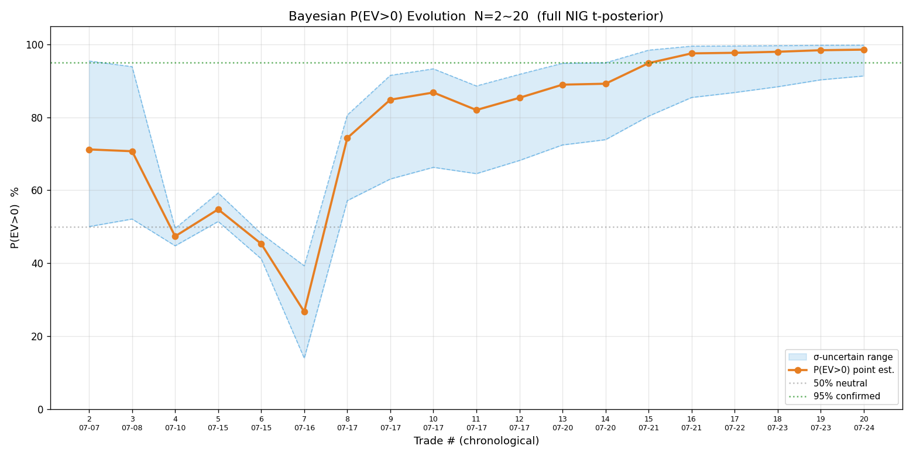
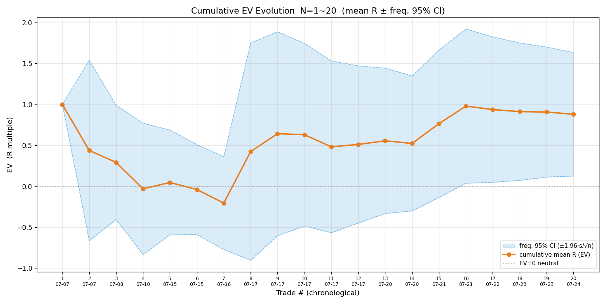
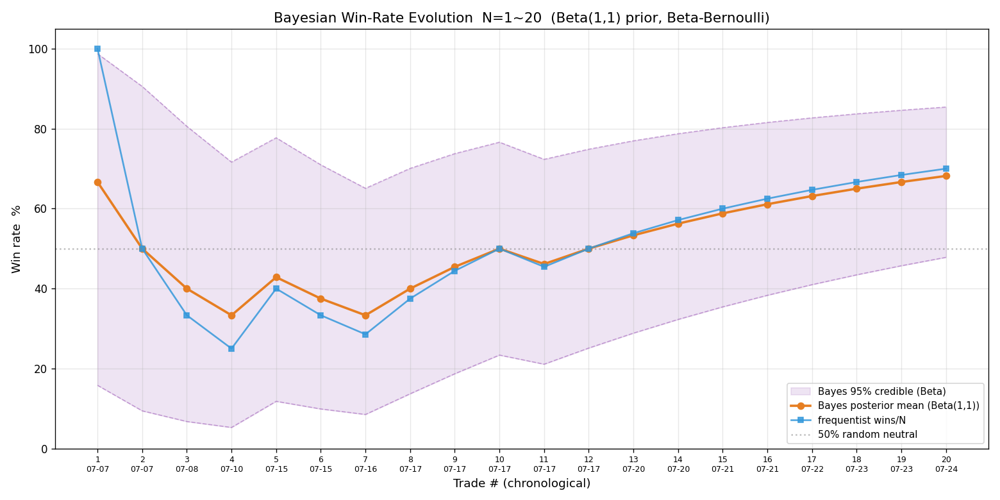
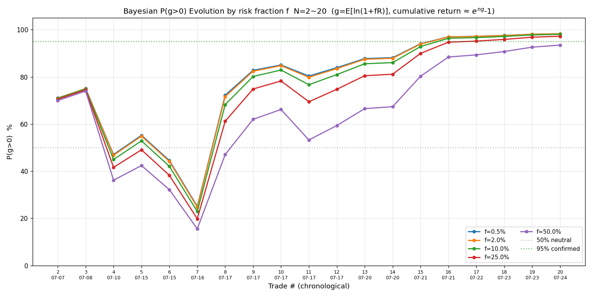
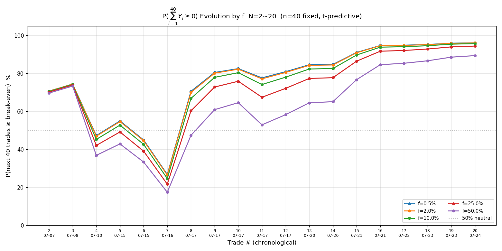
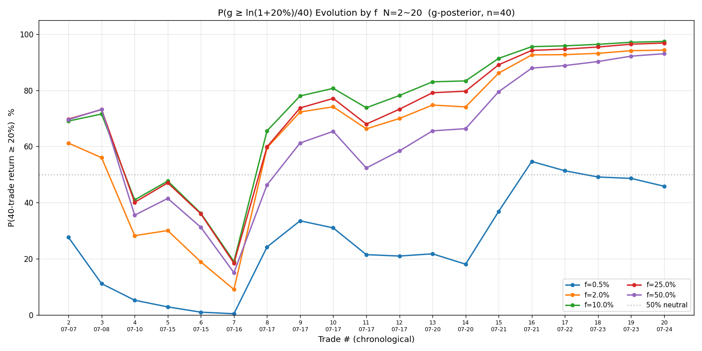
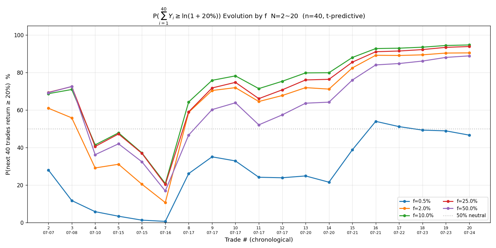

# 2026-07-26 复盘报告

> ⚠️ **勘误声明（2026-07-27 补）**：本报告写作时 config 处于中间态（risk_fraction=0.5%、f_max=2%、文案仍提"固定 10000 HKD"），现 config 已演进为 risk_fraction=2%、f_max=2.5%、权益动态 B。文中"0.5% 保守当前档""f_max=2%""固定 10000 HKD 方案"等均为**当时快照**，结论以 [2026-07-27 复盘](2026-07-27-review.md) 为准。另：序贯表的 N 编号按当时 CSV 原序、与序贯图 sort 顺序可能不同，参考时以标的 + 日期为准。

> 复盘范围：`reviews/2026-07-26-trades.csv` 累积 **20 笔**已平仓交易（7-21 复盘的 16 笔 + 7-22 MU / 7-23 阿里 / 7-23 中芯 / **7-24 SOXS**）。较 2026-07-23 复盘（N=19）新增 **1 笔**：7-24 美股 SOXS 做多 +0.37R。
>
> 本报告含**五张序贯演化图**：P(EV>0)、EV、胜率（原有三项）+ **P(g>0)、P(∑₄₀Y≥0)**（本次新增，对应 SKILL 2026-07-26 新立的复盘必含项——g=E[ln(1+fR)] 才是复利增长的真实刻度，比 EV 更严谨）。

---

## 一、终局统计（N=20，[review.py](.claude/skills/trade/scripts/review.py) 实算）

| 指标 | 值 | 较 N=19 |
|---|---|---|
| 样本 N | 20 | +1（7-24 SOXS）|
| 胜率 p | **70.0%**（频率 14/20）/ 68.2%（贝叶斯）| +1.6pp |
| 败率 q | 25.0%（5 败；另 1 笔 R≈0 平——7-08 SOXL）| — |
| 胜赔率 $R_W$ | +1.528 | — |
| 败赔率 $R_L$ | −0.759（移动止损锁利让亏损未满 1R）| — |
| **EV** | **+0.880R** | −0.027（+0.37 低于累计均值，略拉低）|
| 平均每单 $\overline P$ | +6338（港美混合金额，参考）| — |
| R 标准差 s | 1.723 | — |

EV 分解：$\mathrm{EV}=pR_W+qR_L=0.70\times1.528+0.25\times(-0.759)=+0.880$。败赔率 $|R_L|=0.759<1$，说明移动止损锁利生效（亏损笔未亏满 1R）。

---

## 二、贝叶斯 P(EV>0) + 样本量

- 完整贝叶斯 NIG（t 后验）：**P(EV>0)=98.6%（σ 不确定下 91.3%~99.8%）**
- σ 的 95% CI：[1.311, 2.517]（跨 1.9 倍——小样本 σ 仍不确定）
- 频率派 EV 95% CI=[+0.125, +1.635]（**全正**）
- **判读**：σ 跨度 8pp（>5pp）→ 小样本，**只取方向（偏正）、不作加仓/改策略决策**。N=20 处在「N=20~30 边界」，未达 N≈50+ 的确认区。
- 样本量规划（s=1.723）：确认 EV>0（80% 把握、真实 EV=0.20R）需 ~459 笔——距离尚远，继续攒样本。

---

## 三、新增笔逐笔点评：7-24 SOXS（反向 ETF 做空半导体，+0.37R）

**这笔是 SKILL 2026-07-24 新增规则「做空优先用反向 ETF、避开融券」的首个实战实例**——通过做多 SOXS（三倍做空半导体 ETF）实现做空半导体板块，规避了融券的强制收回/逼空/券源召回三大风险。

| 阶段 | 内容 |
|---|---|
| 入场逻辑 | 半导体破位：SOXL 破 145→144.08 加速下跌、MU 续新低 919.54、资金大幅净流出（MU −7336 万 / SOXL −3921 万）、海力士 −6.7% 领跌。SOXS 突破 49 创日内新高 49.66（**真突破**，区别于此前 49.09 假突破）|
| 第一次开仓 21:52 | **开仓失败**——参考价 49.38 → 响铃实测 50.09，超出成交范围上沿 49.75（SOXS 突破后加速上涨、2 分钟涨 1.4%），实际赔率降到 0.74<1 不值得开。**信号方向正确但成交偏离致失败，不计样本 T**。|
| 第二次开仓 22:20 | 参考价 50.78 → 响铃实测 50.20（朝有利方向偏离），成交。修正后 R=1.70、max_loss=$697、**修正赔率 2.24**（预估 1.41）|
| 移动止损 | 22:34→49.80（浮盈 +0.66/股，max_loss 697→164）；22:46→50.50（浮盈 +1.25/股，进盈利区锁微利）|
| 平仓 22:51 | 主动平 @50.825，**+0.37R**。理由：SOXS 急跌近止损 50.50 + SOXL 强势反弹至 139.9（板块企稳、做空逻辑动摇）→ 主动锁利 $256，不等触止损被动锁 $123 |

**赔率三阶段**：初始预期 1.41 → 修正预期 2.24 → **实际落地 0.37**。

**评价**：
- ✅ **工具对**：反向 ETF 做空板块，避开融券（新规则首个实例，执行到位）。
- ✅ **方向对**：做空半导体，板块确实续跌（SOXL 当日续崩）。
- ✅ **风控对**：移动止损逐步锁利、情况不对主动平（不等固定止盈 54）。
- ⚠️ **落地赔率低（0.37R）**：又一个「预估乐观、落地打折」——和 7-23 阿里（2.30→0.82）、中芯（3.21→0.48）**同模式**。三笔连见，根因见第九节。

---

## 四、序贯贝叶斯 P(EV>0) 演化

| N | 交易 | 本笔 R | 累计均值 | P(EV>0) | 区间 |
|---|---|---|---|---|---|
| 7 | 07-16 SOXL | −1.20 | −0.21 | **26.7%** | 14~39%（全程最低）|
| 8 | 07-17 智谱 | +4.83 | +0.42 | 74.3% | 57~81%（一笔转折）|
| 16 | 07-21 海力士(07709) | +4.20 | +0.98 | 97.5% | **85~100%（下界首破 85%）**|
| 19 | 07-23 阿里 | +0.82 | +0.91 | 98.4% | 90~100%（下界破 90%）|
| **20** | **07-24 SOXS** | **+0.37** | **+0.88** | **98.6%** | **91~100%**|

**解读**：三阶段清晰——N=2~7 探底偏负（SOXL 做空 + 美团赌突破亏损压低）、N=8 智谱一笔跳升、N=9~20 稳步攀升。本次 +0.37R 维持攀升趋势（P 点 +0.2pp、下界 +1pp），但**下界仍含运气**（智谱 +4.83R 占累计均值大半）。

---

## 五、序贯 EV 演化（累计 R 均值 ± 频率派 95% CI）

| N | 累计均值 | EV 95% CI |
|---|---|---|
| 7 | −0.21R | 跨 0（CI 横跨正负）|
| 8 | +0.42R | 仍跨 0 |
| 16 | +0.98R | **[+0.04, +1.92]（CI 下界首转正）**|
| 20 | **+0.88R** | **[+0.12, +1.64]（全正）**|

**解读**：EV CI 下界 N=16 首次转正、N=20 全正且更稳。但**均值仍被 4 笔大胜主导**（智谱 +4.83、海力士(07709) +4.20、中芯 +4.14、07709 +1.09 等撑起 +0.88 的大半），中位数低——好看的平均 R 不代表一致性。

---

## 六、序贯胜率演化（Beta-伯努利 共轭，Beta(1,1) 先验）

| N | 贝叶斯后验均值 | 频率法 | 95% CI |
|---|---|---|---|
| 7 | 33.3% | 28.6% | 9~65% |
| 8 | 40.0% | 37.5% | 14~70% |
| 16 | 61.1% | 62.5% | 38~82% |
| **20** | **68.2%** | **70.0%** | **48~85%**|

**解读**：胜率稳步升到 70%，但 **CI 下界 48% 几乎贴 50% 随机线**——「胜率显著高于抛硬币」在小样本下尚未确认。这是三张图里最薄弱的一环：P(EV>0) 强正（靠大胜赔率）、但胜率一致性未定。凯利最优仓位 $f^*=p-q/b$ 里胜率 $p$ 线性出现，胜率估计不稳 = 仓位估计不稳，故胜率 CI 下界能否稳定脱离 50% 是后续重点观察。

---

## 七、序贯 P(g>0) 演化（本次新增 · 多 f 折线）

**为什么需要 g 而不只是 EV**：累计收益率 $\approx e^{ng}-1$（不是 $(1+f\cdot EV)^n$，后者丢方差惩罚），$g=\mathbb{E}[\ln(1+fR)]\approx f\cdot EV-\frac{f^2}{2}\mathbb{E}[R^2]$。**方差惩罚项让 EV>0 不蕴含 g>0**——所以 P(EV>0) 作为「不亏概率」不严谨，**P(g>0) 才是复利意义上的「长期不亏概率」**。

| f | ĝ/笔 | P(g>0) | σ 不确定区间 |
|---|---|---|---|
| 0.5%（保守当前档）| +0.44% | **98.3%** | 94~100% |
| 2%（$f_{max}$ 上限）| +1.69% | 98.3% | 94~100% |
| 10% | +7.34% | 98.0% | 94~100% |
| 25%（≈凯利 $f^*$）| +14.7% | 97.2% | 92~100% |
| 50%（≈$2f^*$ 临界）| +20.6% | **93.5%** | 86~98% |

**解读**：
- 小 f 区（0.5%~2%）各曲线几乎重合——$\ln(1+fR)\approx fR$ 线性、信噪比 $\hat g/s_Y$ 与 f 无关；**在保守档，P(g>0)≈P(EV>0)**，现有 EV 口径判据仍有效。
- 大 f 区（接近 $2f^*$）方差惩罚显现、P(g>0) 明显下降（93.5%，下界 86%）——**f 影响「edge 是否够用」**：同一个策略，轻仓 P(g>0) 达标、重仓可能不达标。
- **方法注**：P(g>0) 用频率派 t（$=t\text{-cdf}(\sqrt N\hat g/s_Y, N{-}1)$，即贝叶斯无信息先验后验），**不用 NIG(b0=1)**——后者假设 $\sigma^2\sim1$，对小 f 时 $Y$ 的 $\sigma^2\sim10^{-4}$ 先验主导后验、严重扭曲（实测会把 P 从 ~98% 压到 52%）。

---

## 八、序贯 $P(\sum_{i=1}^{40} Y_i\geq 0)$ 演化（本次新增 · 多 f 折线，n=40 固定）

| f | $P(\sum_{40}Y\geq0)$ | 含义 |
|---|---|---|
| 0.5% | **96.1%** | 接下来 40 笔不亏的概率 |
| 2% | 96.1% | |
| 10% | 95.7% | |
| 25% | 94.4% | |
| 50% | 89.4% | |

**与 P(g>0) 对照读**：P(g>0)（f=0.5%）=98.3% > P($\sum_{40}Y\geq0$)=96.1%——**长期 edge 概率 ≥ 40 笔不亏概率**。差距反映「即便 edge 确认，40 笔内仍可能因波动短期亏损」。预测分布 $t\text{-stat}=\sqrt{nN/(N+n)}\cdot\hat g/s_Y$（n=40），N 大时趋于 $\Phi(\sqrt{40}\hat g/s_Y)$ 的稳定值——这值由 edge 厚度（$\hat g/s_Y$）决定，不会随 N 趋于 100%。

---

## 九、序贯 P(累计收益率 ≥ 20%) 演化（target=20%，本次新增）

对应上两图（target=0「不亏」）的 **target=20%** 版——阈值从 0 提到 $\ln(1.2)=0.1823$：

- **⑥ P(g ≥ ln1.2/40)**：g 后验版，「40 笔累计≥20% 所需 g（=0.456%/笔）」成立的概率。
- **⑦ P(∑₄₀Y ≥ ln1.2)**：预测版，「未来 40 笔累计≥20%」的概率。

| f | P(g≥ln1.2/40) | P(∑₄₀Y≥ln1.2) |
|---|---|---|
| 0.5%（保守）| **45.8%** | **46.6%** |
| 2%（$f_{max}$）| 94.3% | 90.5% |
| 10% | 97.4% | 94.7% |
| 25%（≈凯利 $f^*$）| 96.9% | 93.8% |
| 50%（≈$2f^*$）| 93.0% | 88.9% |

**关键发现**：f=0.5%（保守档）的 P(≥20%) 只有 ~46%——$\hat g$=0.44%/笔，40 笔预期累计 19%、略低于 20% 阈值，约一半概率真实 g 够。**这量化了「保守 vs 进取」的核心权衡**：

- f=0.5% 足以「不亏」（P(g>0)=98.3%）但**不足以「40 笔赚 20%」**（P=46%）。
- f=2% 才让 P(≥20%) 达 90%+。

**对选 f 的启示**：「不亏」和「达成收益目标」是**两个独立约束**——f=0.5% 满足前者不满足后者。若目标包含「40 笔≥20%」，f 需 ≥2%（但 f 越大、单笔风险与爆仓尾部越大）。这把 [risk-sizing-plan.md](../notes/risk-sizing-plan.md)「保守档保生存 vs 进取档达增长」的权衡，用 P(≥20%) **首次量化可见**——选 f 时两个约束都要看：保生存看 P(g>0)、达目标看 P(≥20%)。

---

## 十、教训与多层评估

### 1. 「没让利润奔跑」模式连续第三次出现 ⚠️

| 笔 | 预估赔率 | 修正赔率 | 落地赔率 | 折扣 |
|---|---|---|---|---|
| 7-23 阿里 | 2.30 | 2.00 | **0.82** | 落地/修正 41% |
| 7-23 中芯 | 3.21 | 2.20 | **0.48** | 22% |
| 7-24 SOXS | 1.41 | 2.24 | **0.37** | 17% |

三笔连续：预估 2-3 倍赔率，落地 0.4-0.8。**根因**：浮盈中遇到板块/大盘反弹就主动平（判「情况不对」），没等趋势走完到止盈。

**辩证**：主动平符合 SKILL「情况不对随时平、不等固定止盈」纪律，**不是错**。问题在「情况不对」的判定是否**过敏感**——
- 7-24 SOXS 平仓理由是「SOXL 强势反弹至 139.9」，但 SOXL 从 137 反弹到 139.9 仅 +2.1%，可能是**正常波动反弹**而非**真反转**。信号文件本身注明「SOXS 后续续涨、板块续跌」——若平后确实续涨，则主动平**过早**，错失续涨段。
- **改进判据**：浮盈中区分「真反转」与「正常波动反弹」——真反转需**结构确认**（如 SOXL 重破前低、跌破关键支撑、资金流转正持续），而非单根反弹。一根反弹就判「情况不对」= 防守过度、进攻不足。

### 2. 反向 ETF 做空首例：规则落地正确 ✅

7-24 SOXS 是「做空优先反向 ETF」新规则的首个实战——通过做多 SOXS 做空半导体板块，**完全规避了融券风险**（无强制收回、无逼空、无券源召回），风险结构和做多一样（亏损封顶）。规则落地到位，后续做空板块继续沿用。

### 3. 大胜主导 + 胜率一致性：edge 仍未确认

- P(EV>0) 点 98.6%、P(g>0) 点 98.3%——**方向强正**。
- 但 EV 均值 +0.88R 被 4 笔大胜（智谱/中芯）主导，中位数低；胜率 CI 下界 48% 贴随机线——**幅度与一致性均不足以确认**。
- σ 跨度 8pp（>5pp）、N=20 在边界——**继续按纪律攒样本，不作加仓/改策略决策**。

### 4. 成交偏离致开仓失败（7-24 SOXS 第一次）

21:52 第一次开仓，发信号到响铃 2 分钟内 SOXS 涨 1.4%，成交偏离致失败。**信号方向对、但成交时段失去入场位**——呼应 SKILL「信号时效性」总则。急涨中的做多信号，发信号到成交的延迟会让成交价超出盈亏比=1 价。**这是执行层面的固有限制**（信号模式靠用户 App 手动执行），接受失败、等下一次入场机会（22:20 第二次成功）。

---

## 十一、如何科学选 f（约束优化 + 凯利交叉 + 稳健性收缩 + 尾部红线）

选 f 不能凭直觉，要有可复现的数学判据。本节给出四步框架。核心思想：**f=10% 是数学最优、f=2% 是当前稳健收缩——不是二选一，是按 edge 状态分阶段切换**。

### 数据：两曲线随 f 的变化（N=20，细网格实算）

| f | P(∑₄₀Y≥0) 不亏 | P(∑₄₀Y≥ln1.2) ≥20% | ĝ/笔 |
|---|---|---|---|
| 0.5% | 96.1% | 46.6% | +0.44% |
| 1% | 96.1% | 80.4% | +0.86% |
| **2%（当前 $f_{max}$）** | **96.1%** | 90.5% | +1.69% |
| 3% | 96.0% | 92.7% | +2.49% |
| 5% | 95.9% | 94.0% | +4.00% |
| 7% | 95.8% | 94.5% | +5.41% |
| **10%** | **95.7%** | **94.7%（峰值）** | +7.34% |
| 12% | 95.6% | 94.7% | +8.54% |
| 15% | 95.3% | 94.6% | +10.2% |
| 20% | **94.9% ❌** | 94.3% | +12.6% |
| 25% | 94.4% ❌ | 93.8% | +14.7% |

### 第 1 步：约束优化（求数学理想 f）

- **目标**：最大化 $P(\sum_{40}Y \geq \ln1.2)$（达 20% 目标）
- **硬约束**：$P(\sum_{40}Y \geq 0) \geq 95\%$（40 笔不亏——生存优先）

从表：约束边界在 f≈15%~20%（f=20% 不亏跌破 95%）；约束内 $P(\geq20\%)$ 峰值在 **f=10%~12%（94.7%）**。取 **f=10%**（峰值左侧、单笔风险更小、稳健）。

→ **数学最优 f≈10%**：不亏 95.7% ≥ 95% 约束、达 20% 概率 94.7%（全局最高）。

### 第 2 步：凯利交叉验证

数据估凯利 $f^* = p/|R_L| - q/R_W = 0.70/0.76 - 0.25/1.53 \approx 72.6\%$。

⚠️ **这个值高估、不可全信**：小样本（N=20）+ 移动止损锁利让样本 $|R_L|=0.76<1$（败赔率被压低），把 $f^*$ 推高。真实 $f^*$ 应更低。

- f=10% ≈ **14% $f^*$**（约 1/7 凯利，属保守分数凯利——理论支持）
- f=2% ≈ 3% $f^*$（超保守）

→ **f=10% 即便从凯利视角也是保守档**（小样本下用分数凯利本就是正确做法）。

### 第 3 步：稳健性收缩（按 edge 状态）

数学最优 f=10% 基于 N=20 的小样本估计，而当前 **edge 未确认**（P(g>0) 下界 91% < 95%、胜率 CI 下界 48% 贴随机线、大胜主导）。**在 edge 未确认前，把 f 收缩到当前风控上限 $f_{max}$=2%**：

- f=2% 的 P(不亏)=96.1%、P(≥20%)=90.5%——**不亏稳、达目标概率略低但可接受**（90.5% 仍很高）。
- 这是「**风险调整后的当前选择**」，不是纯数学最优。

### 第 4 步：尾部红线（任何阶段不破）

即便 edge 确认后释放 f，**硬上限 f ≤ 15%**：

- f=20% 时 P(不亏) 跌破 95%（94.9%）、单笔风险 20%（遇跳空 −15% 亏 3% 本金）——尾部不可承受。
- f=15% 的 P(不亏)=95.3%（贴 95% 红线），是激进上限。

### 决策框架总结

| 阶段 | f 选择 | 依据 |
|---|---|---|
| **当前（edge 未确认，N=20）** | **2%（$f_{max}$）** | 稳健性收缩：守风控上限、不亏稳、攒样本 |
| edge 确认后（N≥50、P(g>0) 下界 > 95%、胜率 CI 下界脱离 50%）| **10%** | 释放到约束优化解、同步提 $f_{max}$ 到 10% |
| 激进上限（任何阶段不破）| **≤15%** | 尾部红线：P(不亏) ≥ 95%、单笔风险可控 |

### 核心取舍

**f=10% 是「不亏≥95% 约束下达 20% 目标」的数学最优；f=2% 是「edge 未确认期的稳健收缩」。两者不冲突——是按 edge 状态分阶段切换**：

- 当前用 **f=2%**（保生存 + 攒样本）。
- edge 确认后切到 **f=10%**（达增长目标）。
- 切换条件**明确、可检测**（N≥50、P(g>0) 下界 > 95%、胜率 CI 下界脱离 50%），避免凭感觉调 f。

⚠️ **所有 f 选择基于 N=20 小样本**——曲线峰值、凯利 $f^*$ 都随样本变化。**每次复盘用当下数据重算四步、动态调整 f，不固化**。例如若后续样本让 P(≥20%) 峰值移到 f=7% 或 f=15%，最优 f 跟着变。

---

## 十二、结论与下一步

**edge 状态**（N=20，较 N=19 略强化但未质变）：

| 维度 | 状态 |
|---|---|
| 方向（P(EV>0)、P(g>0)）| ✅ 强正（98%+，下界 91%~94%）|
| 幅度（EV）| ⚠️ +0.88R 可观但被大胜主导、中位数低 |
| 一致性（胜率）| ⚠️ 70% 但 CI 下界 48% 贴随机线 |
| 样本量 | ⚠️ N=20 在「20~30 边界」，未达确认区（N≈50+）|

**稳健结论**：方向偏正（较 N=19 更稳），但 edge 的幅度与一致性均不足以确认——**继续按纪律攒样本**，重点看：
1. **胜率 CI 下界**能否稳定脱离 50% 随机线；
2. **EV CI 下界**稳定脱离 0（N=20 已全正，需维持）；
3. **大胜主导**是否消退（后续小赔率稳定盈利笔累积，降低对大胜的依赖）。

**操作层面**（不改当前固定 10000 HKD 方案）：
- 继续用固定保守风险比例（参考 [risk-sizing-plan.md](../notes/risk-sizing-plan.md) 与 [cumulative-return-derivation.md](../notes/cumulative-return-derivation.md) 的分阶段路线：当前 edge 未确认 → 阶段 1 保守比例、不上凯利）。
- 做空板块继续用反向 ETF（7-24 首例成功）。
- **改进「情况不对」判定**：浮盈中用结构确认（破前低/破支撑/资金流转正）区分真反转 vs 正常波动，避免防守过度、让利润奔跑更充分。

---

> ⚠️ 盈亏按信号实测价与 max_loss 实算，不涉及真实账户资金（信号模式：AI 不管账户）。所有统计由 [review.py](.claude/skills/trade/scripts/review.py) + [tmp/bayes_evolution.py](tmp/bayes_evolution.py) 实算，数值结论带区间、不心算报数。
