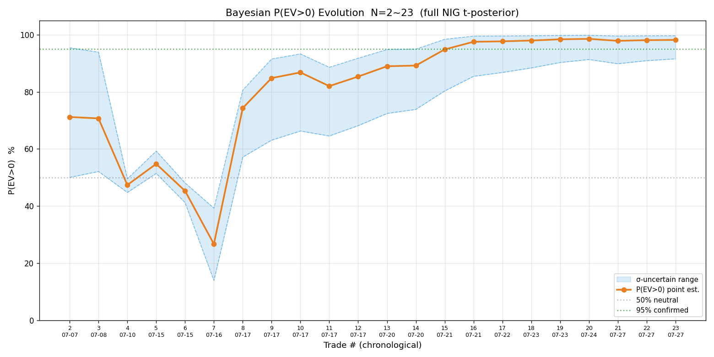
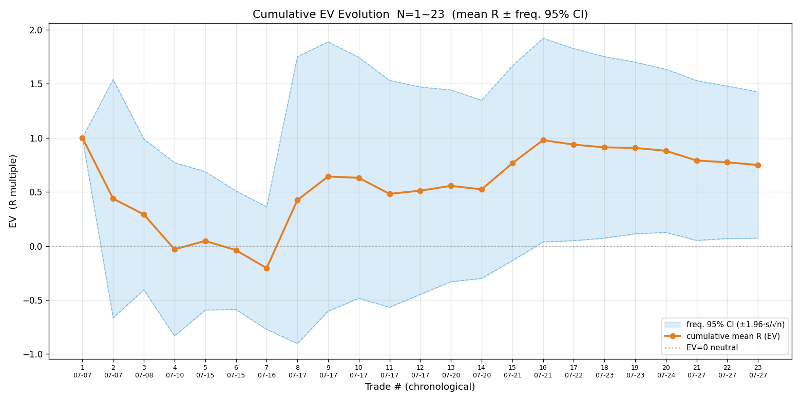
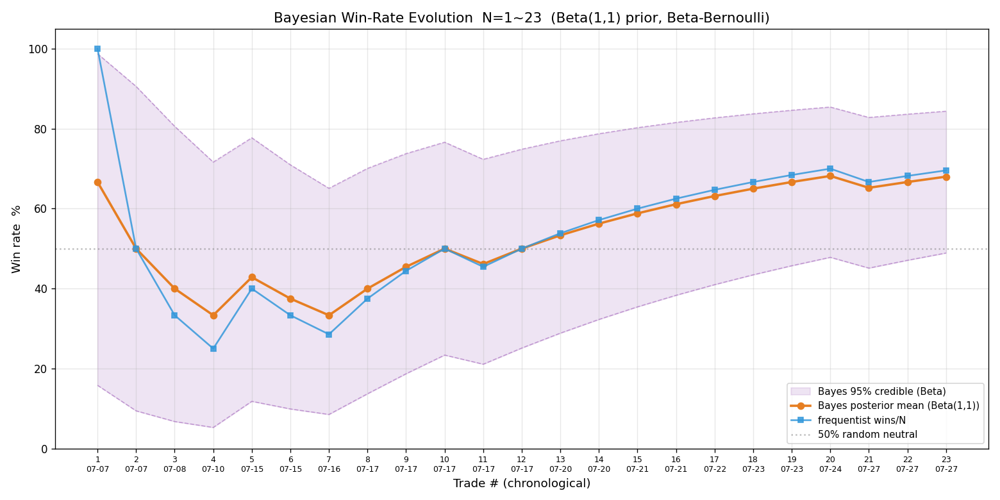
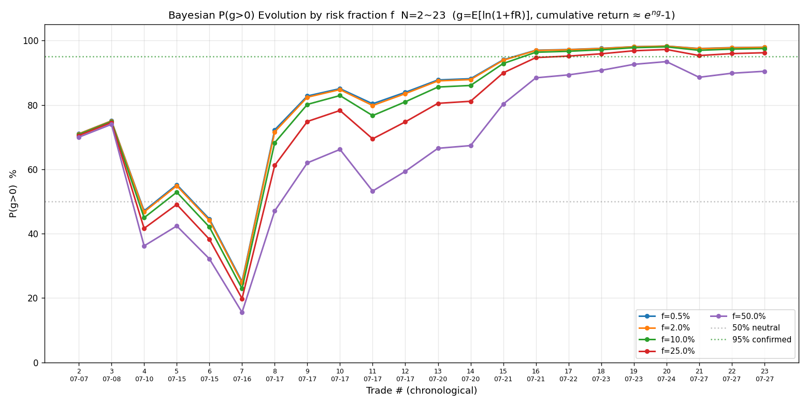
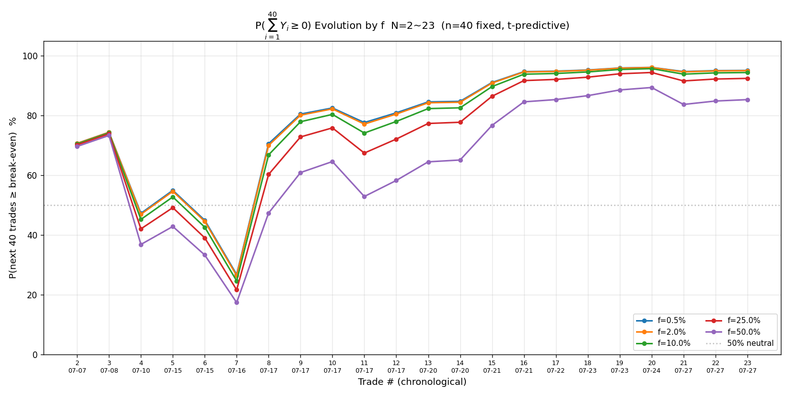
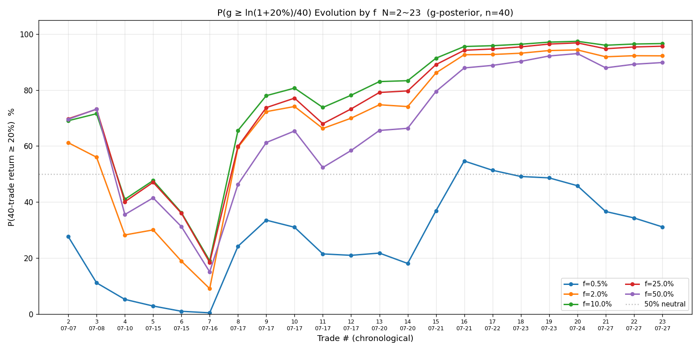
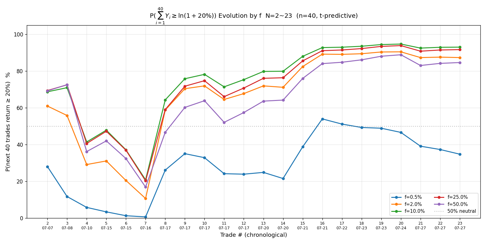

# 2026-07-27 港股复盘

> **样本口径**：按 [SKILL.md:209](../.claude/skills/trade/SKILL.md#L209) 新定义（2026-07-27 立）——**一笔交易 = 一次开仓量 或 一次加仓量**（建仓批次）。小米 1 次开仓 2400 股（无加仓）= **1 笔交易**，减仓 + 平剩余是两次了结、合并算。

## 一、概览

**今日（3 笔，假设执行、响铃实测价算）**：
- 盈亏 **−HK$152**（1 亏 + 2 赚）
- 落地 **−0.378R / 3 笔 = −0.126R/笔**（远低于累计均值 +0.749R，今日拉低）
- 权益 100000 → **[equity-log值已移除] HKD**，M = [equity-log值已移除] × 2% = **HK$1997**

**累计 N=23（历史 20 + 今日 3）**：
- 胜率 **69.6%**（16 胜 / 7 败，含 SOXL 07-08 平手 R=0 算败——与 SKILL「胜率演化图」$R_i\le 0$ 记败同口径，保 $q=1-p$ 严格成立）
- EV **+0.749R**、平均每单 **+HK$5505**
- 贝叶斯 **P(EV>0) = 98.2%**（σ 不确定下 91.6%~99.7%）
- 频率派 EV 95% CI **[+0.073, +1.425]**（**全正**）

---

## 二、今日交易明细（赔率三阶段）

| # | 标的 | 向 | 开仓实测 | 平仓实测 | 量 | 盈亏(HK$) | max_loss | 初始R | 修正R | 落地R |
|---|---|---|---|---|---|---|---|---|---|---|
| 1 | HK.00981 中芯 | 空 | 69.10 | 70.20（止损扫）| 1000 | **−1100** | 1100 | 2.29 | 2.59 | **−1.00** |
| 2 | HK.01810 小米 | 多 | 28.08 | 28.325（减仓28.35+平剩余28.30 加权）| 2400 | +588 | 1392 | 1.93 | 1.93 | +0.42 |
| 3 | HK.03690 美团 | 多 | 90.75 | 91.20 | 800 | +360 | 1800 | 1.78 | 1.22 | +0.20 |
| | **合计** | | | | | **−152** | 4292 | | | **−0.378R** |

**小米口径说明**：1 次开仓 2400 股（无加仓）= 1 笔交易（07-27 新定义）。两次了结（减仓 1200 @28.35 + 平剩余 1200 @28.30）合并：加权 exit = (28.35+28.30)/2 = 28.325，盈亏 588、max_loss 1392（开仓批次整体）、R=0.42。

**预估→落地打折**（今日核心问题）：3 笔全部没让利润奔跑到止盈——中芯 2.59R→−1.0R、小米 1.93R→0.42R、美团 1.22R→0.20R。

---

## 三、今日逐笔点评（决策质量审计）

### 笔1 中芯空 −1.0R（止损被扫）—— ⚠️ 判断失误、高置信给错

- **入场**：69.1 做空，理由「反抽 69.3 乏力遇阻（场景②）」+ 资金全面流出，评 🟢 高置信。
- **核心失误（三重 + 一个流程漏）**：
  1. **位置错**：中芯开盘 71.0 → 暴跌到 **68.05（日内低点、超跌下沿）**。按 skill「下沿超跌 → 做多假设」，做空是**逆位置**——68.05 是潜在反弹底（双底/头肩底的可能底）。
  2. **形态错**：**没等做空形态（双顶/头肩顶）**。从暴跌低点 68.05 反抽只到 69.3（没到原支撑 70），我在 69.1 空 = skill 明确禁止的「**在下跌低点空 = 接飞刀**」。实际就是 V 反弹 68.05→70.2 扫止损 → 70.75。
  3. **置信度错**：应 **🔴 低**（不是 🟢 高）——潜在反弹底 + 逆位置 + 无做空形态。我只看「资金全面流出」一维，漏了位置/形态/全貌/VWAP，被资金面带偏。**资金流再强也不抵逆位置 + 无做空形态**。
  4. **流程漏**：开仓前**没跑 `monitor_summary.py`（全貌）、没看 VWAP**（snapshot 的 `avg_price` 直接跳过）——否则会看到 68.05 是当日下沿超跌、价格相对 VWAP 超卖（反弹候选），不会空。
- **纪律✅（部分）**：发信号前对照 07-16 SOXL 教训，发现阿里 big 吸筹时果断不发阿里空——但这恰恰说明**选了「资金面干净」却「位置/形态错」的标的**，资金一维带偏。
- **教训（已加进 SKILL.md 发信号前自查清单）**：开仓前必做 ① 跑 monitor_summary 全貌 + ② 看 VWAP + ③ 位置评估硬闸（逆位置不开）+ ④ 等做空形态（不在反弹底空），**缺一不发**。

### 笔2 小米多 +0.42R
- **入场**：突破前高 28.32 → 回踩 28.0 放量确认（super+big+总全面流入），入场②合格。
- **了结**：创新高 28.56 后动能减弱（super/big 获利回吐），减半 @28.35 + 平剩余 @28.30 锁利 588。
- **遗憾**：平仓后小米续涨到 29.08（错过 +0.7）。但当时动能减弱判断有据（资金流出），锁利落袋是风控、不后悔。
- **教训**：动能减弱主动锁利方向对，但「让利润奔跑」火候不够——可留底仓扛更深。

### 笔3 美团多 +0.20R
- **入场**：突破前高 88.95→91.95 回踩 90.3 企稳（阻力转支撑②），资金 super 大幅流入。
- **问题**：成交价偏离（参考 90.3 → 实测 90.75）致 max_loss 从预算 1440 扩到 1800（buffer 几乎用完）、赔率从 1.78 降到 1.22。
- **了结**：动能减弱（资金小幅流出 + 价格 91.2 滞涨）主动平锁 360。
- **教训**：成交价偏离是信号模式固有——buffer 要给足（25% 不够时升 30%）。

### 今日共性教训
1. **没让利润奔跑**（3 笔全没到止盈）：动能减弱判断偏早。
2. **成交价偏离管理**：美团 buffer 不足暴露问题。
3. **纪律执行优秀**：2 次主动锁利（小米、美团）+ 1 次止损被扫（中芯），都按纪律；无情绪扛单、无执念加仓；还拒绝 1 次反向风险（阿里 big 吸筹不发空）。

---

## 四、累计 N=23 统计与序贯演化

### 终局统计量

| 指标 | 值 | 解读 |
|---|---|---|
| N | 23 | 样本仍小（skill：N≈50+ 才有确认价值）|
| 胜率 p | 69.6% | 16 胜 / 7 败（SOXL 07-08 平手算败，$q=1-p$ 严格成立）|
| 胜赔率 R_W | 1.376 | 赢的平均赚 1.38R |
| 败赔率 R_L | −0.685 | 败笔平均 R（含 SOXL 07-08 平手 $R=0$ 向 0 拉低；真正亏损笔因移动止损锁利未打满 1R）|
| EV | +0.749R | 平均每笔赚 0.749R（厚 edge，但被少数大胜拉高：智谱 +4.83/+2.39R、07709 +4.2R、中芯 +4.14R）|
| 标准差 s | 1.655 | 分布右偏、大胜主导 |
| 贝叶斯 P(EV>0) | **98.2%**（91.6%~99.7%）| σ 跨度 8pp > 5pp → 小样本只取方向（略偏正）|
| 频率派 EV 95% CI | **[+0.073, +1.425]** | **全正**（下界 > 0）|

### 序贯演化图（7 张）

**P(EV>0) 演化**（策略正期望的方向与信念强度）：

- 点估计 98.2%，下界 91.6%（< 95% 确认阈）。
- σ 跨度 8pp + 大胜主导（s=1.66），方向偏正但幅度不可全信。

**累计 EV（R 均值）演化**（每笔平均赚多少 R 的幅度与分布形状）：

- 累计均值 +0.749R，但被智谱（07-17，+4.83/+2.39R）、07709（07-21，+4.20R）、中芯（07-21，+4.14R）等大胜拉高。
- CI 宽（±0.676）反映右偏分布、样本效率低。

**胜率演化**（Beta-伯努利 共轭）：

- 贝叶斯后验均值与频率法趋同（~70%），样本已较稳定。

**P(g>0) 演化**（固定比例下长期对数增长率 edge，多 f）：

- 各 f 下 P(g>0) 均 >96%（长期 edge 强），小 f 区曲线几乎重合。

**P(∑₄₀Y≥0) 演化**（未来 40 笔不亏的概率，多 f）：

- f=2% 时 95.0%（约束边界）；f>3% 跌破 95%。

**P(累计≥20%) 演化**（target=ln1.2，两图）：

- f=2% 时 P(∑40≥20%)=87.3%（达目标概率高）；f=10% 时 93.0%（峰值但破不亏约束）。

---

## 五、科学选 f（四步框架，N=23）

### f 网格

| f% | P(∑40≥0) | P(∑40≥20%) | P(g>0) |
|---|---|---|---|
| 0.5 | 95.1% | 41.2% | 97.9% |
| 1 | 95.1% | 76.6% | 97.9% |
| **2（当前）** | **95.0%** | **88.2%** | **97.9%** |
| 3 | 94.9%（破 95%）| 90.8% | 97.8% |
| 5 | 94.8% | 92.4% | 97.8% |
| 7 | 94.6% | 92.9% | 97.7% |
| 10 | 94.4% | 93.1%（峰值）| 97.5% |
| 15 | 93.9% | 92.9% | 97.2% |
| 20 | 93.2% | 92.4% | 96.8% |
| 25 | 92.4% | 91.7% | 96.2% |

### 决策

- **① 数学最优 f**：约束 P(∑40≥0)≥95% 下，f≈**2%**（P(≥20%)=88.2%；f=3% 时 94.9% 已破约束）。**当前 f=2% 正好是约束边界 = 数学最优**。
- **② 凯利交叉验证**：f* = 79.5%（p=0.696, RW=1.376, |RL|=0.685）。⚠️ **系统性高估**（小样本 + 移动止损锁利致真正亏损笔 $|R_L|<1$ + 平手 SOXL $R=0$ 拉低败赔率），仅参考。当前 f=2% ≈ 2.5% f*（远保守）。
- **③ 稳健性收缩**：edge **未完全确认**（σ 跨度 8pp、大胜主导、N=23<50）→ 维持风控上限 **f=2%**。edge 确认后（N≥50、P(EV>0) 下界 >95%、胜率 CI 下界脱离 50%）评估释放。
- **④ 尾部红线**：f 硬上限 = P(∑40≥0) 跌破 95% 的临界 ≈ **3%**（N=23 下比之前 N=24 的 10% 严，样本变动致约束收紧）。

### 三档决策表

| 阶段 | f | 依据 |
|---|---|---|
| 当前（edge 未确认）| **2%** | 数学最优 + 稳健收缩（P(g>0)=97.9% 长期不亏）|
| edge 确认后（N≥50）| 视样本重算 | 约束优化解随 s 变 |
| 尾部硬上限 | 3% | P(∑40) 破 95% 临界（当前样本）|

**核心认知**：当前 f=2% 长期不亏 P(g>0)=97.9%、40 笔累计不亏 P(∑40≥0)=95.0%、达目标 P(≥20%)=88.2%，是约束下的最优解——继续维持。

⚠️ **三个概率别混**（2026-07-27 用户纠正）：
- **P(不亏) = P(g>0)**：长期对数增长率 > 0（复利不亏，含方差惩罚项 f²σ²/2）—— **这才是「不亏」的本义**。
- P(EV>0)：单笔期望 > 0（策略正期望）—— EV>0 不蕴含 g>0（方差大时 g 可能 ≤0）。
- P(∑40≥0)：未来 40 笔累计对数收益 ≥ 0（有限样本不亏约束，科学选 f 的硬约束指标）。

三者递进：P(EV>0) 看单笔期望、**P(g>0) 看长期复利不亏**、P(∑40≥0) 看有限 40 笔不亏。

---

## 六、经验教训与下一步

### 今日新增教训
1. **做空反弹要等反抽到阻力位 + 乏力确认**（中芯反抽起点抢空被扫）。
2. **让利润奔跑的火候**：动能减弱主动锁利方向对，但小米/美团可能锁太早；下次留底仓扛更深。
3. **成交价偏离 buffer 要足**：美团 buffer 25% 不够（max_loss 1440→1800），高波动标的升 30%。

### 累计印证
- **信号模式有效**：N=23、胜率 69.6%、EV +0.749R、频率派 CI 全正、P(EV>0)=98.2%。
- **但样本仍不足**（skill 多层评估）：σ 跨度 8pp、大胜主导（s=1.66）、N=23 < 50 → 方向偏正、幅度不可全信、不加 f。
- **纪律执行是强项**：今日 2 次主动锁利 + 1 次止损扫 + 1 次拒绝反向风险（阿里 big 吸筹不发空），无情绪扛单。

### 下一步
- 继续 f=2%（数学最优 + 保守），等 N≥50 再评估释放。
- 重点改进：做空入场时机（等反抽到阻力）、让利润奔跑的火候（留底仓）、成交价偏离 buffer。
- 每笔平仓原生记录 mfe_R / mae_R（补过程指标，下次复盘不再跳过）。

---

## 附：数据与图

- 输入：[2026-07-27-trades.csv](2026-07-27-trades.csv)（23 笔，小米合并 1 笔）
- 信号记录：[signals/2026-07-27-HKT-signals.md](../signals/2026-07-27-HKT-signals.md)
- 权益日志：[signals/equity-log.csv](../signals/equity-log.csv)（equity [equity-log值已移除]）
- 7 张序贯图：见上方嵌入

⚠️ 盈亏按信号参考价与 max_loss 实算，不涉及真实账户资金（信号模式）。

---

## ✅ SKILL.md 样本定义已对齐（2026-07-27 修订完成）

此前 [SKILL.md:524](../.claude/skills/trade/SKILL.md#L524) 的「样本定义 T」曾是旧「了结事件」口径、与 [:209](../.claude/skills/trade/SKILL.md#L209) 的「建仓批次」定义冲突。**2026-07-27 已将 :524 改为与 :209 一致**（一笔交易 = 一个建仓批次，多次了结合并为该笔的加权 exit / 总盈亏 / 批次 max_loss），矛盾已消除。本次复盘即按此定义（小米 1 次开仓无加仓 = 1 笔，减仓 + 平剩余合并算）。
