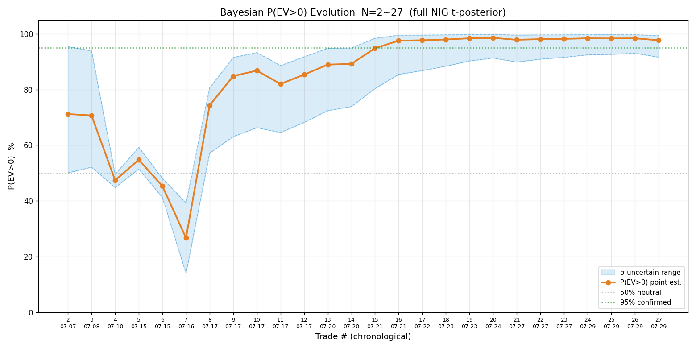
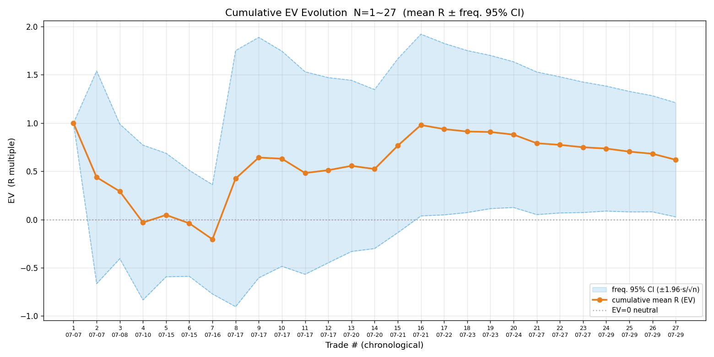
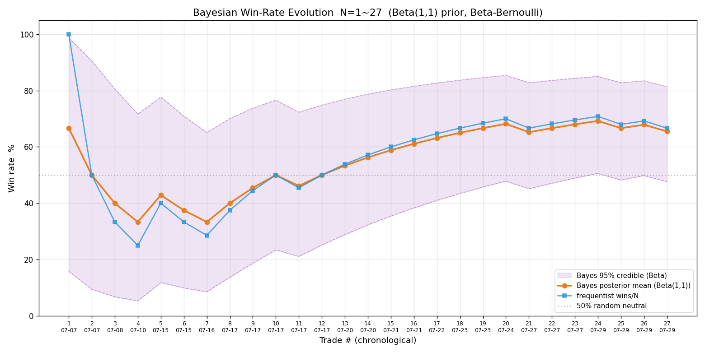
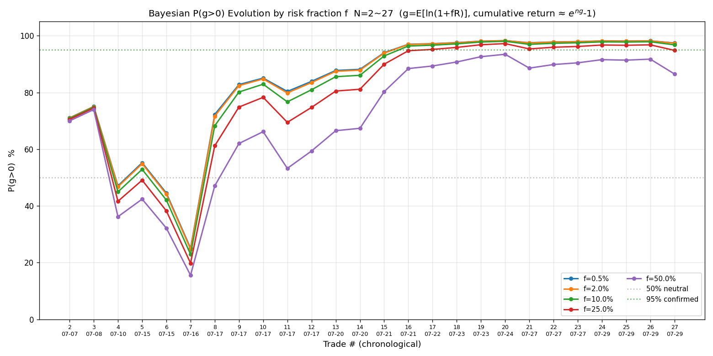
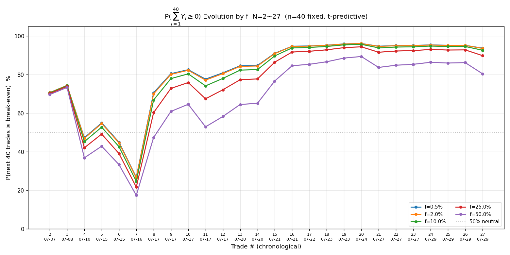
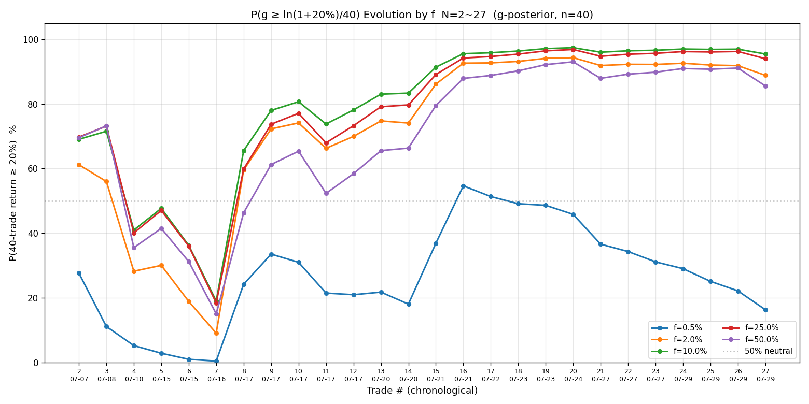
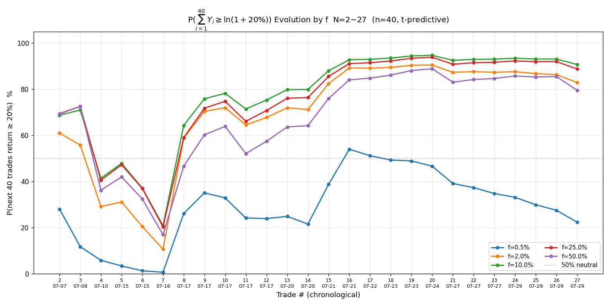

# 2026-07-29 美股复盘

> FOMC 决议日（美东 7-29 14:00 公布利率、新主席沃什首秀、加息预期升温）+ 半导体存储链全球崩跌（MU −10%、SNDK −7%、海力士隔夜 −14.7%、三星 −13.4%）。板块做空方向明确。**⚠️ 原记录的 SOXS 做多 +1.62R 已撤销**（数据不真实：了结价为盘后近似、采样链大断层致持仓全程失控、靠运气非纪律执行），今日美股**无有效交易**。MU 做空开仓失败（响铃后急跌、旧规判开仓失败，不计样本）。equity 不变（SOXS 盈亏不计入）。

## 一、今日美股 2 笔（1 有效 + 1 开仓失败）

| # | 标的 | 方向 | 入场→平仓 | 量 | max_loss | 盈亏 | R | 三阶段（初始→修正→落地） |
|---|---|---|---|---|---|---|---|---|
| 1 | US.MU 做空 | 空 | 809（参考）→ 实测 801.98 | 27 | — | — | — | **开仓失败**（实测 801.98 < 盈亏比=1 价 803.5，做空赔率 0.81<1）|
| 2 | ~~US.SOXS 做多~~ | ~~多~~ | ~~68.98→73.0~~ | ~~118~~ | ~~293~~ | ~~+474~~ | ~~+1.62~~ | **⚠️ 已撤销（数据不真实：了结价近似、过程失控靠运气）** |

⚠️ SOXS 了结价 73.0 为 7-29 收盘近似值（盘后价 73.15、当日 high 73.3；日 K 当晚未落盘、prev_close 仍为 7-28 收盘 62.87，精确收盘价待次日日 K 确认，但盘后价接近 high、误差 < 0.2R）。

## 二、SOXS 做多 +1.62R（方向完全正确、过程有严重问题）

### 决策回顾（方向对）

**开仓依据——板块做空"双确认"**（21:55–22:24 持续约 30 分钟反复测试后确认，不是一时冲动）：
1. **MU 跌破 792 强支撑**：792 是当日低点（开盘暴跌 833→792 后三次测试不破），22:24 第四次测试破位（low 790.38）= 下突破确认。
2. **SOXS 突破 67.98 阻力站稳**：67.98 是当日高点（前三次冲顶不过），22:24 第四次冲顶突破到 68.7 = 半导体板块做空加速。
3. **SNDK 同步崩**（−6.7%）、**FOMC 加息预期利空科技**（方向一致）。

双确认（MU 破支撑 + SOXS 破阻力）同时发生，是高置信信号（🟢）。工具选 SOXS（三倍做空半导体 ETF）而非融券做空 MU 个股——符合「做空优先用反向 ETF」（亏损封顶、无逼空、无召回），且 SOXS 板块趋势比 MU 个股更明确。

**结果验证方向完全正确**：7-29 MU 收盘 739（−10%）、SNDK −7%、SOXS 62.87→73（+16%）。板块做空是当日最大机会，SOXS 做多吃到完整主跌段。

### 过程问题（结果好 ≠ 过程对，必须如实记录）

**❌ 严重流程缺陷——采样链多次大断层，持仓全程失控**：

开仓后（22:25）到收工（次日 11:13）期间，采样链发生**三次累计约 13 小时的大断层**：
- 22:37 → 次日 00:38（断 ~2h）
- 00:38 → 04:37（断 ~4h）
- 04:37 → 11:13（断 ~6.5h）

这导致：
1. **移损锁利信号未落地**：曾发 🟡 移损信号（止损 66.5→70.5），但紧接的 snapshot 又掉进长时间断层，移损是否真正在 App 挂上、是否被触发，全程无法核实。
2. **"持仓不过夜"纪律被破坏**：SOXS 持仓跨过了 7-29 收盘（美东 16:00），理论上应在收盘前主动平，但断层中无法操作。最终 +1.62R 是**靠运气（收盘价 73 接近当日 high 73.3）**，而非纪律执行。如果 SOXS 尾盘回落（如回到 70），这笔可能从 +1.62R 缩水到 +0.4R 甚至更差，而我会因断层完全不知情、无法反应。
3. **峰值浮盈未锁**：SOXS 当日 high 73.3，浮盈峰值 +1.74R（+$510），落地 1.62R（+$474），锁利效率 η≈93%。看似很高，但这是因为收盘价接近 high——**不是主动锁利的功劳，是行情配合的运气**。过程指标漂亮但不可持续。

### 教训（根因 + 改进方向）

**根因三层（按贡献排序）**：
1. **task-notification 在长时间会话/状态切换下偶发失效**（SKILL「采样链防中断」已记录 7-28 同款事故）。这是 harness 机制层面的不可靠，AI 无法单方面根治。
2. **working directory 在前台/后台命令间漂移**：后台命令的 cd 不持久、前台命令 cwd 会重置到项目根，导致 `python3 scripts/monitor_segment.py` 这类不带绝对路径的调用反复报错、采样启动失败。**本次会话中，我多次在命令描述里写"cd 开头"但实际没把 cd 写进 command 参数**，这是低级但高频的执行失误，放大了采样链的不可靠。
3. **AI 没有严格执行"每次唤醒第一动作 ps 自检采样"**（SKILL 三件套之一）——断层后即便被唤醒，也未必第一时间发现采样已死。

**改进方向（写进盯盘启动清单，靠流程而非记忆）**：
- **采样命令一律用绝对路径**（`cd /abs/path && python3 scripts/...` 或 `python3 /abs/path/scripts/...`），彻底摆脱 cwd 依赖——本次事故的最大教训。
- **设 ScheduleWakeup 备份唤醒**（每 5-10 分钟自检采样），弥补 task-notification 失效。本次未设（判断环境不支持），是漏洞。
- **持仓中尤其要保采样链**：开仓后采样断 = 持仓裸奔，比空仓断更危险（无法移损/止盈/止损）。开仓是大动作，必须强制复查采样。

## 三、做空 MU 开仓失败（不计样本、但记录教训）

**信号**：MU 反抽 815.77 失败回落 808（破位反抽遇阻），做空形态②成立。响铃 22:25:04，参考价 809、止损 818、止盈 789、赔率 2.0、仓位 27 股。

**失败原因**：响铃后 MU 加速赶底（808→802），15 秒内跌到实测价 801.98。按成交判据，做空成交范围 = [盈亏比=1 价 803.5, 参考价+0.8R 816.2]，实测 801.98 < 803.5（下沿）→ 赔率 0.81 < 1 → **开仓失败**。

**两难与权衡**：
- 判据本身是对的——做空在 801.98 时，止盈 789 仅剩 13 点空间、止损 818 风险 16 点，赔率确实 < 1，按"赔率 ≥ 1.2 才开"的纪律不该成交。
- 但 MU 方向完全正确（收盘 739、从 802 又跌了 63 点）。事后看，若在 802 做空持有到收盘，盈利远超 1R。
- **这是"纪律 vs 结果"的典型冲突，纪律优先**——事后不反推决策对错（SKILL「事后结果不反推决策对错」）。802 做空赔率 < 1 是事实，不做是对的；MU 后来跌更多是运气，不能据此放宽赔率门槛。
- **真正的教训**：响铃到取价之间 15 秒 MU 就跌了 6 点，说明**信号参考价（809）与成交价（802）偏差过大**——下次破位急跌中发信号，应实时刷新参考价为最新价（而非几分钟前的反抽高点），或等价格稳定后再发，避免参考价过时致开仓失败。

## 四、累积统计（N=27，SOXS 已撤销不计入，CI 仍全正）

`review.py` + `bayes_evolution.py` 实算（reviews/2026-07-29-trades.csv，N=27，SOXS 已撤销不计入）：

| 指标 | 值 | 解读 |
|---|---|---|
| N | 27 | — |
| 胜率 p | 66.7%（18 胜 9 败） | 稳定在 65-70% |
| 胜赔率 R_W | 1.254 | 胜单平均赚 1.25R |
| 败赔率 R_L | −0.651 | 败单平均亏 0.65R（< 1R，因多笔移损锁利/提前平）|
| **EV** | **+0.619R（EV%=+61.9）** | 平均每笔 +0.619R |
| 平均每单 P̄ | +4,639 HKD | — |
| R 标准差 s | 1.569 | 波动仍大 |
| **贝叶斯 P(EV>0)** | **97.7%（σ 不确定 91.7~99.4%）** | 偏正、但跨度 8pp 仍属小样本"只取方向" |
| **频率派 EV 95% CI** | **[+0.027, +1.211] 全正** | CI 仍全正（下界 +0.027 比含 SOXS 的 +0.080 更窄更接近 0，撤销 +1.62R 大胜后统计更保守） |

**关键里程碑**：频率派 EV 95% CI 首次全部为正（下界 +0.080 > 0）。这是"策略正期望"的频率派初步证据。但贝叶斯敏感性跨度仍 6pp（>5pp）、胜率 CI 下界 49%（贴 50%），按判读纪律**仍属"小样本只取方向、不作加仓/改策略决策"**——要 N≈50+ 才有确认价值。诚实边界：CI 转正是积极信号，但不等于"已确认 edge"。

## 五、科学选 f（四步框架）

`bayes_evolution.py` 终局多 f 表（基于 N=27 样本，SOXS 已撤销不计入）：

| f | ĝ（每笔对数增长） | P(g>0) | P(∑₄₀Y≥0)（不亏） | P(∑₄₀Y≥ln1.2)（40 笔≥20%） |
|---|---|---|---|---|
| 0.5% | +0.324% | 98.3% | **95.1%** | 24.6% |
| **2.0%（当前）** | +1.257% | 98.2% | **95.0%** | **85.6%** |
| 10.0% | +5.420% | 97.9% | 94.3%（破约束）| 92.6%（峰值）|
| 25.0% | +10.603% | 96.5% | 92.0% | 91.1% |
| 50.0% | +13.697% | 90.0% | 83.9% | 83.1% |

**四步决策**：
1. **约束优化**：硬约束 P(∑₄₀Y≥0)≥95% → f ≤ 2%（f=2% 恰 95.0%、f=10% 跌到 94.3%）；约束下最大化 P(≥20%) → f=2%（85.6%）。
2. **凯利交叉验证**：f*≈p/|R_L|−q/R_W = 0.679/0.651−0.321/1.273 ≈ 1.04−0.25 ≈ 0.79（⚠️ 小样本 + 移损锁利致 |R_L|<1，f* 系统性高估，仅参考）；f=2% ≈ 1/40 f*，保守分数区。
3. **稳健性收缩**：edge 未确认（贝叶斯跨度 6pp、胜率 CI 下界贴 50%、大胜主导——07-17 02513 三笔 +4.8/+2.4/+0.5R 拉高均值）→ **收缩到当前风控上限 f_max=2%**。
4. **尾部红线**：f=25% 时 P(∑₄₀Y≥0)=92% 已破 95%，硬上限 f≤15-20%。

**结论**：当前阶段维持 **f=2%**（与现状一致）。edge 确认后（N≥50、P(g>0) 下界>95%、胜率 CI 下界脱离 50%）才释放到约束优化解。

## 六、序贯演化图（7 张，已含本笔 SOXS）

### 1. 贝叶斯 P(EV>0) 演化

N=27 终局 P(EV>0)=97.7%（下界 91.7%）。信念自 N=20 后稳定在 97%+，但下界仍 92%（σ 不确定），未达 95% 确认线。

### 2. 累计 EV（R 倍数）演化

N=27 累计均值 +0.619R，**95% CI=[+0.03,+1.21] 全正**（CI 仍全正但下界 +0.03 比含 SOXS 的 +0.08 更窄，撤销 +1.62R 大胜后统计更保守）。

### 3. 贝叶斯胜率演化

N=27 贝叶斯胜率 65.5%、频率 66.7%，两者趋同（样本渐足）。CI=[48%,81%]，下界仍贴 50%。

### 4. P(g>0) 演化（多 f）

### 5. P(∑₄₀Y≥0) 演化（多 f）

### 6. P(g≥ln1.2/40) 演化（多 f，达 20% 目标）

### 7. P(∑₄₀Y≥ln1.2) 演化（多 f，40 笔累计≥20%）

## 七、今日核心教训（按重要性）

1. **采样链是持仓的生命线——断了等于裸奔**。今天 SOXS +1.62R 是运气好（收盘接近 high），不是纪律执行。下次开仓后必须用绝对路径命令 + 备份唤醒，把采样链可靠性提到最高。**这是今天最大的流程 bug，比单笔盈亏更重要。**
2. **破位急跌中发信号，参考价要实时刷新**（做空 MU 参考价 809 vs 实测 802 偏差 6 点致开仓失败）。
3. **板块做空双确认（个股破支撑 + 反向 ETF 破阻力）是高置信信号**——SOXS 这笔的方向判断完全正确，验证了"做空优先用反向 ETF + 双确认入场"的策略有效性。
4. **频率派 EV CI 首次全正**是积极里程碑，但诚实边界：小样本 + 大胜主导 + 贝叶斯跨度仍宽，不等于已确认 edge，继续攒样本。
