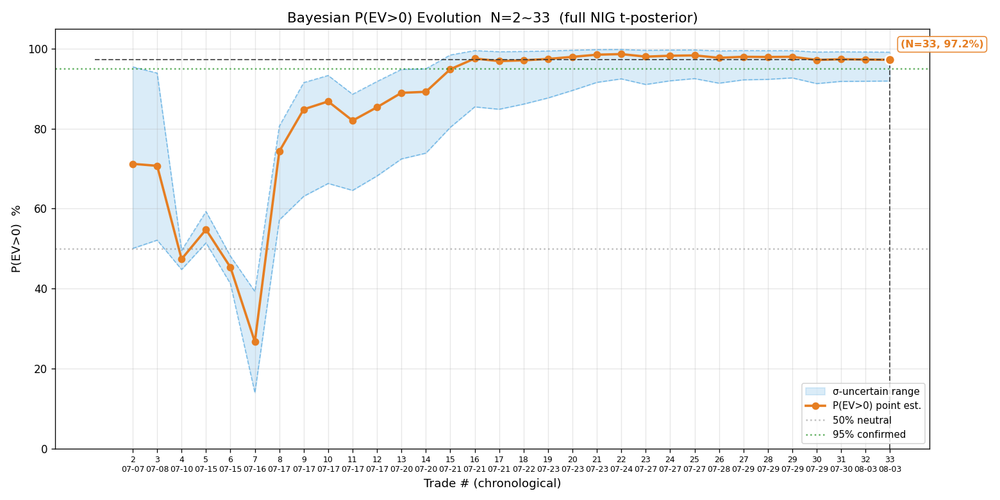
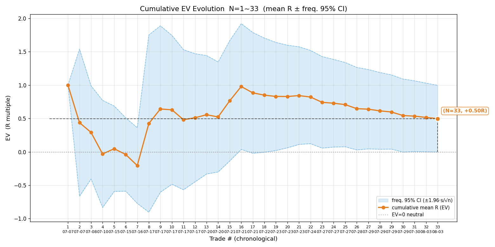
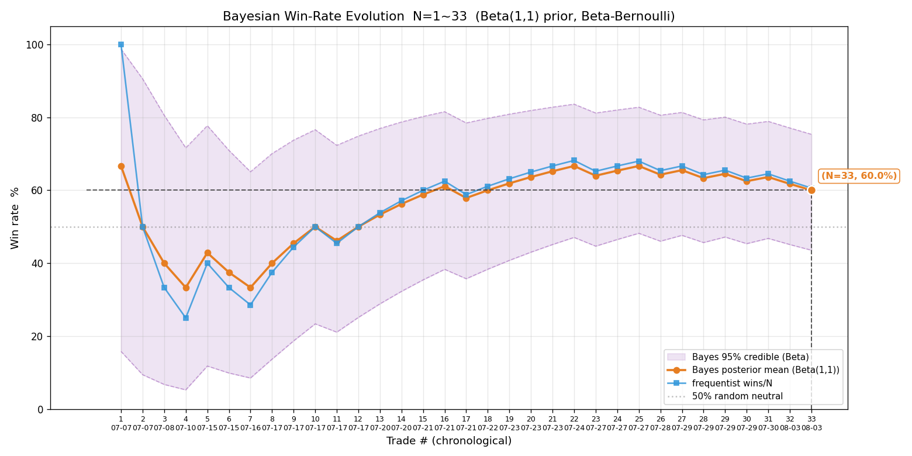
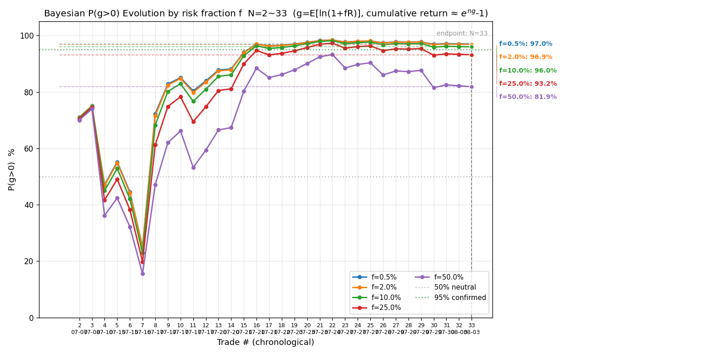
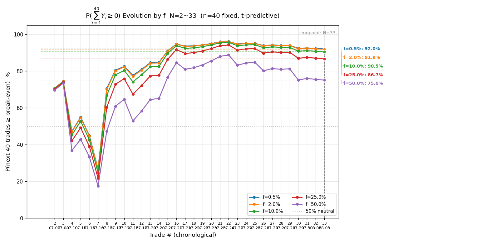
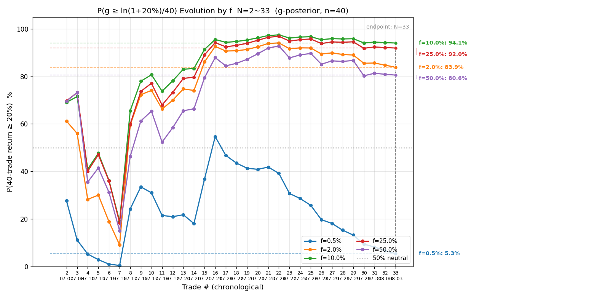
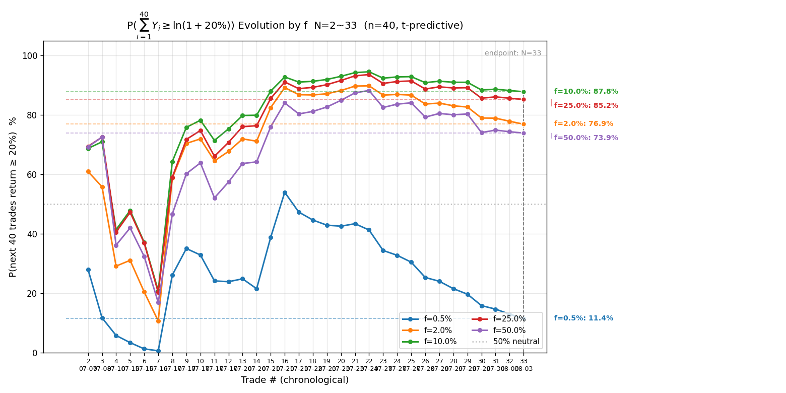

# 全量交易复盘 · 2026-08-03（N=33）

> **本次复盘特殊性（2026-08-03 用户立新口径）**：复盘数据源 = `signals/` + `actions/` 两个目录下的**全部**交易记录（不再按模式只读其一）。本次为首次全量口径重建——**补入 3 笔此前遗漏的美股交易**（07-21 MU 做空、07-23 MU 做多、07-28 SOXS 做多，均在 `signals/` 有完整信号记录、但未进过任何历史样本），并纳入 `actions/` 的 08-03 auto 交易。N 由旧口径 28 笔 → 全量 33 笔。

## 一、样本修订说明（本次全量重建的变化）

| 项 | 旧口径（07-30 复盘） | 全量口径（本次） |
|---|---|---|
| 样本量 | N=28 | **N=33** |
| 补入 | — | 07-21 US.MU 做空 −0.64R、07-23 US.MU 做多 +1.11R、07-28 US.SOXS 做多 −0.86R |
| 撤销 / 作废 | — | 07-29 US.SOXS（数据不真实，07-29 复盘已撤销）、07-31 美股（基础设施 bug 作废）、07-28 中芯信号（断网时间断层作废）、07-27/07-29 MU 空（开仓失败） |
| 新增 | — | 08-03 HK.09988 做多（signal）−0.07R、08-03 HK.07709 做空（auto）−0.09R |

⚠️ **发现的问题**：07-26 起历次复盘的美股样本只含 07-08/07-10/07-16/07-17/07-22/07-24 六笔，**07-21 MU 空、07-23 MU 多、07-28 SOXS 多三笔有完整信号记录却被遗漏**（美股复盘与合并样本之间衔接缺失）。补入后美股样本 9 笔、港股 24 笔。

## 二、当日交易概要（08-03 两笔：signal 阿里 + auto 07709）

| # | 标的 | 方向 | 开仓→平仓 | 量 | max_loss | 盈亏 | R |
|---|---|---|---|---|---|---|---|
| 1 | HK.09988 阿里 | 多 | 125.30→125.20 | 1300 | 1820 | −130 HKD | **−0.07R** |
| 2 | HK.07709 海力士 2x | 空 | 35.52→35.54 | 87000 | 20010 | −1740 HKD | **−0.09R** |

**赔率三阶段**：

| 标的 | 初始预期 | 修正预期 | 实际落地 | 问题 |
|---|---|---|---|---|
| 阿里 | 3.3R | 3.3R（成交 125.30） | −0.07R | 横盘 86 分钟（125.0-125.5）无突破、止盈 130 需破今日高 126 空间受限、临近收盘主动平 |
| 07709 | 1.39R | 1.39R（成交 35.52） | −0.09R | 破位追空（15:38 破 35.6 → 15:40 成交）后下杀动能衰竭（35.42 低点反弹）、距收盘 15 分钟止盈 35.2 不可达、主动平 |

**逐笔点评**：

- **阿里做多（−0.07R）**：方向成立（算力大单催化 + 资金净流入 + 放量突破 125），但两个瑕疵：① 13 手需 16.3 万 HKD、超 equity 97,069 可用资金（信号文件自己标注「若资金不足可减至 7 手」）——**仓位超资金约束是决策瑕疵**，已实际成交说明按 13 手假设执行；② 追涨连涨第二日 + 止盈 130 距今日高 126 有 4 元空间需先破高，赔率兑现难。横盘无突破后按「临近停止盯盘分情况策略」主动平仓，纪律执行正确。
- **07709 做空（−0.09R）**：四维共振依据成立（空头趋势日 + 机构净流出 + 有效跌破 35.6 支撑），破位追空时机略晚（发信号到成交 2 分钟内动能已衰竭）；**流程验证成功**——auto 模式平仓顺序正确（先撤 4 笔止损单含历史遗留 3 笔，再 MKT 平仓立即成交），这是 08-03 修复后的首次完整验证。落地基本打平（−0.09R），防守正确。

## 三、累积统计（N=33，全量）

### 终局统计量

| 指标 | 值 |
|---|---|
| 样本量 N | **33** |
| 胜率 p | **60.6%**（20 胜 / 13 败） |
| 败率 q | 39.4% |
| 胜赔率 R_W | 1.197 |
| 败赔率 R_L | −0.578 |
| EV | **+0.498R**（+49.8%） |
| 平均每单 P̄ | +3,765（港美混合币种口径，历史沿用） |
| R 中位数 | **+0.263R**（均值 0.498，右偏） |
| ≥2R 大胜 | 4 笔（+15.56R，占总 R 和 **94.7%**） |
| R 标准差 s | 1.464 |

> 与旧口径（N=28，EV +0.606R）对比：补入 3 笔美股 + 2 笔 08-03 后 EV 降至 +0.498R——**旧样本有幸存者偏差**（遗漏的 3 笔美股中 2 笔亏损）。

### 贝叶斯 P(EV>0)（完整 NIG，t 后验）

| 输出 | 值 |
|---|---|
| 后验 μ | t35（位置 +0.483，尺度 0.244） |
| P(EV>0) | **97.2%**（σ 不确定下 91.9%–99.1%） |
| σ 95% CI | [1.178, 1.937]（跨 1.6 倍） |
| 频率派 EV 95% CI | **[−0.002, +0.998]（跨 0）** |

**判读**：贝叶斯点估计仍强正（97.2%），但**频率派 CI 首次从「全正」退回「跨 0」**（旧口径 [+0.036, +1.177] 全正）——补入亏损样本后正期望证据变弱，诚实结论：方向仍偏正、但不足以确认，继续按纪律攒样本（N≈50+ 才有确认价值）。

### 样本量规划（当前 s=1.464）

| 目标 | 误差 / 假设 | 需要样本 |
|---|---|---|
| 胜率（p=0.5） | ±5% | 384 笔 |
| EV 估计 | ±0.2R | 206 笔 |
| EV 估计 | ±0.1R | 824 笔 |
| 确认 EV>0（80%把握） | 真实 EV=0.10R | 1326 笔 |
| 确认 EV>0（80%把握） | 真实 EV=0.20R | 331 笔 |

## 四、科学选 f（四步框架，基于 N=33）

| f | ĝ（每笔） | P(g>0) | P(∑₄₀Y≥0)（不亏） | P(≥20%) |
|---|---|---|---|---|
| 0.5% | +0.246% | 97.0% | 92.0% | 11.4% |
| **2.0%（当前）** | **+0.951%** | **96.9%** | **91.8%** | **76.9%** |
| 10.0% | +4.022% | 96.0% | 90.5% | 87.8%（峰值） |
| 25.0% | +7.521% | 93.2% | 86.7% | 85.2% |
| 50.0% | +8.428% | 81.9% | 75.0% | 73.9% |

**四步决策**：
1. **约束优化**：硬约束 P(∑₄₀Y≥0)≥95% **无解**——全 f 网格（0.5%~25%）最高仅 92.0%（f≤1%），任何比例都达不到 95%「40 笔不亏」约束（07-30 复盘时 f=2% 尚为 93.6%、更早 95.0%，补入亏损样本后整体下移）。约束下最大化 P(≥20%) 的峰值在 f≈10%（87.8%）。
2. **凯利交叉验证**：f* = p/|R_L| − q/R_W = 0.606/0.578 − 0.394/1.197 = **0.720**（⚠️ 小样本 + 移动止损致 |R_L|<1、f* 系统性高估，仅参考）；f=2% ≈ 1/36 f*，深度保守分数区。
3. **稳健性收缩**：edge 未确认（贝叶斯跨度 7pp > 5pp、**频率派 CI 跨 0**、胜率 CI 下界 44% 贴 50%）→ **收缩到当前风控上限 f_max=2%**。
4. **尾部红线**：f=25% 时 P(不亏)=86.7% 已远破 95% 约束，硬上限 f≤2%。

**结论**：维持 **f=2%**。⚠️ 与上次复盘的实质差异：**当前样本下「40 笔 95% 不亏」已无 f 可满足**（含 f=2% 的 91.8%）——这不是 f 选小了、是 edge 本身比旧口径弱（EV 0.498 vs 0.606）；保生存靠纪律止损（|R_L|=0.578 < 1）、达目标靠 2% 下 76.9% 的 P(≥20%)。edge 确认（N≥50、贝叶斯跨度收窄、CI 下界脱离 0）后重评。

## 五、7 张序贯演化图（全量 N=33）

存于 `reviews/`（2026-08-03 命名），以下按规范嵌入报告（同目录相对路径）：

### 1. 贝叶斯 P(EV>0) 演化（N=2~33）

> 橙线 = 点估计、蓝带 = σ 不确定区间（下界~上界）、灰虚 = 50% 中性、绿点 = 95% 确认阈值。

### 2. 累计 EV 演化（N=1~33）

> 橙线 = 累计 R 均值（序贯 EV 点估计）、蓝带 = 频率派 95% CI（±1.96·s/√n）、灰虚 = EV=0 中性线。

### 3. 贝叶斯胜率演化（N=1~33）

> 橙线 = 贝叶斯后验均值（Beta(1,1) 先验）、蓝线 = 频率法累计 wins/N、紫带 = Beta 95% 可信区间、灰虚 = 50% 随机中性线。

### 4. P(g>0) 演化（多 f）

### 5. P(∑₄₀Y≥0) 演化（多 f）

### 6. P(累计≥20%) g 后验版（多 f）

### 7. P(累计≥20%) 预测版（多 f）

**关键节点（分阶段解读）**：

| 阶段 | N | 代表交易 | 累计均值 | P(EV>0) | 说明 |
|---|---|---|---|---|---|
| 探底 | 7 | SOXL −1.20R | −0.205R | 26.7% | 全程最低，早期 SOXL 逆反弹做空连亏 |
| 转折 | 8 | 智谱 +4.83R | +0.424R | 74.3% | 智谱大胜翻转 EV |
| 攀升 | 16 | 海力士 +4.20R | +0.979R | 97.5% | EV CI 首次转正（+0.04） |
| 峰值区 | 21 | MU +1.11R（补） | +0.843R | 98.5% | CI 最宽正区间 [+0.11, +1.57] |
| 回落 | 26 | SOXS −0.86R（补） | +0.647R | 97.7% | 补入亏损单拉低 EV |
| 今日 | **33** | 阿里 −0.07R | **+0.498R** | **97.2%** | **EV CI 回到跨 0** |

**观察**：P(EV>0) 自 N=16 起稳定 >97%（下界 91-93% 未达 95% 确认线）；EV 点估计自峰值 +0.979R 持续回落至 +0.498R，**频率派 CI 从 N=16 全正 → N=33 跨 0**（[-0.00, +1.00]）——大胜主导（4 笔 ≥2R 占 R 和 94.7%）的问题在补入普通亏损单后被放大暴露。胜率贝叶斯 60.0%、频率 60.6%（CI [44%, 75%]，下界贴 50% 随机线），一致性中等。

## 六、分组分析（多层评估·按情境分类合并）

| 分组 | n | 胜率 | 均值 R | 结论 |
|---|---|---|---|---|
| **港股** | 24 | 66.7% | **+0.731R** | **edge 的主要来源** |
| **美股** | 9 | 44.4% | **−0.125R** | 整体为负，拖累总样本 |
| 杠杆/反向 ETF（SOXL/SOXS/07709） | 12 | — | +0.125R | 弱正，靠 07709 港股两笔大胜（+4.20/+1.09）撑 |
| 正股 | 21 | — | +0.711R | 强正（智谱/中芯/小米/美团） |

**关键洞察**：
- **美股 9 笔负期望**（−0.125R）：3 笔 SOXL 全是逆超跌反弹做空被扫（07-08 平手 / 07-10 −1R / 07-16 −1.2R 滑点超损）、MU 反弹中段做空被资金逆转（07-21 −0.64R）、SOXS 07-28 反抽破前高止损（−0.86R）。模式：**美股做空「逆日内反弹 + 3x ETF 波动」连续失败**——已固化为「强反弹市不做空反弹」纪律，但美股样本仍整体拖后腿。美股 07-17 MU 做多（+0.83）和 07-23 MU 做多（+1.11）是少数正贡献。
- **港股正股是真实 edge 来源**：智谱（+4.83/+2.39/+0.52/−1.00）、中芯（+4.14/+0.48/+0.43/+0.26、−1/−0.06）、小米（+0.42/+0.13）、美团（+1.00/+0.20、−0.12）、阿里（+0.82、−0.07）。
- 若剔除 4 笔 ≥2R 大胜，其余 29 笔均值 = (16.434 − 15.56)/29 = +0.030R——**≈打平**。edge 高度依赖少数大胜（智谱事件性暴跌 + 中芯/海力士单日强势）。

## 七、多层评估

### 一、即时层

- **决策合规率**：33 笔中 2 笔瑕疵——07-07 美团#2 赌突破（已立教训）、08-03 阿里仓位超资金约束（13 手需 16.3 万 > equity 9.7 万）。违规率 6.1%。
- **置信度校准**：🟢 高置信 33 笔，胜率 60.6%、EV +0.498R——校准方向正确（高置信 = 正期望）。
- **过程指标**：trades.csv 未提供 raw_high/raw_low，MAE/MFE/回吐/锁利效率跳过（持续待办：平仓时原生记录 mfe_R/mae_R）。

### 二、累积层

- P(EV>0)=97.2%（下界 91.9%<95%）、频率派 CI 跨 0 → edge 方向偏正、**幅度不足以确认**。
- 胜率贝叶斯 60.0%、频率 60.6%，两线趋同；但 CI 下界 44% 贴 50%——「胜率显著高于随机」未确认。
- 中位数 +0.263R vs 均值 +0.498R：均值被 4 笔大胜（占 R 和 94.7%）主导，「平均每笔 +0.5R」不可外推为「下一笔期望 +0.5R」。

### 三、对照层

需反事实基准（随机开仓 / 买持 / 反向），本次不计算。

### 四、覆盖层

港美混合、多标的（中芯/小米/美团/智谱/阿里/海力士 2x/MU/SOXL/SOXS）、多方向、多环境（暴涨/暴跌/震荡/FOMC 数据日）。**不平衡点：美股 9 笔中 6 笔是做空且集中在逆反弹场景**，与「港股正股做多/做空均衡」形成对比。

## 八、账户状态

| 项 | 值 |
|---|---|
| signal 模式 equity（equity-log 口径） | 07-30 末 97,069 HKD；08-03 阿里笔 −130 → 96,939 HKD（equity-log 未记 08-03 行，按记录推算） |
| auto 模式（老虎模拟账户） | 07709 笔 equity 基数 1,000,572.06 USD，本笔 −1,740 HKD |
| 当日总盈亏（两笔） | −1,870 HKD（阿里 −130 + 07709 −1740） |

> 注：08-03 为 signal + auto 混合日，两个账户口径并存、各自独立。

## 九、总结

**全量口径修订是本日核心价值**：补入 3 笔遗漏美股后，EV 从 +0.606R 修正为 +0.498R、频率派 CI 从全正退回跨 0——**旧样本存在幸存者偏差**，本次为首次无遗漏全量统计。

**当前结论**：N=33，方向仍偏正（贝叶斯 97.2%）但 edge 幅度不足以确认（CI 跨 0、胜率 CI 贴 50%、大胜主导 94.7%）。分组看：**港股正股是真 edge（+0.73R），美股做空是拖累（−0.13R）**。维持 f=2%，「40 笔 95% 不亏」硬约束当前无 f 可满足——诚实面对：样本还不足以支撑更进取的比例。

**下一步**：① 继续按纪律攒样本至 N≈50 重评 f；② 美股做空场景（逆反弹 + 3x ETF）已是连续失败模式，重点复盘是否该收窄美股做空；③ 平仓时原生记录 mfe_R/mae_R 使过程指标可算；④ 阿里仓位超资金约束的决策瑕疵已记录，开仓前须校验资金上限。
