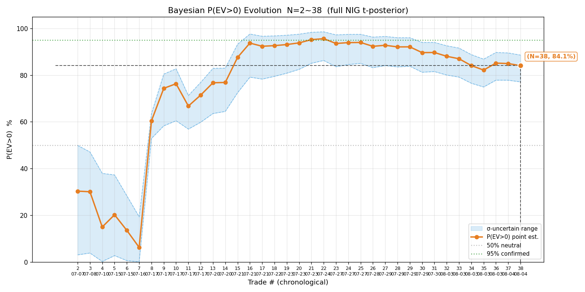
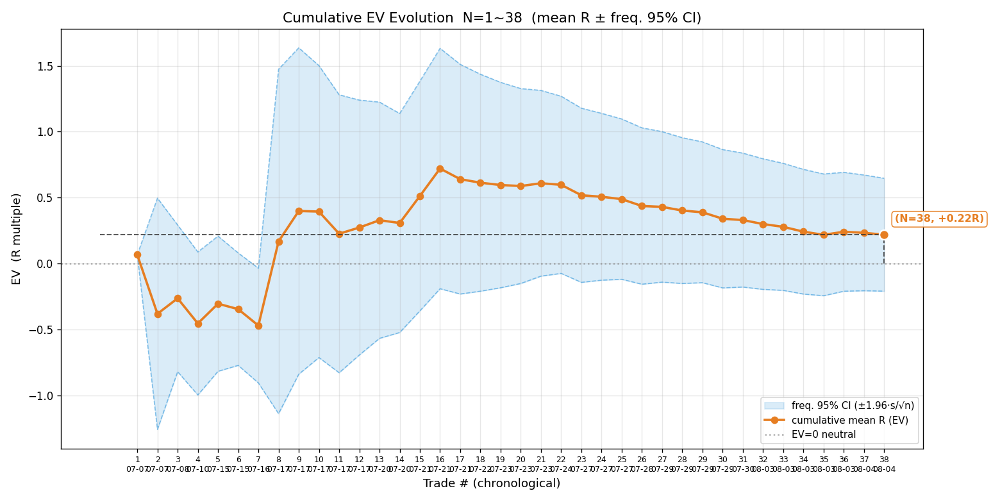
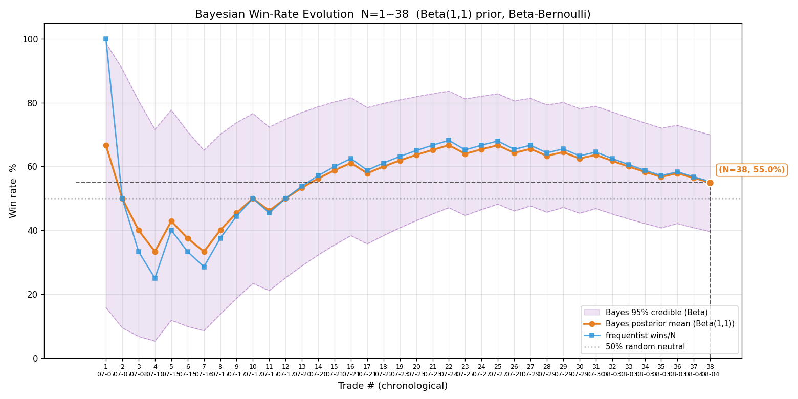
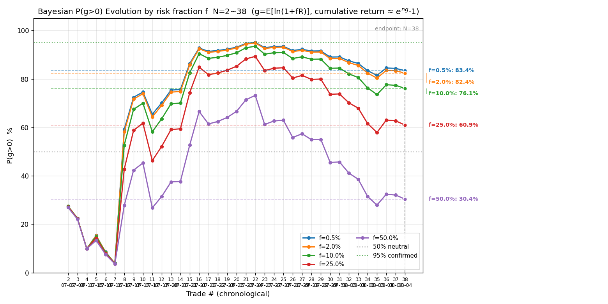
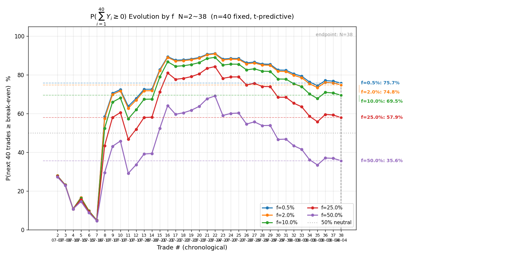
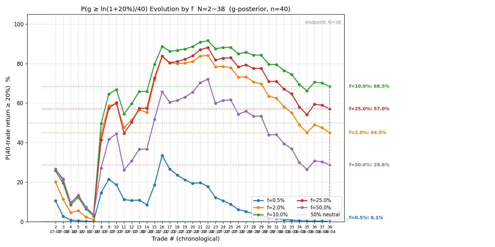
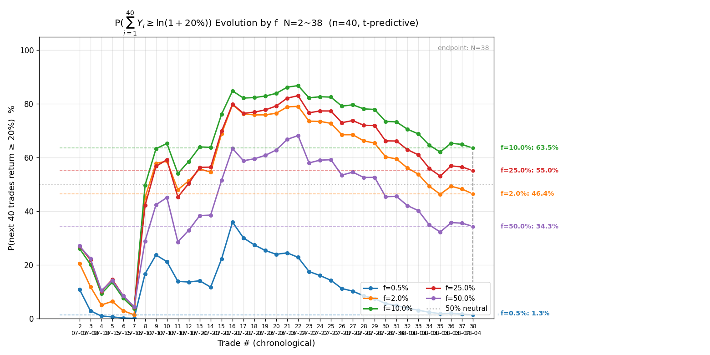

# 历史交易复盘 · 2026-08-04（净口径，N=38）

> 复盘日期：2026-08-04（北京时间 12:23 起，港股午休中）。
> **盈亏口径：净口径（2026-08-03 立）**——所有盈亏、赔率、EV、胜率、贝叶斯 P(EV>0) 一律扣双边手续费后再算：港股 18bps/边、美股 3bps/边，开仓 + 平仓两边各收一次；分母 max_loss 保持毛值（开仓前定的风险预算标尺不动），故止损单净 R 可略低于 −1。
> 数据源：遍历 `signals/` + `actions/` 两目录全部记录，合并为全量样本（signal 模式在 `signals/`、auto 模式在 `actions/`），与上轮基线逐日对账。
> 工具：`scripts/review.py`（全套统计）+ `scripts/bayes_evolution.py`（7 张序贯演化图）。所有数值 Python 实算，不心算。

## 一、本轮相对上轮（8-03）的变化：补 5 笔漏网

上轮 8-03 复盘定稿 N=33（EV +0.278R）。本轮**全量对账发现 5 笔漏网**（8-03 复盘时点美股 8-03 盘尚未走完或刚平仓、未纳入），全部补入：

| # | 日期(市场日) | 标的 | 方向 | entry | exit | shares | max_loss | 净 R | 来源文件 | 漏网原因 |
|---|---|---|---|---|---|---|---|---|---|---|
| 34 | 2026-08-03 | US.MU 美光 | short | 783.19 | 791.27 | 30 | $264 | **−0.972** | actions/8-03-ET | 8-03 复盘在美股开盘前做，该笔 HKT 21:52 才开 |
| 35 | 2026-08-03 | US.MU 美光 | long | 821.23 | 818.60 | 40 | $209 | **−0.598** | actions/8-04-ET | 同一美股交易日（ET 8-03），HKT 跨午夜到 8-04 00:23，文件归 8-04-ET |
| 36 | 2026-08-03 | US.NVDA 英伟达 | long | 202.19 | 205.15 | 86 | $231 | **+1.056** | signals/8-03-ET | HKT 22:04 开 / 22:28 平，8-03 复盘时刚平仓、未纳入 |
| 37 | 2026-08-04 | HK.02359 药明康德 | short | 181.5 | 181.2 | 300 | HK$1650 | **−0.064** | signals/8-04-HKT | 本轮新增（8-04 上午盘） |
| 38 | 2026-08-04 | HK.09988 阿里巴巴 | short | 126.5 | 126.5 | 16600 | HK$24900 | **−0.304** | actions/8-04-HKT | 本轮新增（8-04 上午盘） |

5 笔里 **4 亏 1 盈**（仅 NVDA +1.06R）。N 由 33 → **38**。

> ⚠️ 日期归类口径：`trades.csv` 的 date 取**该标的所在市场的交易日**（美股按 ET 日、港股按 HKT 日），不按记录写入时的北京时间。故两笔 MU（HKT 8-03 21:52 与 HKT 8-04 00:23）同属美股 8-03 交易日，date 均记 2026-08-03——它们因北京时间跨午夜被分写在 `8-03-ET`、`8-04-ET` 两个动作文件，但属同一交易日，复盘合并到 8-03。
>
> ⚠️ 另有 1 笔 **2026-07-29 ET SOXS 做多 118 股**（signals/8-29-ET）信号文件停在「假设持仓……FOMC 决议前移损或平仓」、无实际平仓记录；signal 模式下用户是否真执行、平仓价多少 AI 不知，**缺平仓价无法算 R，本轮声明跳过**（不计入样本，亦不计入作废）。历史 3 笔「有开无平」（07-08 SOXL、07-10 SOXL、07-17 MU）上轮已据 archive / 止损价补平仓价纳入，本轮保留。
>
> ⚠️ 5 笔作废 / 不计样本（开仓失败 / 撤销 / 跨日基础设施 bug），与上轮一致剔除：07-21 HKT 00981 第二笔（成交价=止损价）、07-24 ET SOXS 首单（实测价超范围）、07-27 ET MU（限价不成交）、07-28 HKT 00981（断网时间断层、用户撤销）、07-31 ET 全文件（auto 基础设施 bug、无明细）。

## 二、终局统计量（N=38，净口径）

| 指标 | 本轮(38笔) | 上轮(33笔) | 变化 |
|---|---|---|---|
| 样本量 N | 38 | 33 | +5 |
| 胜率 p | **55.3%**（21 胜 17 败） | 60.6% | ↓5.3pp |
| 败率 q | 44.7% | 39.4% | ↑5.3pp |
| 胜赔率 R_W | +0.979 | +0.975 | 基本持平 |
| 败赔率 R_L | −0.722 | −0.795 | 略改善（败笔亏得少了） |
| **EV** | **+0.218R**（EV% +21.81） | +0.278R | ↓0.06R |
| 平均每单盈亏 P̄ | +HK$2181.6 | +HK$2748.6 | ↓（港股大单亏损拖累金额） |
| R 标准差 s | 1.347 | 1.412 | 略降 |

| 推断指标 | 本轮 | 读法 |
|---|---|---|
| 贝叶斯 P(EV>0)（完整 NIG t 后验） | **84.1%**（σ 不确定 77.1%~88.6%） | 点估计偏正，但下界 77%、跨度 11pp >5pp |
| 频率派 EV 95% CI | **[−0.210, +0.646]** | **跨过 0**，不足以判断 EV 正负 |
| σ 的 95% CI | [1.098, 1.742]（跨 1.6 倍） | σ 自身仍不确定 |

**判读**：点估计 P(EV>0)=84% 看着偏正，但 σ 不确定区间下界只到 77%、频率派 CI 仍跨 0——按 SKILL 判读纪律（跨度 >5pp 或点值近 50% 即小样本、只取方向），**当前 edge 未确认**，不作加仓 / 改策略决策。

## 三、核心发现：账面正 EV 靠 4 笔大胜撑起，右偏严重（一致性差）

这是本轮复盘最该看穿的一点。均值 +0.218R 看着是正期望，但它被极少数大胜主导，**典型一笔其实几乎打平**：

| 右偏诊断 | 数值 | 含义 |
|---|---|---|
| 均值 vs 中位数 | +0.218R vs **+0.030R**（7.4 倍） | 一半交易赚得少于 +0.03R（近乎打平）；均值被尾部大胜拉高 |
| 剔除 top2 大胜后 | 剩 36 笔 EV = **−0.005R**（打平） | 去掉智谱 +4.6R、海力士 +3.9R，整体就不赚钱了 |
| 剔除 top4 大胜后 | 剩 34 笔 EV = **−0.171R**（负） | 再去掉中芯 +3.4R、智谱第二笔 +2.2R，转负 |
| ≥2R 大胜合计 | 4 笔 +14.10R，**占总 R 和 +8.29 的 170%** | 其余 34 笔合计是 −5.81R 的负贡献 |

**4 笔 ≥2R 大胜全部集中在 7-17 ~ 7-21 五天内**：

- 2026-07-17 HK.02513 智谱做空首仓 **+4.635R**（+HK$43569，暴跌顺势做空爆发）
- 2026-07-17 HK.02513 智谱做空第二仓 **+2.244R**
- 2026-07-21 HK.00981 中芯做多 **+3.376R**（+HK$14769）
- 2026-07-21 HK.07709 海力士做多 **+3.850R**（+HK$17324）

也就是说：**策略的正期望高度依赖「捕捉大趋势日 / 暴跌顺势的大胜」**。这 4 笔的共同背景是 7 月中旬半导体板块的单边大波动（智谱 IPO 后暴跌、中芯 / 海力士突破趋势日）。一旦市场转入 8 月以来的震荡 / 无趋势，大胜来源消失，剩下大量「赢得薄（典型 +0.03R）+ 偶尔止损（−1R 上下）」的交易，整体就转负——这正是近期窗口看到的：

| 近期窗口 | EV | 胜率 |
|---|---|---|
| 近 5 笔（N=34~38） | **−0.176R** | 20% |
| 近 7 笔（N=32~38，即 8-03 至今） | **−0.274R** | 14% |
| 近 10 笔（N=29~38） | **−0.294R** | 30% |

**近 10 笔 EV −0.29R、胜率仅 30%——8 月以来策略在当下市况明显失效**。这不是「运气差」能解释的小波动，而是连续 10 笔的系统性走弱，方向上要承认：当前账面 +0.22R 的正期望，是 7 月那波大胜行情的遗产，不是策略在任意市况下都成立的一般性 edge。

## 四、本次新增 5 笔的三阶段赔率（预估 → 修正 → 落地）

三阶段并列表能直接看出「预估乐观、落地打折」的程度：

| 标的（方向） | 初始预期 R（毛/净） | 修正预期 R（毛/净） | 实际落地 R（毛/净） |打折 |
|---|---|---|---|---|
| HK.02359 药明康德（空） | 1.93 / 1.82 | 2.09 / 1.98 | 0.055 / **−0.06** | 预估 ~2R，落地打平小亏 |
| HK.09988 阿里巴巴（空） | 1.50 / 1.12 | 1.00 / 0.70 | 0 / **−0.30** | 保本平、扣费后小亏 |
| US.MU 美光（空，8-03） | 2.86 / 2.79 | 2.06 / 2.01 | −0.92 / **−0.97** | 预估 ~2.8R，被动止损 |
| US.MU 美光（多，8-03） | 2.80 / 2.70 | 2.63 / 2.54 | −0.50 / **−0.60** | 突破回踩假信号、主动平 |
| US.NVDA 英伟达（多，8-03） | 2.52 / 2.48 | 2.80 / 2.75 | 1.10 / **+1.06** | 唯一兑现的一笔 |

5 笔初始预期赔率都在 1.5~2.9R（开仓门槛 ≥1.2R 净都过），但**落地只有 NVDA 1 笔兑现（+1.06R），其余 4 笔从「预估 2R 上下」打到「打平 / 止损」**。两个反复出现的打折模式：

1. **预估赔率系统性偏乐观**：开仓前按参考价算的净赔率 1.1~2.0R，实际成交后修正赔率就已降一档（滑点 + 止损距重算），平仓后再降一档。5 笔里 4 笔的三阶段逐级下滑。这说明入场时对「能以参考价成交 + 能在止盈位平」的假设偏乐观。
2. **跳空强势股 / 假突破回踩两类形态反复吃哑巴亏**：药明康德（跳空暴涨 +10.8% 后反抽 VWAP 遇阻做空，多头韧性使价格跌不动，形态对≠能跌）、MU 多（820 突破回踩企稳做多，突破后无续涨量能、回踩失败）。共性是「入场形态成立、但价格不动或反向」，导致浮盈打平 / 小亏离场——净口径下扣双边费后变负。

## 五、7 张序贯演化图与分阶段解读

下图横轴均为交易序号（按开仓时间排序的全部 38 笔已平仓交易），同源同横轴、纵轴各异。读图纪律：以终端数值为依据，图作嵌入展示。

### ① 贝叶斯 P(EV>0) 演化（方向与信念强度）

| 阶段 | 区间 | P(EV>0) 走势 | 驱动 |
|---|---|---|---|
| 探底 | N=2~7（7-07~7-16） | 30% → **6.2%**（N=7 谷底） | SOXL 反复止损 + 美团#2 亏，早期 6 笔仅 1 胜 |
| 转折 | N=8~9（7-17 智谱） | 6% → 60% → 74% | **智谱首仓 +4.6R 单笔翻转**（右偏根源） |
| 攀升 | N=10~21（7-17~7-23） | 76% → **95.2%**（N=21 峰值） | 中芯 / 海力士 / MU 持续盈利，黄金期 |
| 高位震荡 | N=22~33（7-24~8-03） | 88%~96% 高位 | 频率派 CI 始终跨 0（下界 −0.08~−0.20） |
| 回落 | N=34~38（8-03~8-04） | 87% → **84.1%** | 近 5 笔 4 亏，σ 下界 77% |

**关键认知**：P(EV>0) 的攀升几乎全靠 N=8~21 那 14 笔（含 4 笔 ≥2R 大胜）；N=21 达到峰值 95.2% 后再未创新高，反而从 N=30 起缓慢回落。当前 84.1% 的点估计看似偏正，但下界 77%——**信念的「高度」建立在少数大胜上、并不稳健**。

### ② 累计 EV 演化（幅度与分布形状）

累计均值主线（序贯 EV 点估计）从 N=8 起转正，N=16~21 在 +0.6~+0.72R 见顶，之后一路回落到 N=38 的 **+0.218R**；频率派 95% CI **全程跨过 0**（上界 +1.6 收窄到 +0.65、下界始终在 −0.1~−0.24）。本图与①互相对齐：P(EV>0) 峰值（N=21）正是 EV 均值峰值附近；EV 均值被右偏拉高、CI 宽（s=1.35），暴露「好看的 +0.22R 是个别大胜撑起、不代表一致性」。

### ③ 贝叶斯胜率演化（Beta-Bernoulli，胜率这一维的收敛）

终局贝叶斯胜率（Beta(1,1) 后验均值）**55.0%**、频率法 55.3%，两者已基本趋同（N=38 样本下贝叶斯收缩到频率法附近）。后验 95% 可信区间约 [49%, 61%]——**下界贴 50%、胜率这一维也未脱离「抛硬币」**。胜率是仓位的核心输入（凯利 f* 里 p 线性出现），其 CI 下界贴 50% 意味着仓位估计同样不稳。

### ④ P(g>0) 演化（多 f，长期是否有复利 edge）

g = E[ln(1+fR)]，累计收益率 ≈ e^(n·g)−1，**g>0 才长期复利增长**。方差惩罚使 EV>0 不蕴含 g>0，故 P(g>0) 比 P(EV>0) 更严格。

### ⑤ P(∑₄₀ Y≥0) 演化（多 f，接下来 40 笔不亏的概率）

### ⑥ P(g ≥ ln1.2/40) 演化（多 f，40 笔累计≥20% 所需 g）

### ⑦ P(∑₄₀ Y ≥ ln1.2) 演化（多 f，未来 40 笔累计≥20%）

④~⑦ 终局多 f 值见下节「科学选 f」。

## 六、科学选 f（四步框架，基于当次样本重算）

**终局多 f 表（N=38）**：

| f | ĝ（每笔） | P(g>0) | P(∑₄₀Y≥0) | P(∑₄₀Y≥ln1.2)（≥20%） |
|---|---|---|---|---|
| 0.5% | +0.107% | 83.4% [78~89%] | 75.7% | **1.3%** |
| 2.0%（当前 f_max） | +0.401% | 82.4% [77~88%] | 74.8% | 46.4% |
| 10.0% | +1.406% | 76.1% [71~81%] | 69.5% | **63.5%（峰值）** |
| 25.0% | +1.257% | 60.9% [59~63%] | 57.9% | 55.0% |
| 50.0% | **−4.616%** | 30.4% [26~35%] | 35.6% | 34.3% |

**① 约束优化**：硬约束 P(∑₄₀Y≥0)≥95%——**当前任何 f 都达不到**（最高 f=0.5% 仅 75.7%），根因是频率派 EV CI 跨 0、样本不确定大。在「不亏」约束无法满足的前提下，「达目标」P(∑₄₀Y≥ln1.2) 的峰值在 **f≈10%（63.5%）**，即数学最优 f≈10%。

**② 凯利交叉验证**：f* = p/|R_L| − q/R_W = 0.553/0.722 − 0.447/0.979 = 0.309（≈31%）。⚠️ 小样本 + 移动止损锁利致样本 |R_L|<1，f* 系统性高估、仅作参考；保守分数凯利 1/7~1/4 f* ≈ 4.4%~7.7%。

**③ 稳健性收缩（按 edge 状态）**：当前 edge **未确认**（P(g>0) 下界 77% <95%、胜率 CI 下界贴 50%、频率派 EV CI 跨 0、右偏严重 + 近 10 笔转负）→ **收缩到当前风控上限 f=2%**，不释放到约束优化解（10%）。待 edge 确认（N≥50、P(g>0) 下界>95%、胜率 CI 下界脱离 50%）再释放。

**④ 尾部红线**：f=50% 时 ĝ 转负（−4.6%/笔）、P(g>0) 跌到 30%（过度下注、负 edge）。P(g>0)≥50% 的临界约在 f<40%；f 硬上限保守取 **25%**（届时 P(g>0) 仍 61%、但 P(∑₄₀Y≥0) 只剩 58%，已无安全垫）。

**决策表**：

| 档位 | f | 依据 |
|---|---|---|
| 当前阶段（edge 未确认） | **2.0%**（维持 f_max） | 右偏 + 近期转负，保守 |
| edge 确认后（N≥50 等） | 释放到 ~10% | 约束优化 P(≥20%) 峰值 |
| 尾部硬上限 | ≤25% | P(g>0) 尚 >60% 的上界 |

**核心认知「不亏 ≠ 达目标」**：f=0.5% 时 P(不亏)=75.7% 但 P(≥20%) 仅 1.3%（ĝ 太小、40 笔预期累计才 ~4.4%，远低于 20%）；f=2% 时 P(≥20%) 46.4%。**保生存看 P(g>0)、达目标看 P(≥20%)，两个约束独立**——当前 f=2% 是「保生存优先、达目标听天由命」的保守档。

## 七、样本量规划（代入当前 s=1.347）

| 指标 | 误差 / 假设 | 需要样本 |
|---|---|---|
| 胜率（p=0.5） | ±5% | 384 笔 |
| 胜率（p=0.5） | ±3% | 1067 笔 |
| EV 估计 | ±0.2R | 174 笔 |
| EV 估计 | ±0.1R | 697 笔 |
| 确认 EV>0（80% 把握） | 真实 EV=0.10R | 1121 笔 |
| 确认 EV>0（80% 把握） | 真实 EV=0.20R | 280 笔 |

当前 N=38，距「确认 EV>0（即便真实有 0.20R 厚期望）」的 280 笔还差 7 倍以上。**样本量约束无法绕过**：当前所有「正期望」判断都带 σ 跨 1.6 倍的不确定。

## 八、近期走弱归因与待改进方向

**现象**：近 10 笔（N=29~38，7-29 至今）EV −0.29R、胜率 30%，与 7-17~7-23 黄金期（大胜集中）形成鲜明对比。

**归因（待用更多样本验证，当前仅为假设）**：

1. **市况切换、大胜来源消失**：7 月中旬半导体单边大波动（智谱 IPO 暴跌、中芯 / 海力士突破）给了 4 笔 ≥2R 大胜；8 月以来转入震荡 / 缺乏持续性趋势，策略失去大胜土壤，剩下小赚小亏 + 止损。这是「策略本质是趋势 / 波动捕获器、震荡市天然不适配」的体现。
2. **预估赔率偏乐观、窄止损被费率吃掉**：近 5 笔里 HK.02359（止损距 5.5，毛 +90 被双边费 196 吃成净 −106）、HK.09988（毛 0、双边费 7560 直接打成 −0.30R）都是「毛盈亏小、双边费占比高」的典型——窄止损小单在净口径下 edge 极薄（港股 18bps/边对窄止损冲击尤其大）。
3. **跳空强势股逆势做空反复吃哑巴亏**：药明康德（跳空 +10.8% 后反抽遇阻做空）、此前的 07709 教训——逆跳空强势做空「形态对 ≠ 能跌」，多头韧性使价格横盘、扣费后小亏。
4. **signal 模式响铃时序的取价偏差**：药明康德开仓取价 181.5（参考价 181.2 上方）、平仓取价 181.2——响铃后取价与参考价的偏差叠加，把本就薄的毛盈利吃光。

**归因小结（可执行改进项已记入 `TODO.md`「交易规则 / 策略」节，2026-08-04）**：① 大胜捕捉是 edge 来源、震荡市须克制出手；② 窄止损港股单在净口径下 edge 极薄（港股 18bps/边对止损距 <1.5% 的单子冲击毁灭性，HK.09988 止损距 1.5%、毛 0 被双边费打成 −0.30R）；③ 预估赔率三阶段系统性打折（开仓判 EV 宜打折再判 ≥1.2 门槛）；④ 跳空强势股逆势做空「形态对 ≠ 能跌」反复吃哑巴亏。

## 九、结论

1. **账面 EV +0.218R、P(EV>0) 84%，但 edge 未确认**——频率派 CI [−0.21, +0.65] 跨 0、σ 不确定下界 77%、胜率 CI 下界贴 50%。
2. **正期望靠 4 笔大胜撑起、右偏严重**：剔除 top2 大胜后剩 36 笔 EV≈0、剔除 top4 后转负；≥2R 大胜占总 R 和 170%。典型一笔只赚 +0.03R（中位数）。
3. **8 月以来策略失效**：近 10 笔 EV −0.29R、胜率 30%，大胜来源（7 月半导体大波动）消失后整体转负。
4. **仓位决策**：维持当前 f=2%（edge 未确认、保守收缩）；不释放到数学最优 f≈10%。尾部硬上限 25%。
5. **下一步靠积累样本 + 改进一致性**：当前 N=38 远不足以定论；重点不是「等胜率回到 60%」，而是改进「震荡市少亏 / 不扣费转负」+「大胜行情敢 captures」，让 R 分布的右尾更可复现、而非靠天吃饭。

---

## 附：本轮新增 / 变更的产物

- `reviews/2026-08-04-trades.csv`（38 笔全量净口径，相对 8-03 基线补 5 笔漏网）
- `reviews/2026-08-04-{bayes,ev,winrate,pg,psum40,pg20,psum40-20pct}-evolution.png`（7 张序贯演化图）
- `scripts/bayes_evolution.py`（输入 / 输出路径由 8-03 改为 8-04，逻辑未动）
