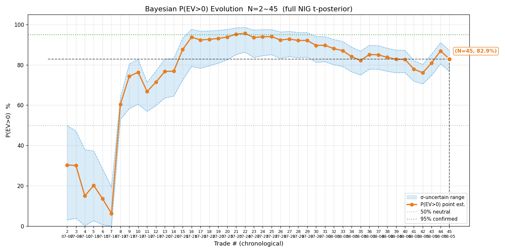
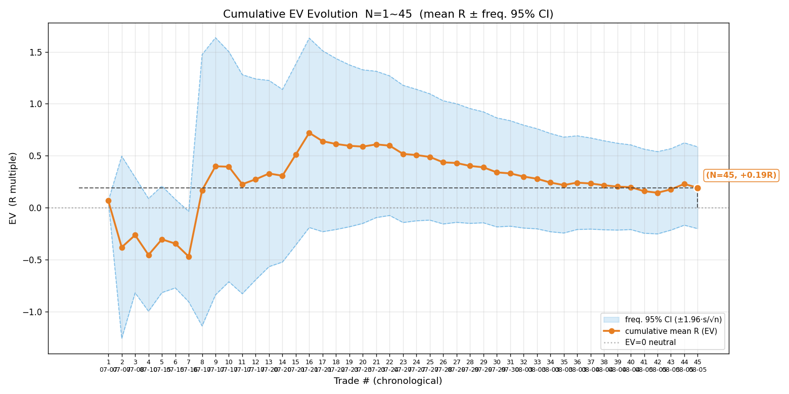
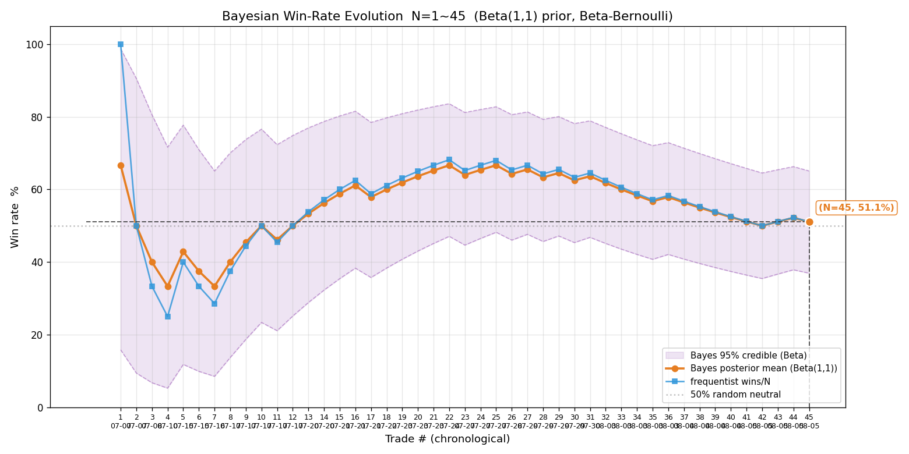
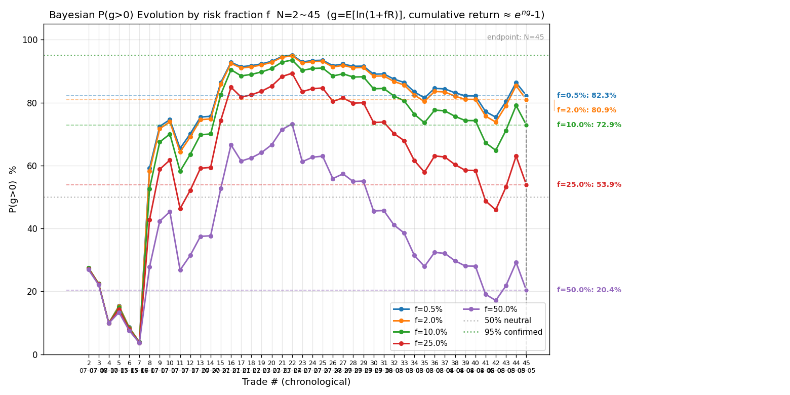
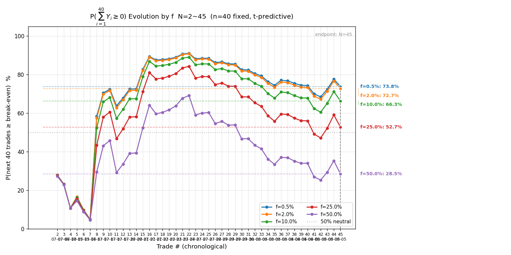
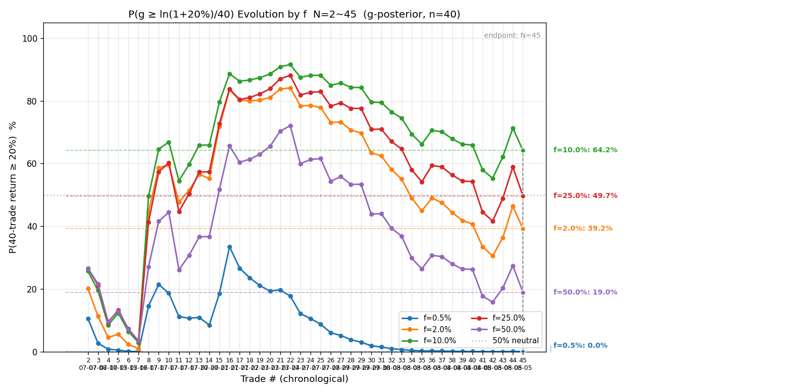
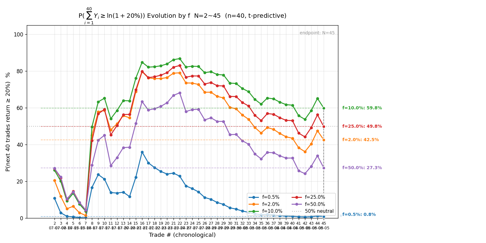

# 全量交易复盘 · 2026-08-05

> 复盘范围：`signals/` + `actions/` 两个目录全部已了结交易，遍历两目录全部文件、与 `2026-08-04-trades.csv` 逐日对账后重建全量样本。所有数值 Python 实算（`review.py` + `bayes_evolution.py`），盈亏一律扣双边手续费（净口径：港股 18bps/边、美股 3bps/边），分母 max_loss 保持毛值。⚠️ 复盘盈亏按信号记录参考价与 max_loss 实算，不涉及真实账户资金。

## 一、对账结论与新增样本

存量 trades.csv（08-04 版）38 笔，本次对账全量核对后**新增 7 笔**（N=45）：

**补录 2 笔（08-04 复盘后发生、当时未入样本）**：

| 日期 | 标的 | 向 | 入场→出场 | 量 | max_loss | R 净 | 来源 |
|---|---|---|---|---|---|---|---|
| 08-04 | HK.06869 长飞 | 多 | 105.6→104.5 | 500 | 1800 | −0.411 | signals（追突破买高、动能衰竭主动平） |
| 08-04 | US.MU 美光 | 多 | 893.89→894.295 | 85 | 1011 | −0.011 | actions（突破箱顶后滞涨 32 分钟、几乎打平） |

**08-05 当日 5 笔（signal 会话 3 笔 + auto 会话 2 笔，两会话并行）**：

| 会话 | 标的 | 向 | 入场→出场 | 量 | max_loss | R 净 | 说明 |
|---|---|---|---|---|---|---|---|
| auto | HK.00981 中芯 | 多 | 68.15→67.50 | 36500 | 23725 | −1.376 | 突破回踩做多、多头动能衰竭主动平 |
| signal | HK.00981 中芯 | 空 | 67.25→67.80 | 1500 | 2475 | −0.481 | 反抽 VWAP 遇阻做空、站上 VWAP 动能逆转主动平 |
| auto | HK.01888 建滔 | 多 | 35.86→36.70 | 15500 | 7130 | +1.542 | 突破回踩企稳、止盈 37.1 到达 + 加速赶顶主动锁利 |
| signal | HK.01888 建滔 | 多 | 35.36→36.62 | 3500 | 1610 | +2.457 | 突破 0.382 放量确认、加速赶顶锁利 |
| signal | HK.06869 长飞 | 多 | 124.0→122.9 | 2000 | 2200 | −1.404 | 突破 0.618 回踩企稳、跌破止损被动平 |

> 📌 注意 08-05 当日 signal 与 auto 两会话并行盯盘、各自独立交易：00981 一多一空（两会话方向判断相反）、01888 两笔多单（两会话各自开仓）。按「signal 与 auto 各记各的目录、互不重叠；同一笔两处都有以 actions/ 实际成交记录为准」——本例中 01888 两笔量价止损均不同（15500@35.86 止损 35.40 vs 3500@35.36 止损 34.90），判定为两笔独立交易、各计一笔，无重复计数。

**新增 7 笔合计**：R = +0.316（胜 2 / 负 5），P 净 = −22,713.8。当日 5 笔 R 合计 = +0.738（胜 2 / 负 3），P 净 = −21,963.5——**被 auto 中芯 −1.38R（−32,637）和 signal 长飞 −1.40R（−3,089）两笔大亏吃掉当日盈利**；中芯同一标的两个会话一多一空都亏，是当日最大教训（见第九节）。

**今日三阶段赔率（停盯总结口径）**：

| 标的（会话） | 初始预期 R | 修正预期 R | 实际落地 R |
|---|---|---|---|
| 00981 多（auto） | 1.88 | 1.43 | −1.376 |
| 00981 空（signal） | 1.82 | 1.22 | −0.481 |
| 01888 多（auto） | 2.14 | 2.27 | +1.542 |
| 01888 多（signal） | 3.92 | 4.89 | +2.457 |
| 06869 多（signal） | 2.39 | 1.77 | −1.404 |

01888 两笔落地兑现良好（预期→落地打折幅度小、达标锁利）；00981 与 06869 均是「预估乐观但落地亏损」——00981 突破/反抽信号快速失效、06869 追突破后破位。

## 二、终局统计量（N=45）

| 指标 | 值 | 上期（N=38，08-04 复盘） | 变化 |
|---|---|---|---|
| 样本量 N | 45 | 38 | +7 |
| 胜率 p | 51.1%（23 胜 22 败） | 55.3%（21 胜 17 败） | −4.2pp |
| 败率 q | 48.9% | 44.7% | +4.2pp |
| 胜赔率 R_W | +1.068 | +0.979 | +0.089 |
| 败赔率 R_L | −0.725 | −0.722 | −0.003 |
| **EV** | **+0.191R（+19.1%）** | +0.218R | −0.027R |
| 平均每单 P̄ | +1,337.5 | +2,181.6 | −844 |
| R 标准差 s | 1.348 | 1.347 | +0.001 |

EV 连续四期回落（07-30 高点 +0.606R → 08-03 +0.278R → 08-04 +0.218R → 今日 +0.191R）：新增 7 笔仅 2 胜、且含两笔 −1.4R 大亏，把均值往下拖。胜率从 65%+ 高位一路回落到 51%——**大胜单集中期（智谱 4.6R / 中芯 3.4R / 07709 3.9R）之后的均值回归正在兑现**，这正是小样本「大胜主导」阶段最该警惕的：好看的点估计被个别大胜拉起，均值回归时回落快。

## 三、贝叶斯 P(EV>0)（完整 NIG，t 后验）

- 后验 μ ~ t47（位置 +0.187，尺度 0.195）
- **P(EV>0) = 82.9%（σ 不确定下 76.7% ~ 87.2%）**
- σ 的 95% CI：[1.116, 1.703]（跨 1.5 倍）
- 判读：跨度 10.5pp（>5pp）且点值离 50% 仅 33pp——**按判读纪律仍属「小样本、只取方向（略偏正）、不作加仓/改策略决策」**。上期（N=38）P=84.1%（77.1~88.6%），本期 82.9%（77~87%）微降——新增 7 笔 2 胜 5 负但两胜单 R 大（1.54/2.46），信念没有明显衰减，但**确认线（区间整体 >95%）从未触及**，N=45 仍在「N≈50+ 才有确认价值」的门槛上。

## 四、频率派对照

- EV 95% CI = +0.191 ± 0.394 = **[−0.203, +0.585]（跨过 0）**
- 上期（N=38）CI = [−0.210, +0.646] 亦跨 0——频率派与贝叶斯一致：**现有样本不足以判断 EV 正负**。07-30 曾出现 CI 全正的「假确认」（N=28，漏样本 + 大胜主导），补全样本后 CI 持续跨 0，说明早期「正期望初步确认」的判断是幸存者偏差，真实证据至今未达确认标准。

## 五、样本量规划（代入当前 s=1.348）

| 目标 | 误差 / 假设 | 需要样本 |
|---|---|---:|
| 胜率（p=0.5） | ±5% | 384 笔 |
| 胜率（p=0.5） | ±3% | 1067 笔 |
| EV 估计 | ±0.2R | 174 笔 |
| EV 估计 | ±0.1R | 698 笔 |
| 确认 EV>0（80% 把握） | 真实 EV=0.10R | 1123 笔 |
| 确认 EV>0（80% 把握） | 真实 EV=0.20R | 281 笔 |

按当前 s 与点估计 +0.19R：若真实 EV 真有 0.2R，约 281 笔可 80% 把握确认——**当前 45 笔约完成 1/6**；若真实 EV 只有 0.1R 则需上千笔。诚实的结论：离「确认」还远，继续攒样本。

## 六、序贯演化图（7 张）

**关键节点（P(EV>0) 与 EV 同源同横轴）**：

| 阶段 | N | 代表交易 | 累计均值 | P(EV>0) | 说明 |
|---|---|---|---|---|---|
| 探底 | 4 | SOXL 连亏 | −0.455R | 15.0% | 开局 7 笔 2 胜，负期望摸索期 |
| 转折 | 8 | 智谱做空 +4.64R | +0.167R | 60.4% | 智谱大胜翻转 EV |
| 攀升 | 16 | 中芯做多 +3.38R / 07709 +3.85R | +0.720R | 93.7% | 连续大胜、EV 峰值区间 |
| 高位震荡 | 21 | MU +1.03R | +0.608R | 95.2% | P 触及 95% 阈值（点估计） |
| 均值回归 | 30 | 07709 止损 −1.08R | +0.339R | 89.7% | 亏损单密集期开始 |
| 回落 | 38 | 长飞 −0.41R 等 | +0.215R | 83.7% | EV 持续下移 |
| **今日** | **45** | **中芯一多一空双亏 + 建滔两笔大胜** | **+0.191R** | **82.9%** | **EV 续回落，P 微降；CI 仍跨 0** |

**胜率演化**：贝叶斯后验均值 51.1%（N=45），频率法 51.1%，两线已完全重合——但**两线一起掉到 50% 附近**（上期 55%），CI=[37%, 65%] 下界贴 50%。从 N=16 的 60%+ 高位回落至此，胜率估计的「收敛」是向 50% 随机分界收敛，不是向高胜率收敛——**这是与早期复盘最大的认知修正**：此前 65-70% 的胜率是高置信开仓 + 大胜单阶段的好样本产物，拉长看胜率并无显著优势（贝叶斯 CI 下界始终贴 50%）。

**多 f 终局表（P(g>0) / P(∑₄₀Y≥0)）**：

| f | ĝ（每笔） | P(g>0) | σ 不确定 | P(∑₄₀Y≥0) | P(∑₄₀Y≥ln1.2) |
|---|---|---|---|---|---|
| 0.5% | +0.093% | 82.3% | 77~87% | 73.8% | 0.8% |
| **2%（当前）** | **+0.347%** | **80.9%** | **76~86%** | **72.7%** | **42.5%** |
| 10% | +1.124% | 72.9% | 69~77% | 66.3% | 59.8% |
| 25% | +0.422% | 53.9% | 53~55% | 52.7% | 49.8% |
| 50% | −7.258% | 20.4% | 16~26% | 28.5% | 27.3% |

## 七、科学选 f（四步框架，基于 N=45 样本）

**① 约束优化**：硬约束 P(∑₄₀Y≥0)≥95%——**所有 f 均不满足**（f=0.5% 最高也只有 73.8%）。当前样本下「接下来 40 笔不亏 ≥95%」的约束无法达到，说明 edge 证据不足，任何 f 都无法给出「不亏」的高置信保证。

**② 凯利交叉验证**：f* ≈ p/|R_L| − q/R_W = 0.511/0.725 − 0.489/1.068 ≈ 0.705 − 0.458 ≈ 0.25（⚠️ 小样本 + 移损锁利致 |R_L|<1，f* 系统性高估，仅参考）。f=2% ≈ 1/12 f*，保守分数区 ✓。

**③ 稳健性收缩（按 edge 状态）**：edge 未确认（P(g>0) 下界 76% < 95%、胜率 CI 下界贴 50%、均值被大胜主导）→ **维持 f=2% 上限**，不释放。

**④ 尾部红线**：f≥25% 时 P(∑₄₀Y≥0) 跌破 53%、P(g>0) 跌破 54%——f 硬上限 ≤10% 附近（f=10% 时 P(g>0) 已降至 72.9%，尾部风险显现）。

**决策表**：

| 档位 | f |
|---|---|
| 当前阶段（edge 未确认） | **2%**（维持） |
| edge 确认后（N≥50、P(g>0) 下界 >95%、胜率 CI 下界脱离 50%） | 10%（约束优化近似最优，P(≥20%)=59.8% 最高） |
| 尾部硬上限 | ≤10% |

⚠️ 与上期对比：上期（N=38）f=2% 时 P(∑₄₀Y≥0)=74.8%、P(g>0)=82.4%；本期 72.7% / 80.9%——样本增大后「不亏概率」进一步下降，两个约束（不亏 ≥95% / 达 20% ≥ 高）都未达标。**核心认知更新：f=2% 保不亏的能力也在下降（72.7%），说明当前策略的真实 edge 可能比早期估计薄得多**；在 P(∑₄₀Y≥0) 回到 90%+ 之前，任何加仓决策都不成立。

## 八、过程指标

⚠️ trades.csv 未提供 raw_high / raw_low（历史样本无持仓期间极值记录，需富途分钟 K 回拉或平仓时原生记录 mfe_R/mae_R），本次仍跳过 MAE/MFE/回吐/锁利效率统计。skill 已落地平仓脚本自动输出 mfe_R/mae_R（2026-08-05），后续交易补进 CSV 即可开始统计。

## 九、多层评估

### 一、即时层

- **决策合规率**：新增 7 笔中 1 笔有明确决策瑕疵——08-05 signal 长飞 06869 追突破成交在 124.0（突破 0.618 位 126.4 后回踩 123.5-124 企稳做多，属合格形态，但入场后跌破止损 122.9 被动平仓 −1.40R，持仓仅 ~8 分钟）；08-04 长飞追突破买在日内高（105.6 接近高 105.8）已有前车之鉴、08-05 再度追突破未放量确认。**同一标的（长飞）连续两天追突破亏损**（08-04 −0.41R、08-05 −1.40R），追突破类入场需警惕。
- **08-05 中芯 00981 两会话一多一空都亏**（auto 多 −1.38R、signal 空 −0.48R）：signal 会话 10:31 做空时 auto 会话 10:01-10:11 刚做完多被套平仓——**两会话并行盯盘同一标的、方向判断相反，等于对同一标的分歧下注双输**。这不是策略问题而是流程问题：signal/auto 两会话并行时，应避免同时操作同一标的（至少在两会话间传递「该标的已操作」标记）。
- **置信度校准**：🟢 高置信 45 笔全部，实际胜率 51.1%——高置信没有换来显著高于随机的胜率。校准警示：AI 的「高置信」判断在胜率维度与随机无显著差异（贝叶斯 CI 下界贴 50%）。

### 二、累积层

- P(EV>0)=82.9%（下界 76.7%），edge 未确认，方向略偏正但证据不足。
- 胜率后验 51.1%（CI [37%, 65%]），向 50% 收敛。
- 频率派 CI 跨 0。三层证据一致：**当前样本不足以支持「策略有正 edge」的结论，也不足以否定**。

### 三、对照层

未做反事实基准（随机开仓 / 买持 / 反向对照）——待样本更足或用户指示时补。

### 四、覆盖层

样本覆盖：港股 + 美股、多标的（中芯/美团/小米/智谱/07709/建滔/长飞/阿里/药明/MU/SOXL/SOXS/NVDA）、多方向（多/空）、多环境（暴涨日/暴跌日/震荡日/V 反日/趋势日）。多样性良好。07-30 复盘后新增的多为港股（auto 模式启用后港股样本快速增长）。

## 十、账户状态

| 项 | 值 |
|---|---|
| signal equity-log | HK$[equity-log值已移除]（08-05 长飞止损后；07-26 起记录，累计 [回撤值已移除]） |
| auto 老虎模拟账户 | 港股/美股按 actions 记录实时成交（equity 以账户 API 为准，不在此记账） |

## 十一、总结

**N=45，EV +0.191R（+19.1%），P(EV>0)=82.9%（77~87%），频率派 CI [−0.20, +0.59] 跨 0。**

本期核心变化：

1. **均值回归持续兑现**：新增 7 笔仅 2 胜，EV 三期连降（+0.606 → +0.241 → +0.191）。早期 65-70% 胜率 + CI 全正的好看数字，被补全样本 + 连续亏损单修正——**当前证据只支持「略偏正、未确认」**，离确认线（N≈50+、区间整体 >95%）还有距离。
2. **胜率向 50% 收敛是最重要的事实**：贝叶斯与频率两线重合且同落到 51%，CI 下界贴 50%——「高置信开仓」的胜率优势在拉长样本后不显著，支撑正 EV 的只剩胜单赔率（R_W 1.07）勉强高于败单（|R_L| 0.73）。
3. **当日两笔教训**：中芯两会话一多一空双亏（流程问题，两会话并行应避免同标的分歧下注）；长飞连续两天追突破亏损（08-04 −0.41R、08-05 −1.40R，追突破须等放量确认 + 不在日内高追）。
4. **科学选 f 结论**：维持 f=2%，不释放——所有 f 的 P(∑₄₀Y≥0) 均 <95%，edge 未确认前不加仓；f 硬上限 10%。
5. **样本对账纪律再验证**：本次全量对账补出 7 笔（08-04 复盘后新发生 2 笔 + 当日 5 笔），N 由 38 → 45，EV 由 +0.241R 修正为 +0.191R——再次证明「每次复盘必须遍历两目录全部文件、逐日对账」的必要性。
