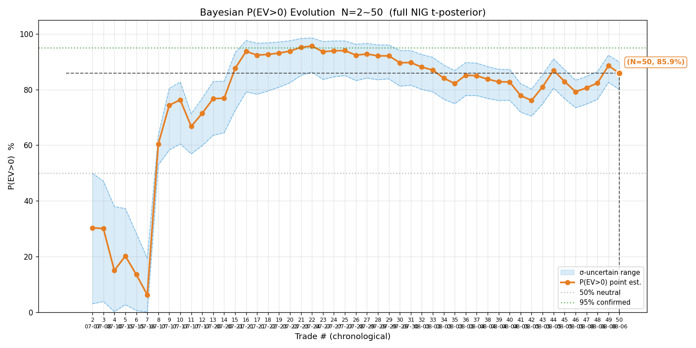
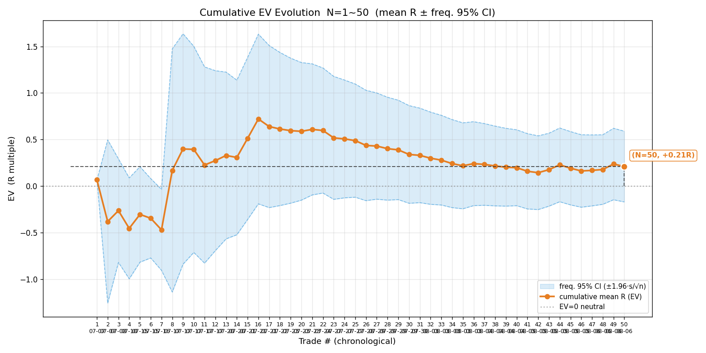
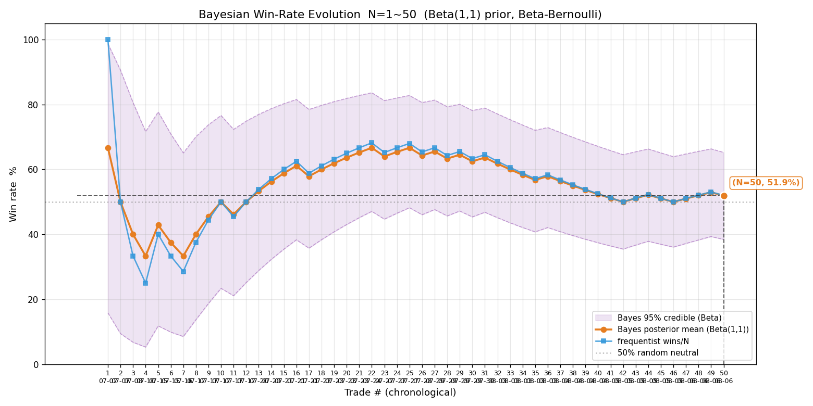
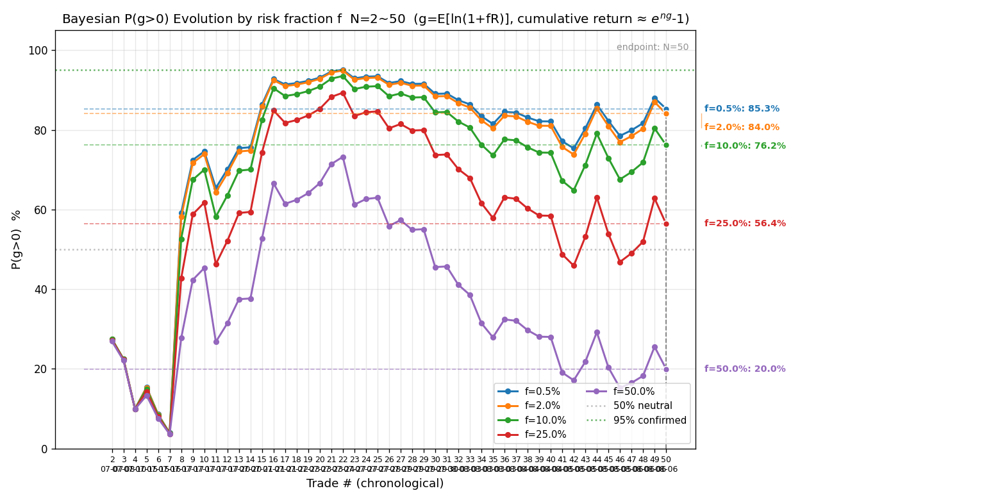
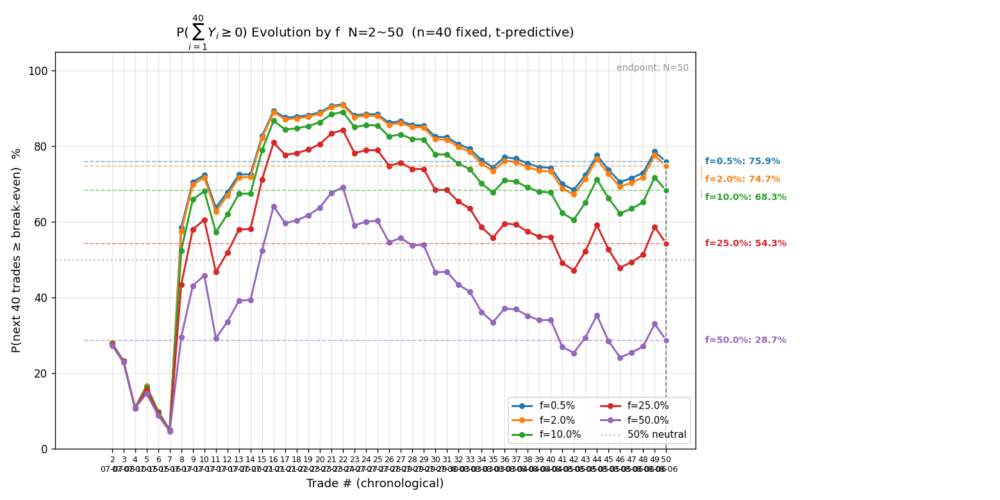
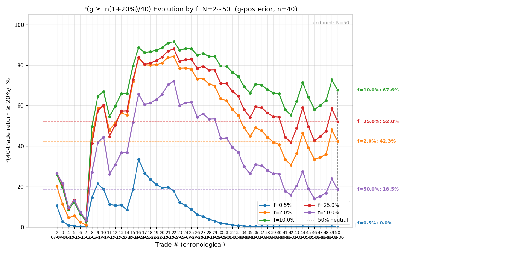
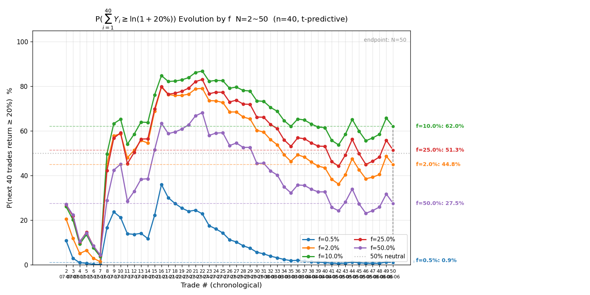

# 全量交易复盘 · 2026-08-06

> 复盘范围：`signals/` + `actions/` 两个目录全部已了结交易，遍历两目录全部文件、与 `2026-08-05-trades.csv` 逐日对账后重建全量样本。所有数值 Python 实算（`review.py` + `bayes_evolution.py`），盈亏一律扣双边手续费（净口径：港股 18bps/边、美股 3bps/边），分母 max_loss 保持毛值。⚠️ 复盘盈亏按信号记录参考价与 max_loss 实算，不涉及真实账户资金。

## 一、对账结论与新增样本

存量 trades.csv（08-05 版）45 笔，本次对账全量核对后**新增 5 笔**（N=50）：

| 日期 | 标的 | 会话 | 向 | 入场→出场 | 量 | max_loss | R 净 | 说明 |
|---|---|---|---|---|---|---|---|---|
| 08-05 | US.NVDA 英伟达 | signal | 多 | 221.98→220.97 | 307 | 300.86 | **−1.166** | 突破前高无量、7 分钟突破失败止损 |
| 08-06 | US.MU 美光 | signal | 多 | 923.96→917.75 | 50 | 298 | **−1.135** | 突破 926 无量（量比 0.8）、回踩 921 未守住止损 |
| 08-06 | HK.01888 建滔积层板 | auto | 多 | 35.56→36.80 | 312,500 | 112,500 | **+3.083** | 突破回踩 + 两段移损锁利 + 高位背离主动平 |
| 08-06 | HK.00100 MINIMAX-W | auto | 多 | 293.6→297.2 | 10,000 | 56,000 | **+0.453** | 回踩 VWAP 企稳突破、动能将竭主动平（仓位缩水） |
| 08-06 | HK.00100 MINIMAX-W | signal | 多 | 294.4→299.4 | 320 | 2,048 | **+0.614** | 浮盈 2R 移损锁利、止损 300 被动触发兑现 |

> 📌 08-05 美股 NVDA 一笔在 08-05 复盘（21:16）之后才发生（22:15 开仓 → 22:22 平仓），上期未入样本，本次补录。08-06 当日港股 00100 两会话各自开仓（auto 10,000 股 @293.6 vs signal 320 股 @294.4，量价止损均不同），判定为两笔独立交易，无重复计数；01888 四条动作（开仓/两次移损/平仓）为同一笔交易，只计一笔。

**新增 5 笔合计**：R = +1.849（胜 3 / 负 2），平均 +0.370R。其中 01888 一笔净 +346,797.5 HKD（3.08R）是项目开跑以来单笔最大盈利（模拟盘大仓位单，312,500 股）。两笔 signal 美股（NVDA / MU）都是「无量突破失败」止损，共 −2.30R，是本期主要拖累。

**今日三阶段赔率（新增 5 笔，净口径）**：

| 标的（会话） | 初始预期 R | 修正预期 R | 实际落地 R |
|---|---|---|---|
| NVDA 多（signal） | 4.93 | — | −1.166 |
| MU 多（signal） | 2.29 | — | −1.135 |
| 01888 多（auto） | 2.74 | 4.19 | +3.083 |
| 00100 多（auto） | 7.04 | 3.02 | +0.453 |
| 00100 多（signal） | 2.75 | — | +0.614 |

01888 是本期唯一「预估→落地全程高赔率」的笔（2.74→4.19→3.08，兑现良好）；00100 auto 三阶段 7.04→3.02→0.45 打折明显（预估乐观 + 追入价抬高 + 未达止盈 311.6 提前锁利）；两笔 signal 美股则是「预估乐观、突破假信号快速失效」。

⚠️ **01888 记录费用笔误**：actions 记录写「净 +383,144（扣双边费 4,356）」，但按 18bps 实算双边费应为 40,702.5（= 0.0018 × (35.56+36.80) × 312,500），净盈亏 346,797.5、R 3.083——记录费用差 9.3 倍（08-05 同日 01888 的 2,024 与 18bps 完全吻合，判断为本次记录笔误，后续回查动作记录时请留意）。本报告按 18bps 统一口径实算。

## 二、终局统计量（N=50）

| 指标 | 值 | 上期（N=45，08-05 复盘） | 变化 |
|---|---|---|---|
| 样本量 N | 50 | 45 | +5 |
| 胜率 p | 52.0%（26 胜 24 败） | 51.1%（23 胜 22 败） | +0.9pp |
| 败率 q | 48.0% | 48.9% | −0.9pp |
| 胜赔率 R_W | +1.104 | +1.068 | +0.036 |
| 败赔率 R_L | −0.761 | −0.725 | −0.036 |
| **EV** | **+0.209R（+20.9%）** | +0.191R | +0.018R |
| 平均每单 P̄ | +8,658.4 | +1,337.5 | +7,321 |
| R 标准差 s | 1.371 | 1.348 | +0.023 |

**EV 连续四期回落（07-30 +0.606 → 08-05 +0.191）后首次回升**（+0.209R），回升全部来自 01888 单笔 +3.08R——剔掉它则本期新增 4 笔合计 −0.234R，EV 仍会续降。**均值仍被大胜单主导**：P̄ 从 +1,337 跳到 +8,658 是 01888 模拟盘大仓位（max_loss 112,500，为其它单的 10~50 倍）拉起来的金额口径假象，R 口径（EV +0.209）不受影响——看 EV 而非 P̄。

## 三、贝叶斯 P(EV>0)（完整 NIG，t 后验）

- 后验 μ ~ t50（位置 +0.205，尺度 0.188）
- **P(EV>0) = 85.9%（σ 不确定下 80.0% ~ 89.9%）**
- σ 的 95% CI：[1.145, 1.709]（跨 1.5 倍）
- 判读：跨度 10pp（>5pp）——**按判读纪律仍属「小样本、只取方向（略偏正）、不作加仓/改策略决策」**。上期（N=45）P=82.9%（77~87%），本期 85.9% 回升 +3pp——新增 5 笔 3 胜且含 01888 大胜，信念小幅增强，但**确认线（区间整体 >95%）仍未触及**。N=50 刚摸到「N≈50+ 才有确认价值」的门槛，区间整体 89.9% 距 95% 还差约 5pp。

## 四、频率派对照

- EV 95% CI = +0.209 ± 0.380 = **[−0.171, +0.589]（跨过 0）**
- 上期（N=45）CI = [−0.203, +0.585] 亦跨 0。频率派与贝叶斯一致：**现有样本不足以判断 EV 正负**（上界已收窄到 0.589、下界 −0.171——比 08-03 的 [−0.24, +0.79] 明显收窄，证据在积累但方向未定）。

## 五、样本量规划（代入当前 s=1.371）

| 目标 | 误差 / 假设 | 需要样本 |
|---|---|---:|
| 胜率（p=0.5） | ±5% | 384 笔 |
| 胜率（p=0.5） | ±3% | 1067 笔 |
| EV 估计 | ±0.2R | 181 笔 |
| EV 估计 | ±0.1R | 722 笔 |
| 确认 EV>0（80% 把握） | 真实 EV=0.10R | 1163 笔 |
| 确认 EV>0（80% 把握） | 真实 EV=0.20R | 291 笔 |

按当前 s 与点估计 +0.21R：若真实 EV 真有 0.2R，约 291 笔可 80% 把握确认——当前 50 笔完成约 1/6；若真实 EV 只有 0.1R 则需上千笔。诚实结论不变：**离确认还远，继续攒样本**。

## 六、序贯演化图（7 张）

**关键节点（P(EV>0) 与 EV 同源同横轴）**：

| 阶段 | N | 代表交易 | 累计均值 | P(EV>0) | 说明 |
|---|---|---|---|---|---|
| 探底 | 4 | SOXL 连亏 | −0.455R | 15.0% | 开局 7 笔 2 胜，负期望摸索期 |
| 转折 | 8 | 智谱做空 +4.64R | +0.167R | 60.4% | 智谱大胜翻转 EV |
| 攀升峰值 | 16~22 | 中芯 +3.38R / 07709 +3.85R | +0.720R | 95.6% | 连续大胜、P 触及 95% 阈值（点估计） |
| 均值回归 | 30 | 07709 止损 −1.08R | +0.339R | 89.7% | 亏损单密集期开始 |
| 回落低点 | 42 | 中芯 −0.48R 等 | +0.143R | 76.1% | EV / P 双双触底（08-05 早期） |
| 上期 | 45 | 中芯双亏 + 建滔两胜 | +0.191R | 82.9% | EV 续回落、P 微降 |
| **本期** | **50** | **01888 +3.08R / 00100 双胜 + NVDA/MU 双损** | **+0.209R** | **85.9%** | **EV 回升、P 上行；CI 仍跨 0** |

**胜率演化**：贝叶斯后验均值 51.9%（N=50）、频率法 52.0%，两线继续重合、仍贴 50% 附近，CI=[38%, 65%] 下界贴 50%。**胜率维度依旧无显著优势**——支撑正 EV 的仍只是胜赔率（R_W 1.104）略高于败赔率绝对值（|R_L| 0.761）这一点，且本期败赔率还恶化了 0.036（NVDA/MU 两笔 −1.1R 上下拉低）。

**多 f 终局表（P(g>0) / P(∑₄₀Y≥0)，N=50）**：

| f | ĝ（每笔） | P(g>0) | σ 不确定 | P(∑₄₀Y≥0) | P(∑₄₀Y≥ln1.2) |
|---|---|---|---|---|---|
| 0.5% | +0.102% | 85.3% | 80~90% | 75.9% | 0.9% |
| **2%（当前）** | **+0.382%** | **84.0%** | **79~89%** | **74.7%** | **44.8%** |
| 10% | +1.268% | 76.2% | 72~80% | 68.3% | 62.0% |
| 25% | +0.666% | 56.4% | 55~58% | 54.3% | 51.3% |
| 50% | −7.148% | 20.0% | 16~25% | 28.7% | 27.5% |

与上期（N=45）对比：f=2% 的 P(g>0) 80.9%→84.0%、P(∑₄₀Y≥0) 72.7%→74.7%、P(≥20%) 42.5%→44.8%——**全面小幅回升**（01888 大胜的贡献），但「不亏 ≥95%」约束依然所有 f 都不满足。

## 七、科学选 f（四步框架，基于 N=50 样本）

**① 约束优化**：硬约束 P(∑₄₀Y≥0)≥95%——**所有 f 均不满足**（f=0.5% 最高也只有 75.9%）。当前样本下「接下来 40 笔不亏 ≥95%」的约束无法达到，任何 f 都无法给出「不亏」的高置信保证。

**② 凯利交叉验证**：f* ≈ p/|R_L| − q/R_W = 0.520/0.761 − 0.480/1.104 ≈ 0.683 − 0.435 ≈ 0.25（⚠️ 小样本 + 移损锁利致 |R_L|<1，f* 系统性高估，仅参考）。f=2% ≈ 1/12 f*，保守分数区 ✓。

**③ 稳健性收缩（按 edge 状态）**：edge 未确认（P(g>0) 下界 79% < 95%、胜率 CI 下界贴 50%、均值被 01888 大胜主导）→ **维持 f=2% 上限**，不释放。

**④ 尾部红线**：f≥25% 时 P(g>0) 骤降至 56%、ĝ 缩到 +0.666%/笔、f=50% 转负（−7.15%/笔）——f 硬上限 ≤10% 附近（f=10% 时 P(g>0) 76.2%，尾部风险已显现）。

**决策表**：

| 档位 | f |
|---|---|
| 当前阶段（edge 未确认） | **2%**（维持） |
| edge 确认后（N≥50、P(g>0) 下界 >95%、胜率 CI 下界脱离 50%） | 10%（约束优化近似最优，P(≥20%)=62.0% 最高） |
| 尾部硬上限 | ≤10% |

⚠️ 核心认知与上期一致并再次验证：**f=2% 保不亏的能力只有 74.7%（<95%）**——当前策略的真实 edge 比早期估计薄得多；在 P(∑₄₀Y≥0) 回到 90%+ 之前，任何加仓决策都不成立。

## 八、过程指标

⚠️ trades.csv 未提供 raw_high / raw_low（历史样本无持仓期间极值记录），本次仍跳过 MAE/MFE/回吐/锁利效率统计。08-06 两笔 auto 的 actions 记录有 mfe_R/mae_R（01888：3.048 / −8.982；00100：2.926 / −6.49），但备注自认是当日盯盘 log 近似、mae 被开仓前低点污染（01888 开仓前低点 32.1、00100 开仓前低点远低于入场价），且仅 2 笔有值、与历史 48 笔口径不一致——不引入样本，待平仓原生 mfe/mae 数据积累到可统计量级再启用。

## 九、多层评估

### 一、即时层

- **决策合规率**：新增 5 笔中 3 笔执行质量好、2 笔有可归因瑕疵：
  - **01888（auto）+3.08R**：本期最佳执行——突破回踩企稳（35.5 获撑 + 买卖比回正 + 恒指走强）+ 移损两段锁利（浮盈 1.44R 上移保本 35.60 → 1.47R 上移 36.00）+ 高位量价背离主动平（买卖比 −54~−63 拉高出货 + 滞涨 + 恒指回落）。**三阶段 2.74→4.19→3.08 全程高赔率兑现**，是「用法 A 锁利 + 动能将竭主动平」的正样本。
  - **00100（signal）+0.61R**：浮盈 2.0R 时移损至 300（用法 A，止损从 288 上移锁利）、15:25 被动触发兑现——移损规则执行正确。
  - **00100（auto）+0.45R**：形态合格（回踩 VWAP 企稳 + 突破 + 买压 75~84），动能将竭主动平（297.8 三冲不过 + 买卖比连续负）也执行正确；**但计划仓位 58,400 股下单失败只成交 10,000（max_loss 56,000 仅单笔预算 163,507 的 34%），收益被仓位缩水拖累**——券商端挂单后加仓被拒（cross-trading）、单笔可下上限未穷尽二分，属流程缺陷，见待办。
  - **NVDA / MU（signal）连续两笔无量突破失败**（−1.17R / −1.13R）：两笔的风险区都自己写了「量比仅 3.1 / 0.8，突破量能不足」，仍按「突破回踩企稳」开仓，结果都是突破 7~30 分钟内失败止损。**明知无量仍开突破单 = 用低质量信号承担突破失败风险**——与早期 SOXL 假突破教训同型，美股 signal 突破类入场应加「量比达标」闸（如量比 < 1 不开突破单）。
- **置信度校准**：🟢 高置信开仓胜率 52.0%（26/50）——高置信仍未换来显著高于随机的胜率，校准警示延续。
- **两会话并行**：08-06 下午 auto 与 signal 同时做多 00100（方向一致、双盈利）——上期「两会话避免同标的分歧下注」教训（08-05 中芯一多一空双亏）本期未重演；但同标的两会话独立交易仍是流程冗余，建议两会话并行时至少标记「该标的已被操作」。

### 二、累积层

- P(EV>0)=85.9%（下界 80.0%），edge 未确认、方向略偏正，本期回升。
- 胜率后验 51.9%（CI [38%, 65%]），贴 50% 无优势。
- 频率派 CI [−0.171, +0.589] 跨 0。三层证据一致：**不足以支持「正 edge」，也不足以否定**；CI 在收窄、证据在积累。

### 三、对照层

未做反事实基准（随机开仓 / 买持 / 反向对照）——待样本更足或用户指示时补。

### 四、覆盖层

样本覆盖：港股 + 美股、多标的（中芯/美团/小米/智谱/07709/建滔/长飞/阿里/药明/MU/SOXL/SOXS/NVDA/00100）、多方向（多/空）、多环境。本期新增 00100 MINIMAX-W（新股高波动标的）与 NVDA。覆盖良好。

## 十、账户状态

| 项 | 值 |
|---|---|
| signal equity-log | HK$99,342（08-06 00100 被动平仓 +1,258 后；07-26 起初始 100,000，累计 −658） |
| auto 老虎模拟账户 | 08-06 港股 01888 净 +346,797.5（18bps 口径；记录口径 +383,144，费有笔误）+ 00100 净 +25,366；equity 以账户 API 为准，不在此记账 |

## 十一、总结

**N=50，EV +0.209R（+20.9%），P(EV>0)=85.9%（80~90%），频率派 CI [−0.171, +0.589] 跨 0。**

本期核心变化：

1. **EV 五期来首次回升（+0.191 → +0.209R）、P(EV>0) 回升 +3pp（82.9% → 85.9%）**——全部来自 01888 单笔 +3.08R（项目单笔最大盈利）与 00100 两笔小胜；若剔掉 01888，本期新增 4 笔合计 −0.234R、EV 仍会续降。**均值被单笔大胜主导的格局未变**，点估计的回升不能当作 edge 增强的证据。
2. **确认线仍未触及**：区间整体 89.9% 距 95% 还差约 5pp，频率派 CI 仍跨 0（[−0.171, +0.589]）。N=50 刚到「有确认价值」的门槛，结论与上期一致：**只取方向（略偏正）、不作加仓/改策略决策**。
3. **连续两笔 signal 美股无量突破失败**（NVDA −1.17R、MU −1.13R，共 −2.30R）：两笔都在风险区自己标注「量比不足」仍开仓。建议美股 signal 突破类入场加「量比达标」硬闸，避免低质量突破信号承担失败风险。
4. **01888 记录费用笔误**：actions 记录双边费 4,356 与 18bps 实算 40,702.5 差 9.3 倍（净盈亏 383,144 vs 346,797.5）——本报告按 18bps 实算 3.08R，请回查动作记录源头。
5. **00100 auto 仓位缩水**：计划 58,400 股仅成交 10,000（max_loss 仅预算 34%）——券商端挂单后加仓被拒，仓位下达流程待完善（见 TODO）。
6. **科学选 f 结论不变**：维持 f=2%，不释放——P(∑₄₀Y≥0) 最高 75.9%、所有 f 均 <95%，edge 未确认前不加仓；f 硬上限 10%。
7. **样本对账纪律再验证**：本次补录 08-05 美股 NVDA 一笔（08-05 复盘后发生），N 由 45 → 50——「每次复盘必须遍历两目录全部文件、逐日对账」继续有效。
