# 全量交易复盘 · 2026-08-07

> 复盘范围：`signals/` + `actions/` 两个目录全部已了结交易，遍历两目录全部文件、与 `2026-08-06-trades.csv` 逐日对账后重建全量样本。所有数值 Python 实算（`review.py` + `bayes_evolution.py`），盈亏一律扣双边手续费（净口径：港股 18bps/边、美股 3bps/边），分母 max_loss 保持毛值。⚠️ 复盘盈亏按信号记录参考价与 max_loss 实算，不涉及真实账户资金。

## 一、对账结论与新增样本

存量 trades.csv（08-06 版）50 笔，本次全量对账（遍历 `signals/` + `actions/` 全部文件 + equity-log，含历次开仓失败 / 撤销 / 作废批次逐笔核销）确认 50 笔全部无误后，**新增 2 笔**（N=52）：

| 日期 | 标的 | 会话 | 向 | 入场→出场 | 量 | max_loss | R 净 | 说明 |
|---|---|---|---|---|---|---|---|---|
| 08-07 | HK.00100 MINIMAX-W | signal | 多 | 321.0→330.0 | 360 | 1,440 | **+1.957** | 突破回踩做多、冲 342.4 浮盈 4.65R、用法 A 移损 330 锁利、回撤触发止损 |
| 08-07 | HK.02476 胜宏科技 | signal | 多 | 245.4→255.2 | 1,600 | 4,160 | **+3.423** | 回踩企稳做多、冲 250/252 前高后破 255 目标、达目标主动平 |

**新增 2 笔合计**：R = +5.380（胜 2 / 负 0），净盈亏合计 **+17,056.5 HKD**（00100 +2,818.2、02476 +14,238.3）。

**今日三阶段赔率（净口径）**：

| 标的（会话） | 初始预期 R（×0.5 折扣） | 修正预期 R | 实际落地 R |
|---|---|---|---|
| 00100 多（signal） | 3.8（1.9） | 6.2 | +1.957 |
| 02476 多（signal） | 3.27（1.63） | 3.3 | +3.423 |

两笔方向、形态、执行全部达标，**当日 100% 兑现**；02476 是「预估→落地全程高赔率」的标准正样本（3.27→3.3→3.42，几乎无打折）；00100 三阶段 3.8→6.2→1.96 是「预估乐观 + 用法 A 紧锁利提前离场」的典型打折样本——浮盈峰值 4.65R（342.4），用法 A 移损到 330 锁 2.25R，回撤触发实际落地 1.96R，**平仓后行情继续上冲（SKILL 已记：紧锁 1.96R 放跑 13.35R）**——这正是当日用户立规「用法 A 已作废、止损永远放趋势结构位、随结构上移」的触发案例。

## 二、终局统计量（N=52）

| 指标 | 值 | 上期（N=50，08-06 复盘） | 变化 |
|---|---|---|---|
| 样本量 N | 52 | 50 | +2 |
| 胜率 p | 53.8%（28 胜 24 败） | 52.0%（26 胜 24 败） | +1.8pp |
| 败率 q | 46.2% | 48.0% | −1.8pp |
| 胜赔率 R_W | +1.218 | +1.104 | +0.114 |
| 败赔率 R_L | −0.761 | −0.761 | 0 |
| **EV** | **+0.3045R（+30.45%）** | +0.209R | **+0.096R** |
| 平均每单 P̄ | +8,653.4 | +8,658.4 | −5.0 |
| R 标准差 s | 1.435 | 1.371 | +0.064 |

**EV 连续二期回升**（08-05 +0.191 → 08-06 +0.209 → 08-07 +0.305），本期回升全部来自新增 2 笔（+5.38R）且**无大胜单主导问题**（两笔 max_loss 仅 1,440 / 4,160，是正常仓位单）。胜率 52.0% → 53.8%、胜赔率 +1.104 → +1.218 同步改善，而败赔率持平（−0.761）——**本期是「胜率 + 胜赔率双升」的健康型回升**，与上期「01888 单笔大胜拉高 EV」不同。P̄ 基本持平（01888 大仓位单权重仍大），看 EV 不看 P̄。

## 三、贝叶斯 P(EV>0)（完整 NIG，t 后验）

- 后验 μ ~ t54（位置 +0.299，尺度 0.193）
- **P(EV>0) = 93.6%（σ 不确定下 88.5% ~ 96.4%）**
- σ 的 95% CI：[1.203, 1.780]（跨 1.5 倍）
- 判读：跨度 8pp（>5pp）——**按判读纪律仍属「小样本、只取方向（略偏正）、不作加仓/改策略决策」**。上期（N=50）P=85.9%（80~90%），本期 93.6% 大幅回升 +7.7pp，且**区间上界 96.4% 首次突破 95% 确认线**（下界 88.5% 仍差 6.5pp）。N=52 已过「N≈50+ 才有确认价值」门槛，证据在向确认方向积累。

## 四、频率派对照

- EV 95% CI = +0.305 ± 0.390 = **[−0.086, +0.695]（跨过 0）**
- 上期（N=50）CI = [−0.171, +0.589] 亦跨 0。下界从 −0.171 收窄到 −0.086（连续三期收窄：−0.24 → −0.17 → −0.086）、上界扩大到 +0.695——**区间整体右移，但仍含 0**。频率派与贝叶斯一致：样本在积累、证据偏正，方向未最终定。

## 五、样本量规划（代入当前 s=1.435）

| 目标 | 误差 / 假设 | 需要样本 |
|---|---|---:|
| 胜率（p=0.5） | ±5% | 384 笔 |
| 胜率（p=0.5） | ±3% | 1067 笔 |
| EV 估计 | ±0.2R | 198 笔 |
| EV 估计 | ±0.1R | 791 笔 |
| 确认 EV>0（80% 把握） | 真实 EV=0.10R | 1273 笔 |
| 确认 EV>0（80% 把握） | 真实 EV=0.20R | 318 笔 |

按当前 s 与点估计 +0.30R：若真实 EV 真有 0.2R，约 318 笔可 80% 把握确认——当前 52 笔完成约 1/6。诚实结论不变：**离确认还远，继续攒样本**。

## 六、序贯演化图（7 张）

> 7 张图同源同横轴：以按开仓时间排序的全部已了结交易（N=52，净口径 R）为交易序号，数据源 `reviews/2026-08-07-trades.csv`。各图纵轴不同，分别回答「方向与信念（①P(EV>0)）」「幅度（②EV）」「胜率（③）」「长期复利 edge（④P(g>0)）」「40 笔不亏（⑤P(∑₄₀Y≥0)）」「40 笔达 20% 目标（⑥⑦）」五类问题。**每图附详细解读**。

### ① 贝叶斯 P(EV>0) 演化

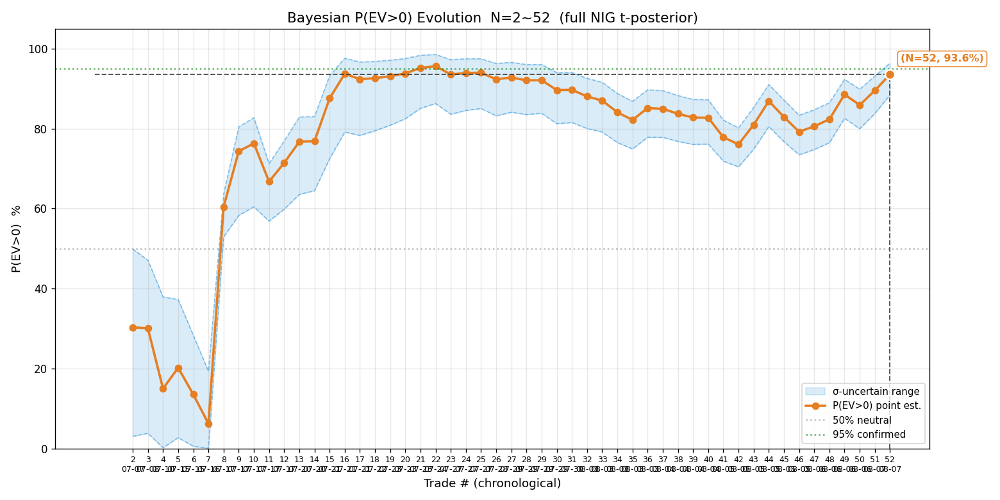

📊 **解读**：
- **指标定义**：完整贝叶斯 NIG 共轭（μ 与 σ² 联合估计），每加一笔用净 R 更新后验，P(EV>0) = μ 边缘后验 t 分布取 μ>0 的概率。橙线 = 点估计；蓝带 = σ 不确定区间（下界/上界）；绿色虚线 = 95% 确认阈值；灰色点线 = 50% 中性。
- **读法**：线越高越支持正期望；蓝带随 N 按 1/√N 收窄（σ 估计更确定）；点估计离 95% 线的距离 ≈ 还需攒多少证据。
- **关键节点（五阶段）**：
  - 探底（N=2~7）：开局 7 笔 2 胜（SOXL 连亏），N=4 时 P=15.0%、累计 −0.455R——负期望摸索期。
  - 转折（N=8）：智谱做空 +4.64R 单笔翻转，P 跳到 60.4%。
  - 攀升峰值（N=16~22）：中芯 +3.38R、07709 +3.85R 连续大胜，点估计触及 95.6%（历史首次破 95%）。
  - 均值回归（N=30~42）：亏损单密集期（中芯、07709 止损），P 从 89.7% 回落到低点 76.1%（08-05 早期）。
  - 二次回升（N=43~52）：01888 +3.08R 起，N=50→85.9%、N=51→89.5%（00100 +1.96R）、**N=52→93.6%（02476 +3.42R）**。
- **终局**：**93.6%（σ 不确定下 88.5%~96.4%）**。区间上界 96.4% 首次突破 95% 确认线、点估计距 95% 仅差 1.4pp；但跨度 8pp（>5pp）按判读纪律仍属「只取方向（略偏正）、不作加仓/改策略决策」。
- **上期对比**：85.9% → 93.6%（+7.7pp），下界 80% → 88.5%（+8.5pp）。本期 2 笔全胜且为正常仓位单（max_loss 1,440/4,160，非大胜主导），信念增强质量高于 08-06 的 01888 单笔拉动。

### ② 累计 EV 演化

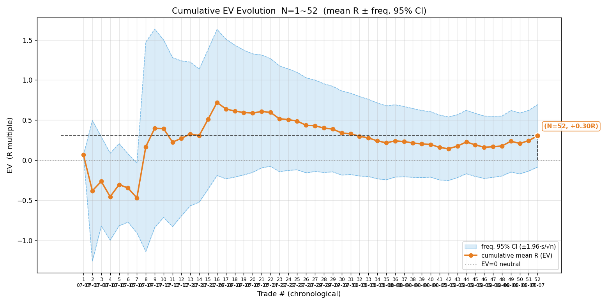

📊 **解读**：
- **指标定义**：累计平均 R（序贯 EV 点估计，橙）+ 频率派 95% CI ±1.96·s/√n（蓝带）+ EV=0 中性线。回答「每笔平均赚多少 R」。
- **读法**：主线 >0 = 正期望（平均口径）；CI 是否跨 0 = 频率派是否定论；主线明显高于多数单笔时 = 均值被大胜主导（分布右偏，好看的平均 R 不代表一致性）。
- **关键节点**：−0.455R（N=4）→ +0.167R（N=8 智谱翻转）→ +0.720R 峰值（N=16~22）→ +0.339R（N=30）→ +0.143R 低点（N=42）→ +0.209R（N=50）→ **+0.305R（N=52）**。
- **终局**：**+0.305R，95% CI [−0.086, +0.695]**。下界三期连续收窄（−0.24 → −0.171 → −0.086）、上界 +0.695——区间整体右移、仍跨 0。
- **解读**：本期回升与历史不同——过往峰值都由大胜单（智谱 +4.64R、01888 +3.08R）拉高均值；本期新增 2 笔是正常仓位单，回升结构性更强。但 CI 半宽 ±0.39R 仍大（s=1.435、N=52），点估计 +0.305R 的精确位置未定——要 EV 确认 >0 且 CI 全正，按样本量规划 ±0.2R 精度还需约 198 笔。

### ③ 贝叶斯胜率演化

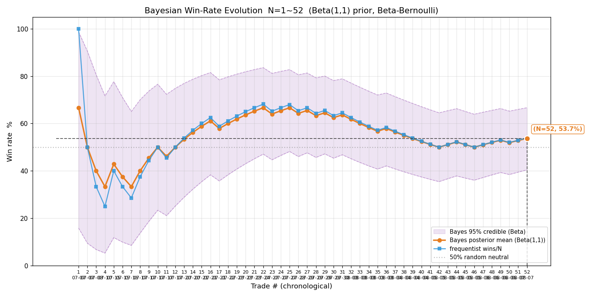

📊 **解读**：
- **指标定义**：Beta(1,1) 弱信息先验 + 伯努利逐笔更新（R>0 记胜）。橙 = 贝叶斯后验均值；蓝 = 频率法 wins/N；紫带 = 后验 95% 可信区间；灰点线 = 50% 随机中性。
- **读法**：早期贝叶斯向先验收缩、频率法剧烈跳动（3 赢 0 输：频率 100% vs 贝叶斯 80%）——小样本防过度自信；后期两线趋同 = 样本足够、胜率估计可信；紫带收窄 = 剩余不确定性。
- **终局**：贝叶斯 **53.7%**、频率 **53.8%**、CI **[40%, 67%]**。上期（N=50）51.9% / 52.0% / [38, 65]。**胜率首次微弱脱离 50% 中枢**（+1.8pp）。
- **解读**：胜率是仓位核心输入（凯利 f*=p−q/b 中 p 线性出现），p 估计不稳 = 仓位不稳。当前 53.7% 的 CI 下界仍 40%（远低于 50%），**胜率优势证据不足**——支撑正 EV 的结构是「胜赔率 R_W=1.218 > 败赔率 |R_L|=0.761」（赢单平均赚 1.22R、输单平均亏 0.76R），而非胜率本身。需胜率 CI 下界脱离 50% 才有胜率确认价值（±5% 精度需 384 笔）。

### ④ P(g>0) 演化（多 f）

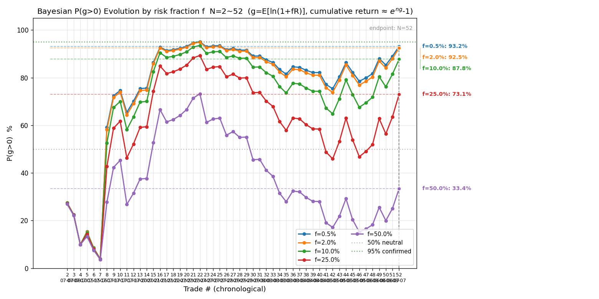

📊 **解读**：
- **指标定义**：g = E[ln(1+fR)]（固定比例 f 下注的长期复利每笔对数增长率），累计收益率 ≈ e^{n·g}−1；P(g>0) =「长期有 edge」的概率（n→∞）。五色线 = f=0.5% / 2% / 10% / 25% / 50%。
- **读法**：小 f 区（ln(1+fR)≈fR 线性、信噪比与 f 无关）各线几乎重合；大 f 区方差惩罚项 f²/2·E[R²] 显现、P 随 f 下降。
- **终局（N=52）**：

| f | ĝ（每笔） | P(g>0) | σ 不确定 |
|---|---|---|---|
| 0.5% | +0.150% | 93.2% | 89~96% |
| **2%（当前）** | **+0.568%** | **92.5%** | **88~96%** |
| 10% | +2.129% | 87.8% | 83~92% |
| 25% | +2.595% | 73.1% | 69~77% |
| 50% | −3.643% | 33.4% | 30~36% |

- **解读**：f=2% 的 P(g>0)=92.5%（上期 84.0%，+8.5pp）——本期 2 笔全胜推高长期增长率后验。f=50% 的 ĝ 转负（−3.64%/笔）= 重仓的方差惩罚吞掉 edge，证明「重仓是长期亏损路径」。五线整体偏高（87~93%）但均未达 95% 确认线——「长期有正 edge」证据较强、尚未定论。

### ⑤ P(∑₄₀Y≥0) 演化（多 f）

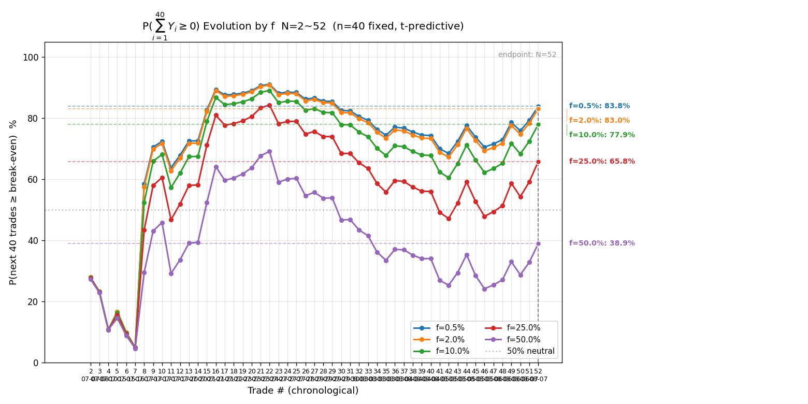

📊 **解读**：
- **指标定义**：未来 40 笔（n=40 固定）对数收益和 ≥0 的预测概率（t 预测近似、含路径方差），回答「接下来 40 笔不亏」。
- **与④对照**：P(g>0) ≥ P(∑₄₀Y≥0)（长期概率 ≥ 有限笔概率，因 t 系数 √N > √(nN/(N+n))）；两者差距 = 即便 edge 确认、40 笔内仍可能因波动短期亏。
- **终局**：0.5%→**83.8%**、2%→**83.0%**、10%→77.9%、25%→65.8%、50%→38.9%。上期 f=2% 74.7% → 83.0%（+8.3pp）。
- **解读**：**所有 f 的「40 笔不亏」概率均 <95%**——「接下来 40 笔不亏 ≥95%」的硬约束当前样本无法满足，这是不放大仓位（维持 f=2%）的最硬理由。f=2% 的 83.0% 意味着：即便策略真有正期望，40 笔窗口内仍有约 17% 概率累计亏损——日内交易的短期方差现实，也是「P(∑₄₀Y≥0) 回到 90%+ 才考虑加仓」的依据。

### ⑥ P(g≥ln1.2/40) 演化（多 f）

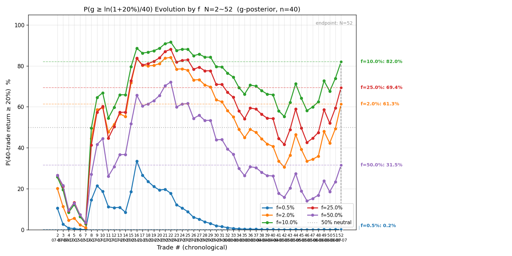

📊 **解读**：
- **指标定义**：P(长期 g ≥ ln(1.2)/40 ≈ 0.456%/笔)。ln(1.2)/40 是「40 笔累计 ≥20%」按确定性折算成每笔增长率的门槛（e^{40g}−1 ≥ 1.2 ⟺ g ≥ ln1.2/40）。**期望口径**：把 40 笔随机路径压成均值 g 判断（丢路径方差、系统性偏高），回答「长期每笔增长率是否足以支撑 40 笔窗口摊到 20%」。
- **与⑦分工（读图关键）**：真正回答「40 笔实际达 20% 的概率」的是 ⑦ P(∑₄₀Y≥ln1.2)（含波动）；⑥ 只是参数门限的辅助判断——**达 20% 概率以⑦为准，⑥ 用来判断长期 g 够不够**。
- **终局**：0.5%→0.2%、2%→61.3%、10%→82.0%、25%→69.4%、50%→31.5%。
- **解读**：f=0.5% 的 ĝ=+0.150%/笔 远低于门槛 0.456%（40 笔期望累计仅约 6%）→ P≈0.2%——**过度保守保不亏（⑤ 的 83.8% 最高）但几乎不可能达收益目标**。f=10% 的 82.0% 为峰值（ĝ=+2.13%/笔 远超门槛）。f=2% 的 61.3%（ĝ=+0.568%/笔 仅比门槛高 0.11pp）——当前比例刚好能支撑「40 笔期望达 20%」的假设、余地不大。这把「保守保不亏 vs 进取达目标」的权衡量化：达目标需要 g 显著高于保不亏所需，而 g 随 f 先升后降（10% 最优）。

### ⑦ P(∑₄₀Y≥ln1.2) 演化（多 f）

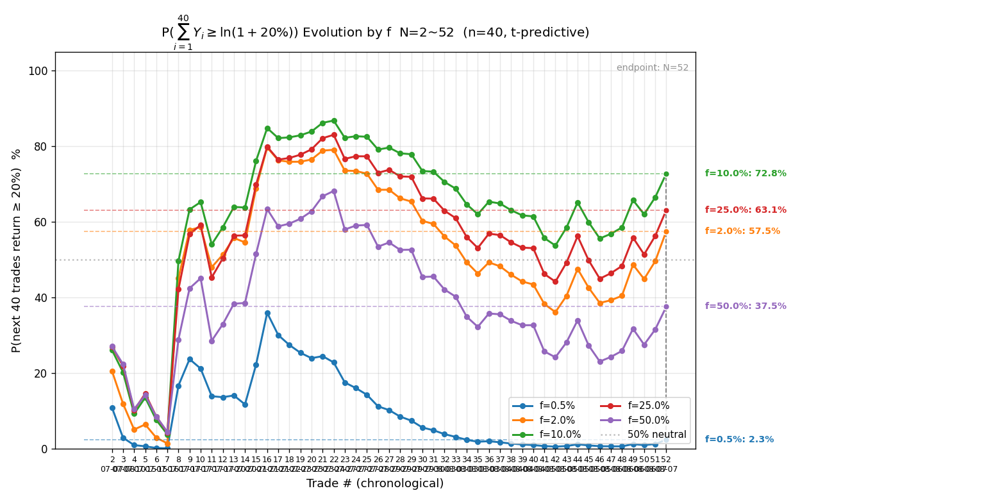

📊 **解读**：
- **指标定义**：未来 40 笔累计收益率 ≥20% 的预测概率（t 预测分布：均 n·ȳ、标准差 s_Y·√(n(1+n/N))，含路径方差），是「40 笔达 20% 目标」的**严格口径**。
- **终局**：0.5%→2.3%、2%→57.5%、10%→72.8%、25%→63.1%、50%→37.5%。上期 f=2% 44.8% → 57.5%（+12.7pp，首度过半）。
- **解读**：f=0.5% 的 40 笔达 20% 概率仅 2.3%——用 0.5% 下注几乎不可能在 40 笔（约两个月）内赚到 20%，这是过度保守的隐性成本。f=10% 的 72.8% 为峰值（与⑥一致：10% 是目标口径最优）。f=2% 的 57.5% 首度过半。**与⑥对照量化路径方差代价**：2% 的⑥ 61.3% > ⑦ 57.5%（差 3.8pp）、10% 的⑥ 82.0% > ⑦ 72.8%（差 9.2pp）——比例越高、路径方差越拖累实际达标率，⑥ 的系统性高估在 10% 档更明显。

**多 f 终局总表（六项指标并览，N=52）**：

| f | ĝ（每笔） | P(g>0) | P(∑₄₀Y≥0) | P(g≥ln1.2/40) | P(∑₄₀Y≥ln1.2) |
|---|---|---|---|---|---|
| 0.5% | +0.150% | 93.2% | 83.8% | 0.2% | 2.3% |
| **2%（当前）** | **+0.568%** | **92.5%** | **83.0%** | **61.3%** | **57.5%** |
| 10% | +2.129% | 87.8% | 77.9% | 82.0% | 72.8% |
| 25% | +2.595% | 73.1% | 65.8% | 69.4% | 63.1% |
| 50% | −3.643% | 33.4% | 38.9% | 31.5% | 37.5% |

与上期（N=50）对比：f=2% 的 P(g>0) 84.0%→**92.5%**、P(∑₄₀Y≥0) 74.7%→**83.0%**、P(≥20%) 44.8%→**57.5%**——**全面大幅回升**（本期 2 笔 +5.38R 全胜 + 胜率赔率双升的贡献），但「不亏 ≥95%」约束依然所有 f 都不满足（f=0.5% 最高 83.8%）。

## 七、科学选 f（四步框架，基于 N=52 样本）

**① 约束优化**：硬约束 P(∑₄₀Y≥0)≥95%——**所有 f 均不满足**（f=0.5% 最高 83.8%）。「接下来 40 笔不亏 ≥95%」的约束当前样本下仍无法达到，任何 f 都给不出「不亏」的高置信保证。

**② 凯利交叉验证**：f* ≈ p/|R_L| − q/R_W = 0.538/0.761 − 0.462/1.218 ≈ 0.707 − 0.379 ≈ 0.33（⚠️ 小样本 + 移损锁利致 |R_L|<1，f* 系统性高估，仅参考）。f=2% ≈ 1/16 f*，保守分数区 ✓。

**③ 稳健性收缩（按 edge 状态）**：edge 未确认（P(g>0) 下界 88% < 95%、胜率 CI 下界 40% 仍远离 50%、样本仅 52）→ **维持 f=2% 上限**，不释放。

**④ 尾部红线**：f≥25% 时 P(g>0) 骤降至 73.1%、ĝ 缩到 +2.60%/笔，f=50% 转负（−3.64%/笔）——f 硬上限 ≤10% 附近（f=10% 时 P(g>0) 87.8%，尾部风险已显现）。

**决策表**：

| 档位 | f |
|---|---|
| 当前阶段（edge 未确认） | **2%**（维持） |
| edge 确认后（N≥50、P(g>0) 下界 >95%、胜率 CI 下界脱离 50%） | 10%（约束优化近似最优，P(≥20%)=72.8% 最高） |
| 尾部硬上限 | ≤10% |

⚠️ 核心认知：**f=2% 保不亏的能力 83.0%（<95%）**，较上期 74.7% 回升 8.3pp，但距「不亏 ≥95%」的确认线仍有距离；P(≥20%) 57.5% 首次过半。在 P(∑₄₀Y≥0) 回到 90%+ 之前，任何加仓决策都不成立。

## 八、过程指标

⚠️ trades.csv 未提供 raw_high / raw_low（历史样本无持仓期间极值记录），本次仍跳过 MAE/MFE/回吐/锁利效率统计。今日两笔 signal 交易无原生 mfe_R / mae_R 记录（auto 平仓脚本才有），维持「待平仓原生过程数据积累到可统计量级再启用」的既有结论。

## 九、多层评估

### 一、即时层

- **决策合规率**：新增 2 笔中 1 笔执行质量高、1 笔有可归因瑕疵：
  - **02476（signal）+3.42R**：本期最佳执行——回踩企稳形态成立（245.2/245.6/246.0 三次企稳逐步抬高）+ VWAP 站上 + 位置下沿反弹中段顺势 + 冲 250/252 前高破 255 目标、浮盈 5.9R 达目标主动平。**三阶段 3.27→3.3→3.42 全程兑现、几乎零打折**，是「回踩企稳 + 达目标主动平」的标准正样本。
  - **00100（signal）+1.96R**：开仓合规（突破回踩 + 全貌偏多 + VWAP 上方 +9.2 + 量比 9-10 巨量 + 独立逆势），但移损用了**「用法 A」**（浮盈 4.65R ≥ 2R 紧锁利到 330）：从峰值 4.65R 回吐至锁 2.25R、实际落地 1.96R，**平仓后行情继续上冲（SKILL 记放跑 13.35R）**。这正是当日用户立规「用法 A 已作废」的直接案例——止损应放趋势结构位（回踩低点 320.8/319.4 一线）、随结构上移，而非机械 2R 紧锁；若止损放结构位，这笔能吃到更完整的趋势段。
- **置信度校准**：🟢 高置信开仓胜率 53.8%（28/52）——高置信胜率随样本微升但 CI 仍宽，校准警示延续。
- **两会话并行**：今日仅 signal 会话有交易（auto 会话无交易记录），无并行冲突。

### 二、累积层

- P(EV>0)=93.6%（下界 88.5%），**区间上界 96.4% 首破 95% 确认线**；edge 仍按纪律判「未确认、略偏正」，但证据强度明显增强（上期下界 80% → 本期 88.5%）。
- 胜率后验 53.7%（CI [40%, 67%]），首次脱离 50% 中枢（微弱）。
- 频率派 CI [−0.086, +0.695] 跨 0、下界三期连续收窄。三层证据一致：**偏正方向更清晰，仍未到确认**。

### 三、对照层

未做反事实基准（随机开仓 / 买持 / 反向对照）——待样本更足或用户指示时补。

### 四、覆盖层

样本覆盖：港股 + 美股、多标的（中芯/美团/小米/智谱/07709/建滔/长飞/阿里/药明/MU/SOXL/SOXS/NVDA/00100/02476）、多方向（多/空）、多环境。本期新增 02476 胜宏科技（PCB 低位反弹标的）。覆盖良好。

## 十、账户状态

| 项 | 值 |
|---|---|
| signal equity-log | 08-07 早 00100 平仓后 102,160 → **注资 ×4（等效权益放大）408,640** → 02476 +14,238 → **422,878 HKD**（equity-log 末行）；单笔预算 B 同步 ×4 = 8,172.8 |
| auto 老虎模拟账户 | 08-07 无 auto 交易动作，账户状态未变 |

> 📌 注资 ×4 是 08-07 用户立（等效权益放大 4 倍、B 同步放大）——后续复盘样本的 max_loss / R 口径不受影响（R 是归一化比率），但 P̄ 金额口径会随仓位放大变化，看 EV 而非 P̄。

## 十一、港美股分开复盘

> 2026-08-07 用户立：复盘报告除全量统计外，必须按市场（港股 / 美股）分开统计。费率各按市场（港股 18bps/边、美股 3bps/边，review.py 按 symbol 前缀自动判定）；数据源拆分见附件 `reviews/2026-08-07-trades-hk.csv`（37 笔）/ `reviews/2026-08-07-trades-us.csv`（15 笔）。

### 港股（N=37）

| 指标 | 值 |
|---|---|
| 样本量 N | 37 |
| 胜率 p | 62.2%（23 胜 14 败） |
| 胜赔率 R_W | +1.335 |
| 败赔率 R_L | −0.756 |
| **EV** | **+0.5442R（+54.42%）** |
| 平均每单 P̄ | +12,147.1 HKD |
| R 标准差 s | 1.566 |
| **贝叶斯 P(EV>0)** | **98.1%（σ 不确定 93.9%~99.5%）** |
| **频率派 EV 95% CI** | **[+0.040, +1.049] 全正** |

**解读**：港股是项目核心盈利来源——胜率 62.2%、R_W 1.335 > |R_L| 0.756（「赢大亏小 + 胜率过半」双优）。主盈利来自智谱 02513（+4.64R 等）、中芯 00981、07709、01888、01810、02476 等。**频率派 CI 首次分市场全正**（下界 +0.040），P(EV>0) 98.1%——港股方向性证据强。跨度 6pp（>5pp）按判读纪律仍属「只取方向（偏正）」，但已是当前样本里最接近确认的子集。

**港股 7 张序贯演化图**（数据源 `reviews/2026-08-07-trades-hk.csv`，N=37）：

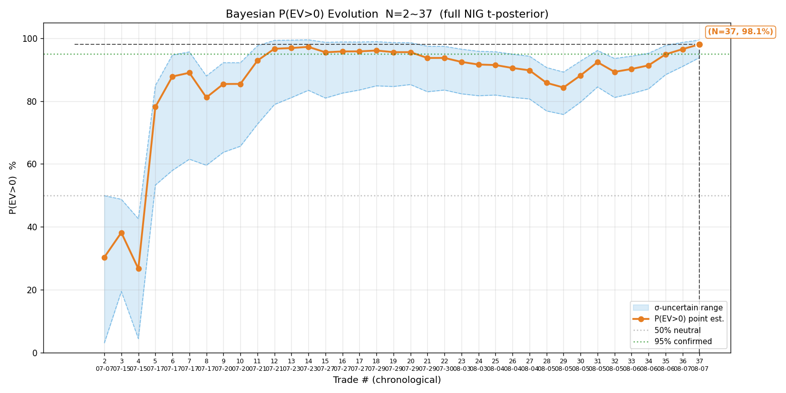

📊 **① P(EV>0)**：终局 **98.1%**（σ 不确定 94~99%）。节点：开局 03690 两笔小亏（N=2 P 30%）→ **N=5 智谱 +4.64R 翻转**（P 78%）→ N=12 07709 +3.85R 峰值（累计 +1.08R / 96.7%）→ N=14 EV CI 首次全正 → N=21~29 均值回归（低点 N=29 84.3%）→ N=30~37 01888/00100/02476 二次冲高至 98.1%。**港股 P 自 N=11 起基本持续 >90%**、蓝带 [94, 99] 上界顶到 99%——港股子集的正期望证据接近确认（全量 P 的高点主要就是港股贡献的）。

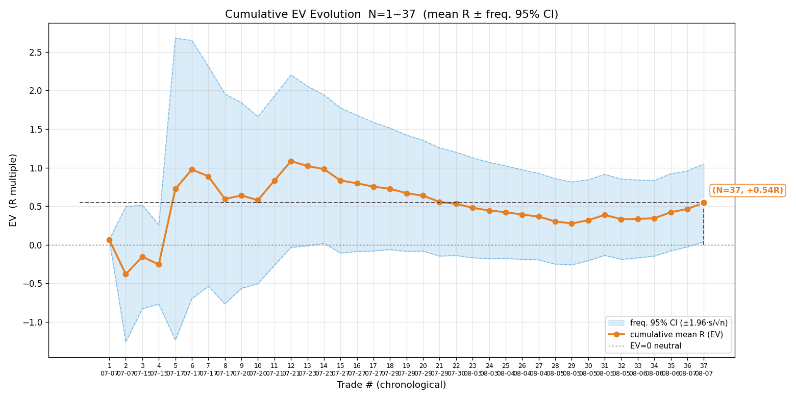

📊 **② 累计 EV**：终局 **+0.544R**、CI **[+0.04, +1.05] 全正**（N=14 时下界首破 0）。累计均值全程为正（+0.27 ~ +1.08R 区间），智谱/中芯连胜期冲高、中芯/07709 止损期回落、01888 大胜后再度抬升。

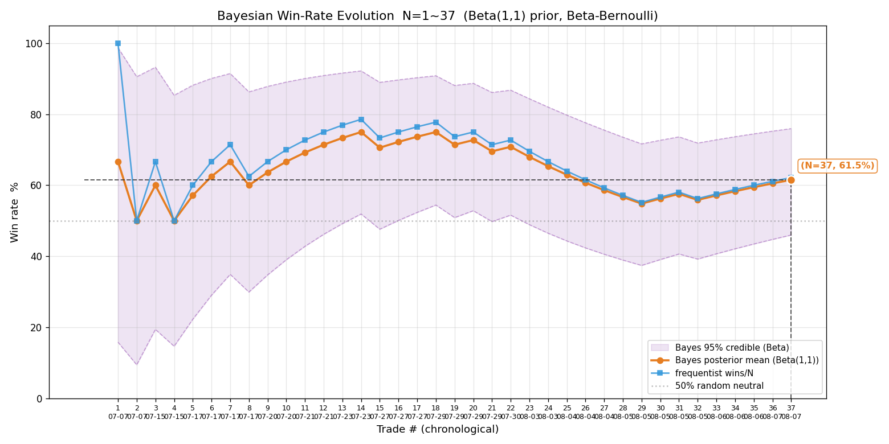

📊 **③ 胜率**：贝叶斯 **61.5%**、频率 **62.2%**、CI **[46%, 76%]**。早期（N=1~14）两线在高位 60~78%（智谱/中芯连胜期）、N=24~30 回落到 56~65%（中芯/07709 止损期）、终局 62%。CI 下界 46% 仍贴 50%——胜率优势方向明确但未确认，显著高于美股（33%）。

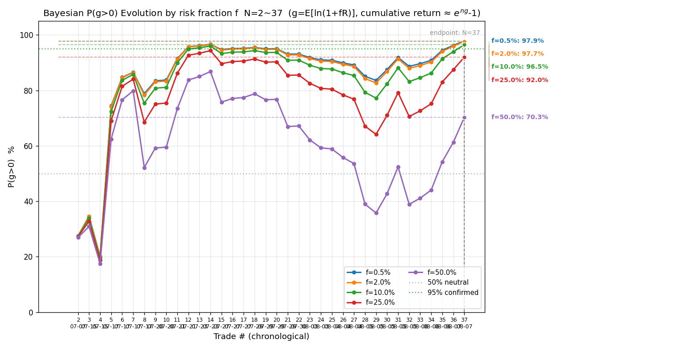

📊 **④ P(g>0)**：港股全 f 高——f=0.5% **97.9%**、f=2% **97.7%**（94~99%）、f=10% 96.5%、f=50% 才降到 70.3%；ĝ 全 f 为正（2% 档 +1.037%/笔）。港股长期复利 edge 强，任何合理 f 下 P(g>0) 都接近确认线。

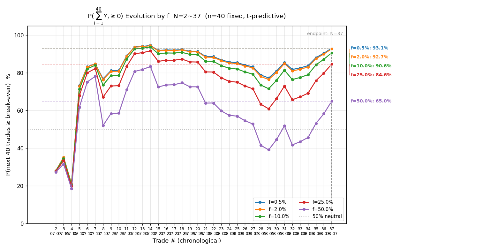

📊 **⑤ P(∑₄₀Y≥0)**：f=0.5% **93.1%**、f=2% **92.7%**、f=10% 90.6%、f=25% 84.6%。**港股 f≤10% 的「40 笔不亏」概率都在 90%+**（全量仅 83%）——虽仍 <95% 确认线，但已接近硬约束水平。

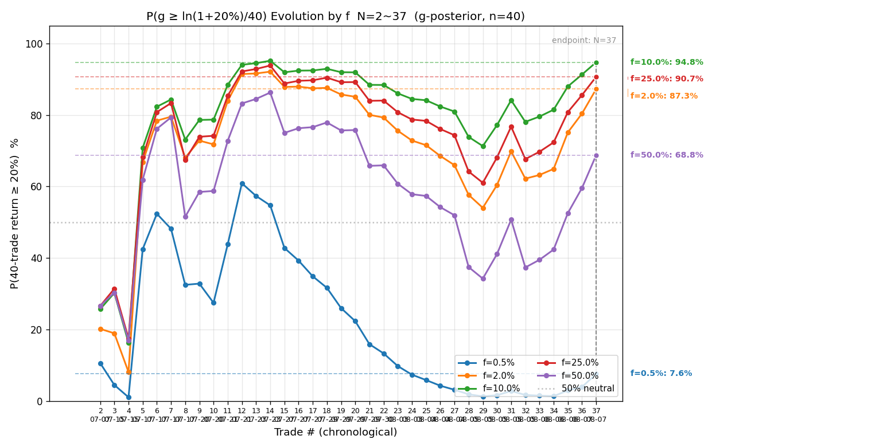

📊 **⑥ P(g≥ln1.2/40)**（期望口径、丢路径方差、偏高，达 20% 概率以⑦为准）：f=2% **87.3%**、f=10% **94.8%** 峰值、f=25% 90.7%。港股 2% 下「40 笔期望达 20%」概率已很高（全量仅 61.3%）。

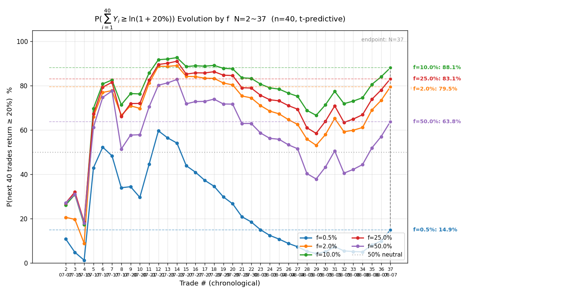

📊 **⑦ P(∑₄₀Y≥ln1.2)**（40 笔达 20% 的严格口径）：f=10% **88.1%** 峰值、f=2% **79.5%**、f=25% 83.1%。港股 f=2% 下 40 笔达 20% 概率近 8 成、f=10% 近 9 成——与美股（全 f <10%）形成鲜明对照。

### 美股（N=15）

| 指标 | 值 |
|---|---|
| 样本量 N | 15 |
| 胜率 p | 33.3%（5 胜 10 败） |
| 胜赔率 R_W | +0.677 |
| 败赔率 R_L | −0.768 |
| **EV** | **−0.2866R（−28.66%）** |
| 平均每单 P̄ | +35.4 USD（金额口径几乎打平） |
| R 标准差 s | 0.819 |
| **贝叶斯 P(EV>0)** | **10.4%（σ 不确定 3.4%~20.7%）** |
| **频率派 EV 95% CI** | **[−0.701, +0.128] 跨 0** |

**解读**：美股是全量样本的最大拖累——15 笔 5 胜 10 败、R_W 仅 0.677（赢单平均赚不到 1R）且败率 2/3。主要失分模式：① **SOXL 三倍做空 3 连亏**（07-08 −0.03R / 07-10 −1.03R / 07-16 −1.22R，超跌反弹日逆势空被扫）；② **无量突破失败**（08-05 NVDA −1.17R、08-06 MU −1.14R，量比不足仍开突破单）。N=15 样本太小（贝叶斯跨度 17pp）只取方向（偏负）、不作「美股不可做」的定论；P̄ 金额 +35.4 说明美股金额几乎打平，问题主要在 R 口径（亏损单 max_loss 相对大）。

**美股 7 张序贯演化图**（数据源 `reviews/2026-08-07-trades-us.csv`，N=15）：

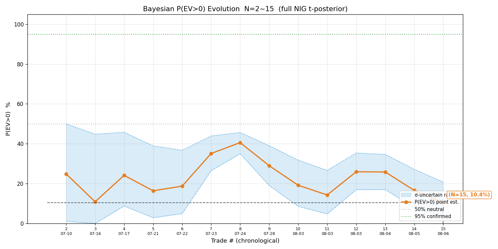

📊 **① P(EV>0)**：终局 **10.4%**（σ 不确定 3~21%）。节点：开局 SOXL 三倍做空 3 连亏（N=3 P 10.9% 低点）→ N=7~8 MU/SOXS 两胜短暂回升（P 40.6%，接近但未过 50% 中性线）→ N=9 起再度下探（SOXS 07-28 止损 + MU/NVDA 无量突破失败）→ 终局 10.4%。**美股 P 全程 <50%、从未越过中性线**——负方向贯穿全程，不是尾部几笔运气差。

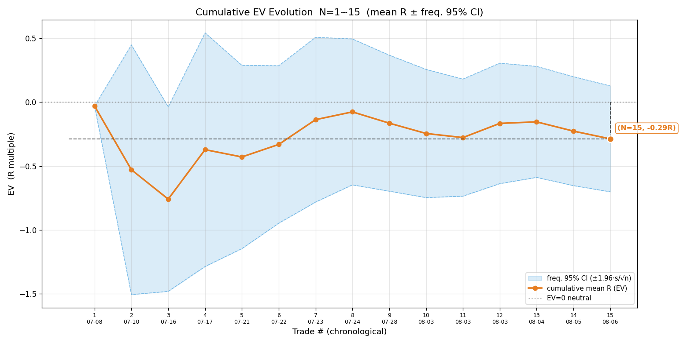

📊 **② 累计 EV**：终局 **−0.287R**、CI **[−0.70, +0.13] 跨 0**。累计均值全程为负（−0.08 ~ −0.76R 区间），**从未转正**。

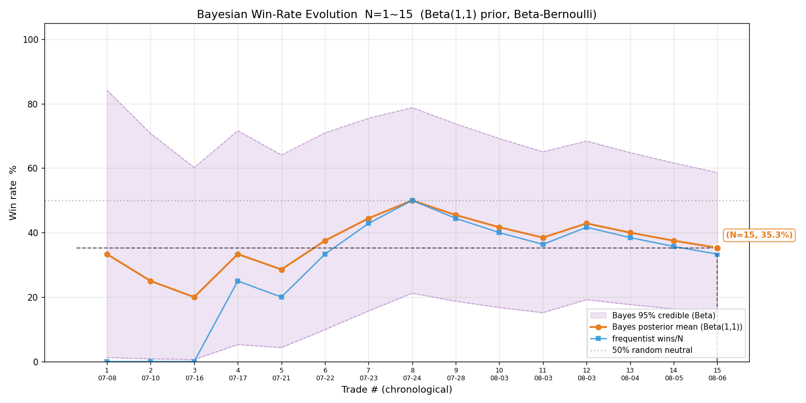

📊 **③ 胜率**：贝叶斯 **35.3%**、频率 **33.3%**、CI **[15%, 59%]**。CI 上界 59% 都摸不到 50% 上方的对称区间——胜率维度结构性不足（5 胜 10 败）。

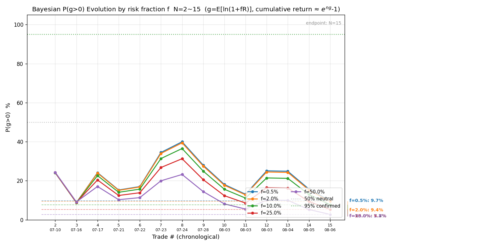

📊 **④ P(g>0)**：美股全 f 极低——f=2% **9.4%**、f=50% 2.8%，ĝ 全 f 为负（2% 档 −0.587%/笔）。**美股在任何 f 下都是长期复利亏损路径**。

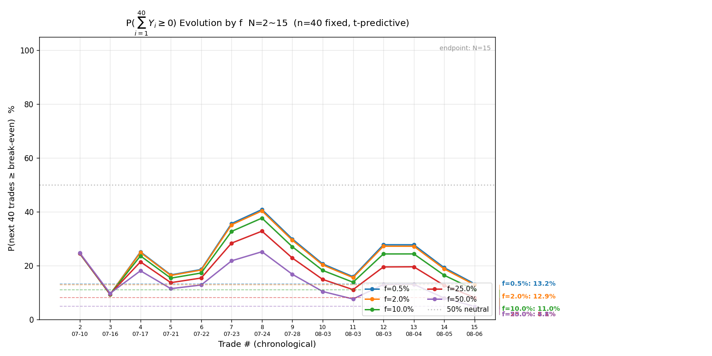

📊 **⑤ P(∑₄₀Y≥0)**：f=2% **12.9%**——美股 40 笔不亏概率仅约 13%（港股 92.7%）。

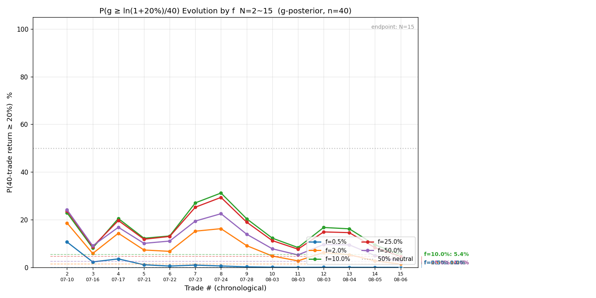

📊 **⑥ P(g≥ln1.2/40)**（期望口径）：全 f 几乎为 0（f=10% 档 5.4%）——长期 g 深度为负、远达不到 40 笔摊薄门槛。

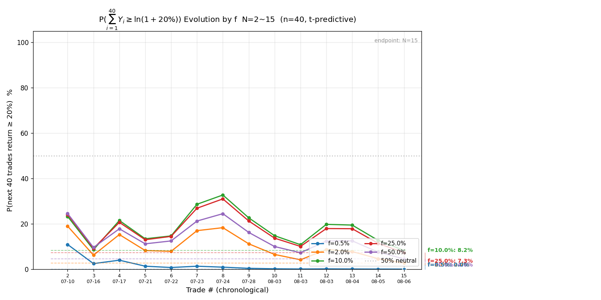

📊 **⑦ P(∑₄₀Y≥ln1.2)**：全 f ≤8.2%——美股 40 笔内达 20% 目标基本无望（港股 f=2% 79.5%）。

> **美股演化图强化了结论**：负 edge 贯穿全程（P 从未过 50%、累计 EV 从未转正、胜率 CI 上界不过 59%、ĝ 全 f 为负）——这不是某几笔的运气波动，而是结构性弱势。

### 港美股对比结论

| 维度 | 港股 | 美股 |
|---|---|---|
| N | 37 | 15 |
| 胜率 | 62.2% | 33.3% |
| R_W / R_L | +1.335 / −0.756 | +0.677 / −0.768 |
| EV | **+0.544R** | **−0.287R** |
| P(EV>0) | 98.1% | 10.4% |
| 频率派 CI | [+0.040, +1.049] 全正 | [−0.701, +0.128] 跨 0 |

1. **全量 EV +0.305R 几乎完全是港股撑起来的**：港股 37 笔 EV +0.54R（胜率 62%、CI 全正），美股 15 笔 EV −0.29R（胜率 33%）——美股把整体 EV 拉低了约 0.24R。
2. **美股两个失分模式与既有教训同型**：3x ETF 逆势做空（SOXL 超跌反弹日空被扫）+ 无量突破（NVDA / MU 量比不足仍开突破单）——美股 signal 突破类应加「量比达标」硬闸（08-06 复盘已建议）、3x ETF 避免超跌反弹日逆势空。
3. **caveat**：美股 N=15 太小、只取方向；港股 N=37 证据较强但跨度仍 >5pp——都不是「确认」级结论。但**分市场方向分化（港正 / 美负）已超出噪音范畴**（同源样本、同一执行规范、仅市场不同），值得在策略层面对美股入场质量专项改进。

## 十二、总结

**N=52，EV +0.3045R（+30.45%），P(EV>0)=93.6%（88.5~96.4%），频率派 CI [−0.086, +0.695] 跨 0。**

本期核心变化：

1. **EV 连续二期回升且转健康**（+0.209 → +0.305R）：本期新增 2 笔 +5.38R 全胜，且是「胜率 +1.8pp、胜赔率 +0.114 双升」的结构性改善——与上期「01888 单笔大胜拉高」不同，本期没有大仓位单主导，**回升可信度更高**。
2. **P(EV>0) 区间上界 96.4% 首破 95% 确认线**（下界 88.5% 仍差 6.5pp）；频率派 CI 下界三期连续收窄（−0.24 → −0.17 → −0.086）。证据偏正方向更清晰，但按判读纪律仍属「未确认、只取方向」，不作加仓/改策略决策。
3. **00100 用法 A 教训当日立规**：浮盈 4.65R 时用法 A 紧锁 2.25R、落地 1.96R，放跑后续 13.35R 行情——用户当日立「止损永远放趋势结构位、随结构上移，用法 A 已作废」。这是规则升级的活案例：**移损锁利要基于结构位距离（现价到最新结构位），不是机械 2R 阈值**。
4. **02476 标准正样本**：三阶段 3.27→3.3→3.42 全程兑现，回踩企稳 + 达目标主动平，是「让利润奔跑 + 目标位了结」的正反馈。
5. **科学选 f 结论不变**：维持 f=2%，不释放——P(∑₄₀Y≥0) 最高 83.8%（上期 75.9%）、所有 f 均 <95%，edge 未确认前不加仓；f 硬上限 10%。
6. **胜率首次微弱脱离 50%**（53.8%），但 CI=[40%, 67%] 太宽，不构成胜率优势证据——继续攒样本。

## 十三、港美股表现差异分析（2026-08-07 用户立）

> 本节与「十一、港美股分开复盘」配套：分开统计回答「差异是什么」，本节回答「差异为什么」。所有数值用 `tmp/hk_us_breakdown.py` 按报告统一口径实算（港股 18bps/边、美股 3bps/边、净 R、分母毛 max_loss），与第十一节数字逐项核对一致。**以后每次复盘都必须做这一步差异分析**（步骤已写入复盘规范）。

**结论先行**：差距不在「亏多少」（两边败赔率几乎相同：港股 −0.756 vs 美股 −0.768，止损执行不分市场），而在「能不能赢大的 + 赢得够勤」——港股靠多头趋势跑出 6 笔 ≥1R 大胜、胜率 62%；美股没有一笔 >1.06R 的赢单，且 65% 的亏损集中在「押注半导体下跌」的 5 笔逆势敞口。

**① EV 差距反事实分解**（总差距 0.831R = +0.544 − (−0.287)；把美股 p / R_W / R_L 逐个替换为港股值、其余保持美股原值重算 EV）：

| 单独替换 | 美股 EV 变为 | 补回 | 占总差距 |
|---|---|---|---|
| 换成港股胜率（33%→62%） | +0.131R | +0.418R | **50%** |
| 换成港股胜赔率（0.68→1.34） | −0.060R | +0.227R | **27%** |
| 换成港股败赔率（−0.77→−0.76） | −0.282R | +0.001R | **0%** |
| 交互项 | — | +0.185R | 23% |

胜率差距是头号原因（一半）；胜赔差距次之（大胜单缺失）；**败赔率几乎零贡献**——港股的 edge 完全来自盈利端（赢得多 + 赢得勤），不靠亏得少，美股要翻身光优化止损没用。

**② 多空方向拆解**：

| 市场 / 方向 | N | 胜率 | EV | R 合计 |
|---|---|---|---|---|
| 港股多头 | 23 | **70%** | +0.714R | +16.42 |
| 港股空头 | 14 | 50% | +0.265R | +3.71 |
| 美股多头 | 10 | 50% | −0.039R | −0.39 |
| 美股空头 | 5 | **0%（全败）** | −0.781R | −3.90 |

港股盈利由多头驱动（+16.42R），空头只是微正；美股空头 5 笔全败（SOXL 做空 3 + MU 做空 2）是胜率差距的直接来源。

**③ 美股剔除 3x 杠杆 ETF（SOXL / SOXS）稳健性检验**：

| 美股子集 | N | 胜率 | EV | R_W |
|---|---|---|---|---|
| 全量 | 15 | 33.3% | −0.287R | +0.677 |
| 剔除 3x ETF | 10 | 40.0% | **−0.150R** | +0.759 |
| 仅 3x ETF | 5 | 20.0% | −0.559R | +0.350 |

「押注半导体下跌」的全部 5 笔敞口（SOXL 做空 + SOXS 做多，同为 3x 半导体 ETF）合计 **−2.79R，占美股总亏损 65%**——7-8 月半导体反弹期逆势做空被反复扫（报告「十一」归因的 SOXL 三连亏只是其中一半，SOXS 做多那条看空路径同样亏）。剔除后美股仍 −0.15R（单股做多 MU+NVDA 8 笔微正 +0.12R，N 太小不作数）——**3x ETF 是主要拖累但非全部原因**，美股整体也没有出现港股那样的大行情标的。

**④ 港股剔除 Top3 大胜单稳健性检验**（剔除智谱 +4.64 / 07709 +3.85 / 02476 +3.42）：

| 港股子集 | N | 胜率 | EV | R_W |
|---|---|---|---|---|
| 全量 | 37 | 62.2% | +0.544R | +1.335 |
| 剔除 Top3 大胜 | 34 | 58.8% | **+0.242R** | +0.940 |

港股 edge = 基础胜率（结构性）+ 大胜单（行情驱动）各约一半：剔除后 EV 仍正、胜率仍 59%，底子还在；但 R_W 从 1.335 腰斩到 0.940，大胜单对赔率的贡献很大——**「让利润奔跑」是港股 EV 的支柱，与当日 00100 用法 A 教训（紧锁放跑 13.35R）互为印证**。

**⑤ 赢单结构对比**：

| 赢单 | 均值 | 中位 | 最大 |
|---|---|---|---|
| 港股（23 笔） | +1.335R | +0.453R | **+4.635R** |
| 美股（5 笔） | +0.677R | +0.790R | **+1.056R** |

美股最大赢单仅 +1.056R、全程 15 笔无任何一笔 ≥1.1R；赢单中位 0.790 反而高于港股 0.453——**美股不缺常态利润，缺的是跑出大胜单的能力**（与用法 A 教训同构：过早了结 / 紧锁截断尾部利润；该假设缺 mfe/mae 原生记录、无法直接证实，待平仓过程指标积累后核实）。

**⑥ caveat 与边界**：美股 N=15、剔除后子集 N=8~10，远低于确认门槛（胜率 ±5% 需 384 笔、EV ±0.2R 需 198 笔），只取方向、不定论「美股不可做」；单股做多 +0.12R 是 8 笔的结果，不构成「美股单股做多可行」的证据；港股 N=37 略好（P(EV>0)=98.1%），但跨度 >5pp 按判读纪律仍属「只取方向」。分市场方向分化（港正 / 美负）已超出纯噪音范畴（同源样本、同一执行规范、仅市场不同），值得策略层面改进，但改进效果需后续样本验证。

**⑦ 可执行改进方向**（按贡献度 × 可控性排序）：

1. **美股暂停「押注半导体下跌」敞口**（SOXL 做空 / SOXS 做多），至少不在超跌反弹日逆势空 3x ETF——占美股亏损 65%，是最高杠杆的改进点。
2. **美股突破单加「量比达标」硬闸**（08-06 复盘已建议；08-05 NVDA −1.17R / 08-06 MU −1.14R 同类失分共 −2.30R，报告归因无量突破、未独立核实 signal 原始量比记录）。
3. **港股保持「让利润奔跑」**——edge 一半来自大胜单，与 00100 用法 A 教训一致：止损放趋势结构位、随结构上移，不机械 2R 紧锁。
4. **优先攒美股样本**——N<20 无法验证任何改进是否有效。
