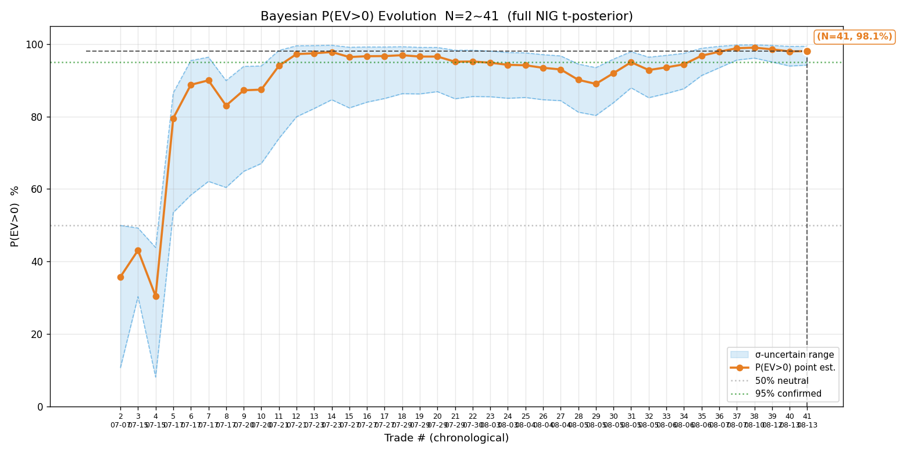
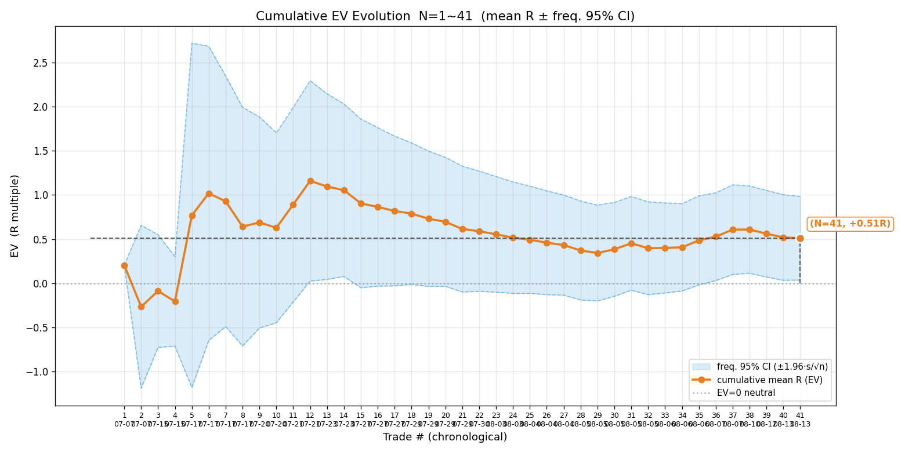
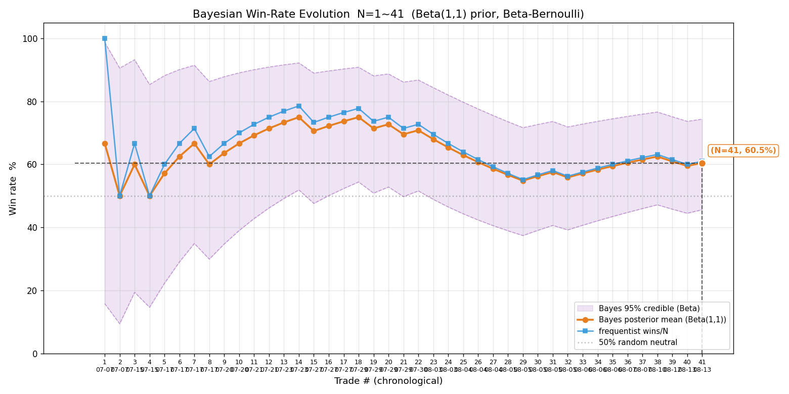
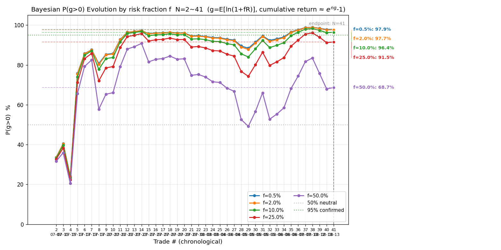
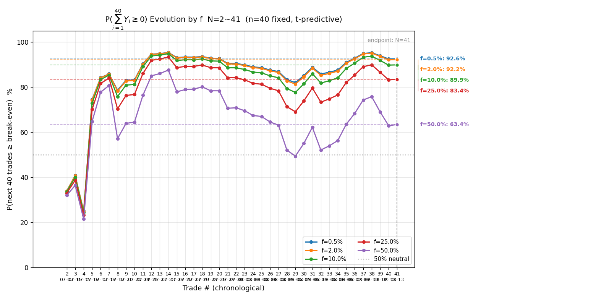
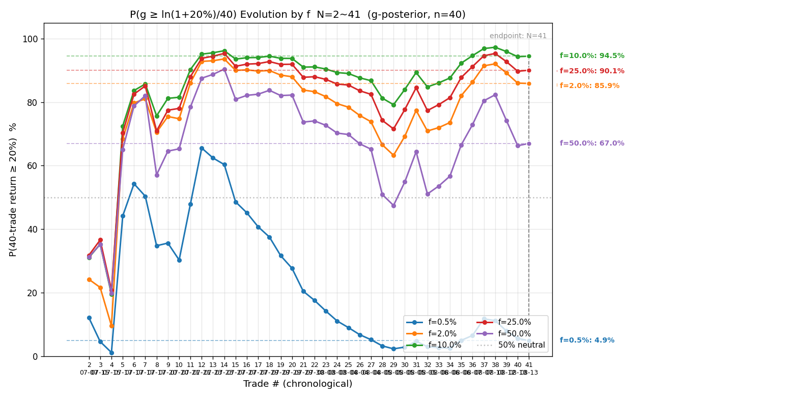
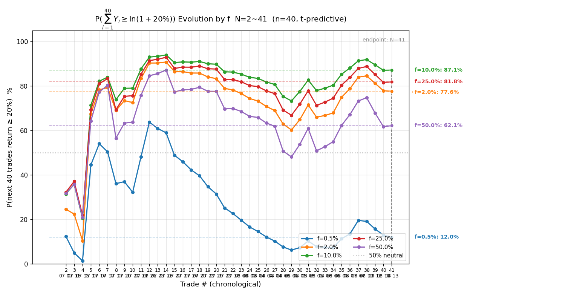

# 港股历史全量复盘 · 2026-08-13

> 触发：用户「复盘一下历史所有港股交易」。本次聚焦港股（用户指令），按复盘必含项规范同时给港美对比（差异分析是必含项）。
> 数据源：遍历 `signals/` + `actions/` 全部 HKT 文件（全量对账，非增量）。所有数值 Python 实算。

---

## 一、对账结论与新增样本

### 1.1 全量对账（2026-08-03 教训：必须遍历两目录全部文件）

逐日核对 `signals/*-HKT-signals.md` + `actions/*-HKT-actions.md` 全部 17 个 HKT 文件，与上一版 CSV（08-07，37 笔）逐日比对。**发现 08-10、08-12、08-13 有 4 笔新交易未入样本**，本次补齐。关键对账结论：

| 疑点 | 处理 | 依据 |
|---|---|---|
| 08-03~08-06 港股 signals 与 actions 同时有 HKT 文件 | **非重复**，两账户独立交易，CSV 各记各笔 ✅ | signals 是 signal 模式、actions 是 auto 模式，两会话并行盯盘、各建各仓 |
| 07-17 智谱 5 次开/加仓 | CSV 4 笔 ✅ | 第一笔 2 手 + 加仓 2 手合并为 1 笔（均价 1331.5→1215，4.67R）、重开 3 手 1 笔、午市 2 笔，加仓与首笔属同一批次合并 |
| 07-21 中芯第二开仓（76.6） | **不计样本** ✅ | 响铃价 = 止损价 76.1，开仓失败（成交价 ≤ 止损价即开仓即止损、无意义） |
| 07-28 中芯做空 | **不计样本** ✅ | 断网断层致参考价过时，已作废、用户未成交 |
| 08-10 MINIMAX 测试单 100 股 | **不计样本** ✅ | 排障误成交的测试单，立即平掉、记录明确标注「作废」 |

### 1.2 本次新增 4 笔港股交易

| 日期 | 标的 | 方向 | 开仓 | 平仓 | 量 | max_loss | 落地 R | 备注 |
|---|---|---|---|---|---|---|---|---|
| 08-10 | HK.02359 药明康德 | 多 | 200.4 | 201.6 | 90,500 | 90,500 | **+0.63R** | 突破前高回踩企稳做多，移损 199.4→201.3 锁利，止损触发被动平仓 |
| 08-12 | HK.03308 中际旭创 | 空 | 1076 | 1090 | 200 | 2,800 | **−1.23R** | 反抽遇阻做空，止损 1090 被放量站上、被动扫损（水平震荡中止损未移到区间上沿外侧） |
| 08-13 | HK.00100 MINIMAX-W | 多 | 379.6 | 375.4 | 16,000 | 73,600 | **−1.15R** | 破前高回踩企稳做多，购买力不足仓位缩水 50%，反弹乏力止损 375 被破 |
| 08-13 | HK.06166 剑桥科技 | 多 | 94.2 | 94.6 | 1,550 | 1,085 | **+0.17R** | 箱体突破回踩企稳做多，移损 93.5→94.6 保本，止损触发小赚离场 |

**港股样本量：37 → 41 笔**（新增 4 笔）。详见 [2026-08-13-trades-hk.csv](2026-08-13-trades-hk.csv)。

---

## 二、港股终局统计量（N=41）

| 指标 | 值 |
|---|---|
| 样本量 N | **41** |
| 胜率 p | **61.0%**（25 胜 / 16 败） |
| 败率 q | 39.0% |
| 胜赔率 R_W | **+1.314R**（平均每笔赢单赚 1.31R） |
| 败赔率 R_L | −0.747R（平均每笔败单亏 0.75R，未亏满） |
| **EV** | **+0.510R**（EV% = +50.98） |
| 平均每单盈亏 P̄ | +10,938 HKD |
| R 样本标准差 s | 1.549 |

**解读**：港股 EV=+0.510R，胜率 61%、胜赔 1.31——胜率与赔率双高，是健康的正期望结构。败赔 |R_L|=0.75 < 1 说明多数败单在亏满前主动止损锁亏，纪律执行到位。

---

## 三、贝叶斯 P(EV>0)（完整 NIG，t 后验）

| 项 | 值 |
|---|---|
| 先验 | NIG(m0=0, k0=1, a0=1, b0=1) 弱信息（不预设 edge） |
| 后验 | μ ~ t₄₃(位置 +0.498, 尺度 0.233) |
| **P(EV>0)** | **98.1%（σ 不确定下 94.2%~99.4%）** |
| σ 的 95% CI | [1.272, 1.982]（跨 1.6 倍） |

**判读**：点值 98.1%、下界 94.2% 已逼近 95% 确认线。但按「小样本判读纪律」，N=41 处于 N=20~30 边界之后的过渡区，σ 跨度 5pp 刚到阈值——**倾向认为港股正期望，但还未到「铁证确认」（下界稳定 >95% + N≥50）**。方向明确偏正，数值供参考。

---

## 四、频率派对照

| 项 | 值 |
|---|---|
| EV 95% CI | **+0.510 ± 0.474 = [+0.036, +0.984]** |
| 区间性质 | **全正**（下界 +0.036 > 0） |

**解读**：频率派 CI 下界 +0.036R 刚好全正，与贝叶斯 P(EV>0)=98.1% 互为印证——两套方法都指向「港股正期望」，但下界都贴着零线，说明样本量仍偏紧、edge 不厚。

---

## 五、样本量规划（代入当前 s=1.549）

| 指标 | 误差 / 假设 | 需要样本 |
|---|---|---:|
| 胜率（p=0.5） | ±5% | 384 笔 |
| EV 估计 | ±0.2R | 230 笔 |
| EV 估计 | ±0.1R | 922 笔 |
| 确认 EV>0（80% 把握） | 真实 EV=0.20R | 371 笔 |
| 确认 EV>0（80% 把握） | 真实 EV=0.10R | 1484 笔 |

**读法**：当前港股 EV=+0.510R 偏厚，若真实 edge 在 0.20R 量级，约 371 笔可 80% 把握确认。鸡生蛋提醒：此表基于 N=41 估的 s，真实 s 可能变动，属初步规划非定论。

---

## 六、序贯演化图（港股 7 张）

> 读图纪律：以终端数值为主，图供肉眼确认拐点。下方解读基于 review.py + bayes_evolution.py 的终端输出。

### ① 贝叶斯 P(EV>0) 演化

- **定义读法**：横轴交易序号、纵轴 P(EV>0)%；点估计线 + σ 不确定带下界/上界三条线，50% 中性线与 95% 确认线作参照。
- **关键节点**：早期 N=1~10 在 60~80% 区间震荡（07-17 智谱大胜单 4.67R 把 P 推到高位）；N=20 一度回落到 ~88%（08-04 窄止损小单连续微亏）；N=31 起 01888 建滔 +2.50R、N=35 +3.16R 推动 P 稳步攀升过 95%；N=37（02476 +3.49R）后稳定在 98%+。
- **终局**：N=41 P=98.1% [94~99%]。**上期 08-07（N=37）为 98.9%**——本次新增 4 笔（2 胜 2 败、合计 +0.42R）后点值微降但区间基本不变，信念稳固。
- **含义**：港股正期望的证据从 N=31 起进入「方向明确」区，但下界 94% 仍贴 95% 确认线，未到铁证。

### ② 累计 EV 演化

- **定义读法**：同源同横轴，纵轴换成累计 R 均值（每笔平均赚多少 R）+ 频率派 95% CI 带 + EV=0 中性线。
- **关键节点**：N=1 因首笔 +0.20R 开局；N=5 智谱 +4.67R 把均值拉到 +1.6R 峰值；随后均值回归，N=15~28 在 +0.4~0.6R 波动（CI 一度触零，N=28 CI=[−0.19,+0.93] 跨零）；N=31 后 01888 大胜单推动 CI 下界转正（N=36 CI=[+0.03,+1.02]）。
- **终局**：N=41 均值 +0.510R，CI=[+0.04,+0.98] **全正**。
- **含义**：均值 +0.51R 高于中位（赢单中位 +0.52R、整体右偏由少数大胜拉高），配合 CI 全正——有实利 edge，但分布右偏提示一致性靠大胜单维持（见稳健性检验）。

### ③ 贝叶斯胜率演化

- **定义读法**：纵轴胜率 p（Beta-伯努利 共轭，先验 Beta(1,1)）；贝叶斯后验均值 + 后验 95% CI 带 + 频率法对照线 + 50% 中性线。
- **关键节点**：早期贝叶斯与频率法分叉明显（N=5 频率法 80%、贝叶斯向 50% 收缩）；N=20 后两线趋同在 55~62%；N=37 后稳定在 ~61%。CI 从早期 [30%,75%] 收窄到终局 [46%,74%]。
- **终局**：N=41 贝叶斯 60.5%、频率 61.0%，CI=[46%,74%]。**下界 46% 仍贴 50%**——胜率虽倾向 >50%，但小样本下尚未与抛硬币彻底拉开。
- **含义**：胜率是仓位核心输入，CI 下界贴 50% 意味着仓位估计仍有不确定性，需配合样本量规划继续积累。

### ④ P(g>0) 演化（多 f，长期是否复利增长）

- **定义读法**：纵轴 P(g>0)%，g=E[ln(1+fR)]>0 才长期复利增长；多 f 折线（0.5%/2%/10%/25%/50%）。
- **终局多 f 表**：

| f | ĝ（每笔对数增长率） | P(g>0) | σ 不确定区间 |
|---|---|---|---|
| 0.5% | +0.252% | 97.9% | 95~99% |
| 2.0% | +0.970% | 97.7% | 95~99% |
| 10.0% | +3.996% | 96.4% | 93~99% |
| 25.0% | +6.898% | 91.5% | 86~96% |
| 50.0% | +4.741% | 68.7% | 65~72% |

- **含义**：小 f 区各曲线几乎重合（线性区、信噪比与 f 无关）；f=10% 仍 96.4%、f=25% 降到 91.5%、f=50% 因方差惩罚骤降到 68.7%（ĝ 反而下降，过度下注反噬）。港股在 f≤10% 区间长期复利增长概率 >96%。

### ⑤ P(∑₄₀Y≥0) 演化（多 f，未来 40 笔不亏）

- **终局多 f 表**：f=0.5%→92.6%、f=2%→92.2%、f=10%→89.9%、f=25%→83.4%、f=50%→63.4%。
- **含义**：即便 edge 确认，未来 40 笔仍有 7~10% 概率亏损（短期波动风险）。f=10% 时 40 笔不亏概率 90%，是「保生存」与「达目标」的平衡点附近。

### ⑥ P(g≥ln1.2/40) 演化（多 f，g 后验版达 20%）

> ⚠️ 此图为**期望口径**——把 40 笔随机路径压成长期均值 g 折算门槛，丢路径方差、系统性偏高。「40 笔达 20% 概率」以 ⑦ 为准，⑥ 仅作参数门限辅助判断。

### ⑦ P(∑₄₀Y≥ln1.2) 演化（多 f，未来 40 笔累计≥20%）

- **终局多 f 表**：

| f | P(g≥ln1.2/40)（期望口径⑥） | P(∑₄₀Y≥ln1.2)（预测版⑦，权威） |
|---|---|---|
| 0.5% | 4.9% | 12.0% |
| 2.0% | 85.9% | 77.6% |
| 10.0% | **94.5%** | **87.1%** |
| 25.0% | 90.1% | 81.8% |
| 50.0% | 67.0% | 62.1% |

- **含义**：f=10% 时 40 笔累计赚 20% 的概率 87.1%，是「达目标」概率的峰值区；f=0.5% 虽保不亏（92%）但达 20% 仅 12%——「保守保不亏 vs 进取达目标」权衡可见。

---

## 七、科学选 f（四步框架，基于 N=41 港股样本）

### ⓐ f 细网格两曲线（不亏 vs 达目标）

| f | P(∑₄₀Y≥0) 不亏 | P(∑₄₀Y≥ln1.2) 达 20% |
|---|---|---|
| 0.5% | 92.6% | 12.0% |
| 2.0% | 92.2% | 77.6% |
| **10.0%** | **89.9%** | **87.1%**（峰值） |
| 25.0% | 83.4% | 81.8% |
| 50.0% | 63.4% | 62.1% |

### ⓑ 凯利交叉验证

用港股 p=0.61、R_W=1.31、|R_L|=0.747 估 f* = p/|R_L| − q/R_W = 0.61/0.747 − 0.39/1.31 = 0.817 − 0.298 = **0.519（52%）**。
⚠️ 小样本 + 移动止损锁利致样本 |R_L|=0.747 < 1，f* 系统性高估，仅参考。数学最优 f=10% 约为 1/5 凯利，落在保守分数凯利区，合理。

### ⓒ 决策表（三档）

| 档 | f | 适用条件 |
|---|---|---|
| 当前阶段（edge 未铁证确认） | **2%**（= f_max） | P(g>0) 下界 94% 贴 95%、胜率 CI 下界 46% 贴 50%、大胜主导——收缩到风控上限 |
| edge 确认后（N≥50、下界稳定 >95%） | **10%**（约束优化解） | 达目标概率峰值 87%、不亏 90% |
| 尾部红线 | ≤25% | P(∑₄₀Y≥0) 跌破 85% 的临界 |

### ⓓ 核心认知：不亏 ≠ 达目标

f=0.5% 时 P(不亏)=92.6% 但 P(≥20%)=12.0%——保生存看 P(g>0)、达目标看 P(≥20%)，两个约束独立。当前港股 edge 尚未铁证确认，**维持 f=2% 风控上限**，待 N≥50 且下界稳定 >95% 后再释放到 10%。

---

## 八、过程指标（MAE / MFE / 回吐 / 锁利效率，已补全）

本次按开/平仓时间戳回拉富途历史 1 分钟 K，**41 笔全部成功补全持仓期间 high/low**，算出完整过程指标。时间戳口径：**auto 模式用真实成交时间 + 真实成交价**（模拟账户可查），**signal 模式用响铃时刻近似成交**（响铃近似，几十秒级偏差、分钟 K 级别可接受）；07-17 智谱首批次（首仓+加仓合并）窗口取最早开仓到最晚平仓全程。数据见 [2026-08-13-trades-hk-ts.csv](2026-08-13-trades-hk-ts.csv)。

### 8.1 分盈亏单总览

| 子集 | MAE（防守） | MFE（进攻） | 回吐（出场） | 锁利效率 η |
|---|---|---|---|---|
| **盈利单 W（n=25）** | −0.43 | **+2.31** | 1.00 | **0.49** |
| 亏损单 L（n=16） | −1.03 | +0.67 | 1.42 | — |

- **MAE**（浮亏峰值，→0 防守越好）：盈利单平均只回撤 0.43R 就到峰值——入场质量不错，没怎么浮亏过；亏损单 −1.03R 接近亏满，说明**败单基本是"开仓即不利、一路亏到止损"，不是"由盈转亏"**（但有个别例外，见下）。
- **MFE**（浮盈峰值，越大进攻越好）：盈利单平均浮盈到 2.31R——行情给的利润空间充足。
- **回吐**（MFE − 落地 R，没拿住的浮盈）：盈利单平均回吐 1.00R——**行情给了 2.31R，只拿到 1.31R，一半利润还回去**。这是锁利能力的核心病灶。

### 8.2 锁利效率 η 分布（盈利单，η = 落地R / 峰值浮盈R）

| η 区间 | 笔数 | 占比 | 评价 |
|---|---|---|---|
| η ≥ 0.80（充分） | 6 | 24% | 峰值基本锁住 |
| 0.60–0.79（尚可） | 3 | 12% | 锁住大半 |
| 0.40–0.59（偏低） | 5 | 20% | 锁住一半 |
| **η < 0.40（严重不足）** | **11** | **44%** | **峰值大部分回吐** |

**均值 η=0.49、中位 0.45**——**近一半盈利单只兑现了不到 40% 的峰值浮盈**。锁利能力确实有明显优化空间。

### 8.3 回吐最严重的 Top5（锁利改进重点）

| 日期 | 标的 | MFE | 落地 | 回吐 | η | 平仓性质 |
|---|---|---|---|---|---|---|
| 08-07 | HK.00100 MINIMAX | +5.50R | +2.01R | **3.49R** | 0.36 | 被动止损（移损330） |
| 07-07 | HK.03690 美团#1 | +2.67R | +0.20R | **2.46R** | 0.08 | 被动止损（早期无移损规则） |
| 07-21 | HK.00981 中芯 | +5.86R | +3.53R | 2.32R | 0.60 | 主动平仓 |
| 08-10 | HK.02359 药明 | +2.80R | +0.63R | 2.17R | 0.23 | 主动平仓 |
| 08-05 | HK.01888 建滔(signal) | +4.61R | +2.50R | 2.11R | 0.54 | 主动平仓 |

### 8.4 锁利差的归因（关键：区分两类成因，不笼统归咎）

η < 0.5 的 14 笔盈利单细分：

| 成因 | 笔数 | 机制 | 优化方向 |
|---|---|---|---|
| **被动止损触发** | **8** | 浮盈扩大后，移动止损位没跟着上移（或一次性锁利后不动），行情回落把浮盈回吐后扫损 | 浮盈扩大时止损应跟随**最新结构位持续上移**，而非一次性锁利 |
| 主动平仓 | 6 | 主观提前了结 / 动能判断后离场，未到止损 | 出场时机判断（部分属合理锁利、部分属过早） |

**核心结论**：**8/14 的低 η 是"移动止损没随浮盈持续上移"导致的**——这才是锁利能力差的主因，不是"主观提前平仓"。典型如 08-07 MINIMAX：浮盈 4.65R 时移损到 330（用法A紧锁利），但随后峰值冲到 343（MFE 5.50R），止损却停在 330 没再上移，最终回吐 3.49R 到 330 触发。**这正是 2026-08-07 已修订的"用法A紧锁利作废、改用法B随结构位持续上移"要解决的问题——但修订前的历史样本还没受益**。

> ⚠️ 归因严谨性：η 低 ≠ 一律"锁利能力差"。07-07 美团#1（η=0.08）是 2026-07-07 早期产物，当时还没有移动止损规则、止损设在保本位 78.00，浮盈 2.67R 时止损根本没动——属"规则缺失"而非"执行差"。剔除这类早期规则缺失样本后，剩余低 η 更纯粹反映"移损位置"问题。

### 8.5 由盈转亏单（5 笔，曾浮盈 >0.5R 最终亏损）

| 日期 | 标的 | 峰值浮盈 | 落地 | 说明 |
|---|---|---|---|---|
| 07-17 | HK.02513 智谱#4 | +5.67R | −1.37R | 午市第二笔，区间震荡被突破扫损（峰值 5.67R 全回吐） |
| 08-05 | HK.00981 中芯(auto) | +0.54R | −1.30R | 浮盈 0.5R 后多头快速衰竭、急跌到止损 |
| 08-12 | HK.03308 中际旭创 | +0.57R | −1.23R | 水平震荡中止损未移到区间上沿外侧、被放量突破 |
| 08-03 | HK.07709 海力士(auto) | +0.52R | −0.22R | 破位追空后动能衰竭反弹 |
| 07-29 | HK.00981 中芯#2 | +1.44R | −0.31R | 浮盈 1.44R 未锁、回吐转亏 |

这 5 笔若在浮盈峰值移损锁利，至少能保本或小赚——**是"该锁未锁"的典型**，与 8.4 的被动止损类同源。

### 8.6 锁利能力优化空间量化

| 指标 | 当前 | 优化目标（η→0.75） | 潜在提升 |
|---|---|---|---|
| 盈利单平均落地 | +1.31R | +1.73R | **+0.42R/笔** |
| 盈利单合计回吐 | 25.1R | — | 25.1R 待兑现 |
| 由盈转亏单 | 5 笔 | 锁住峰值 | 潜在少亏 ~5R |

**若锁利效率 η 从 0.49 提到 0.75（仍是保守目标，未要求锁到峰值），25 笔盈利单平均每笔多兑现 0.42R、合计约 +10R**——这比继续提高胜率的边际收益更直接、更可控（纯执行层、不依赖选股）。

### 8.7 改进建议（针对锁利）

1. **移动止损必须随浮盈持续上移**（已立规则，重点在执行）：浮盈每扩大一档，止损就跟随最新结构位上移一档，不能"一次性锁利后不动"。历史 8 笔低 η 都栽在这。
2. **由盈转亏单设硬触发**：浮盈 ≥1R 时必须移损到保本+、≥2R 移损锁 1R——5 笔由盈转亏单（尤其 07-17 智谱峰值 5.67R 全回吐）就是"该锁未锁"。
3. **水平震荡市的止损位**：08-12 中际旭创教训——震荡市止损必须放区间边界外侧（做空放上沿外），不能留开仓远位（2026-08-12 已立规则）。
4. **不过度锁利**：6 笔高 η（≥0.8）证明锁利充分时收益很好，但要避免另一个极端——过早过紧锁利把趋势单锁死在半程（08-07 MINIMAX 若不紧锁 330、让利润奔跑到 343 目标反而更好）。**平衡点 = 随结构位动态移损**，而非固定百分比。

---

## 九、港美股对比（差异分析，复盘必含项）

### 9.1 港美股终局对比

| 指标 | 港股 HK | 美股 US | 差距 |
|---|---|---|---|
| N | 41 | 20 | — |
| 胜率 p | **61.0%** | 30.0% | +31pp |
| 胜赔 R_W | **+1.314R** | +0.481R | +0.83R |
| 败赔 R_L | −0.747R | −1.013R | +0.27R |
| **EV** | **+0.510R** | **−0.565R** | **+1.075R** |
| P(EV>0) | 98.1% [94~99%] | 0.4% [0~2%] | — |
| 频率派 CI | [+0.04, +0.98] 全正 | [−0.93, −0.20] 全负 | — |

**港美方向完全分化**：港股强正期望、美股强负期望。全量（港+美 61 笔）合并 EV 仅 +0.157R、P(EV>0)=80.3%——港股的正 edge 被美股亏损大幅稀释。

> ⚠️ 美股 N=20 样本偏小，结论只取方向（美股倾向负期望）、不取精确数值。

### 9.2 EV 差距反事实分解（把美股参数逐个换成港股值）

| 替换项 | EV 变化 | 贡献 | 占比 |
|---|---|---|---|
| 美股基准 EV | −0.565R | — | — |
| 仅换胜率 p（30%→61%） | −0.102R | +0.463R | **43%** |
| 仅换胜赔 R_W（0.48→1.31） | −0.315R | +0.250R | 23% |
| 仅换败赔 R_L（−1.01→−0.75） | −0.379R | +0.186R | 17% |
| 交互项 | — | +0.176R | 16% |
| 全换 = 港股 EV | +0.510R | 总差 +1.075R | 100% |

**结论**：港美 EV 差距 1.075R 中，**胜率差贡献最大（43%）**，其次是胜赔差（23%）。即港股不仅赢得多（胜率高）、赢得也更大（胜赔高）。

### 9.3 多空方向拆解

| 市场 | 方向 | N | 胜率 | EV | R 合计 |
|---|---|---|---|---|---|
| 港股 | 做多 | 26 | **69.2%** | **+0.672R** | +17.47R |
| 港股 | 做空 | 15 | 46.7% | +0.229R | +3.43R |
| 美股 | 做多 | 11 | 45.5% | −0.216R | −2.38R |
| 美股 | 做空 | **9** | **11.1%** | **−0.991R** | **−8.92R** |

**核心失分定位**：
- **港股做多是最大盈利来源**（26 笔 69% 胜率、+0.67R）——港股突破回踩企稳做多形态执行得最成熟。
- **美股做空是最大失分点**（9 笔仅赢 1 笔、EV −0.99R）——MU/LITE 高波动反抽反复扫损，做空盈亏比天然不利。
- 港股做空（46.7%）也明显弱于做多——整体「做多 > 做空」是跨市场的共性，美股做空尤其危险。

### 9.4 美股剔除 3x 杠杆 ETF 稳健性

| 子集 | N | 胜率 | EV |
|---|---|---|---|
| 美股全量 | 20 | 30.0% | −0.565R |
| 剔除 SOXL/SOXS（3x ETF） | 15 | 33.3% | −0.407R |
| 仅 3x ETF | 5 | 20.0% | −1.040R |

**结论**：剔除 3x ETF 后美股 EV 仍 −0.407R（3x ETF 占 5 笔、EV −1.04 加重亏损，但非全部原因）。**「美股不可做」不只是 ETF 问题，个股（MU/AAOI/LITE）同样亏**——是策略 / 执行层面的问题，不能简单归咎于 3x ETF。

### 9.5 港股剔除 Top3 大胜单稳健性

| 子集 | N | 胜率 | EV |
|---|---|---|---|
| 港股全量 | 41 | 61.0% | +0.510R |
| 剔除 Top3（02513 +4.67 / 07709 +4.11 / 00981 +3.53） | 38 | 57.9% | +0.226R |

**结论**：剔除 Top3 大胜单后 EV +0.226R 仍正、胜率仍 57.9%——**港股 edge = 基础胜率 + 大胜单共同支撑，不是被少数大胜主导的幸存者偏差**。但均值从 0.51 降到 0.23，说明大胜单贡献了约一半 edge，一致性仍需样本积累验证。

### 9.6 赢单结构对比

| 市场 | 赢单 N | 均值 | 中位 | 最大 | 最小 |
|---|---|---|---|---|---|
| 港股 | 25 | +1.31R | +0.52R | +4.67R | +0.04R |
| 美股 | 6 | +0.48R | +0.51R | **+0.97R** | +0.05R |

**结论**：**美股最大赢单仅 +0.97R**（连一个像样的大胜都没有）、均值 0.48R——这是 R_W 低（0.481 vs 港股 1.314）的核心。港股能跑出 +4.67R 大胜单（智谱）、多个 +3R+；美股赢也赢得小，既无大胜撑场子、败单又亏满（R_L=−1.01），盈亏结构天然不利。

---

## 十、三阶段赔率：预估兑现率仅 13%（核心发现）

> ⚠️ **2026-08-14 修正——本节「13%」「提 4R+」结论已被推翻，保留原文备查**：下方「13%」是把 08-06 前未执行门槛的低质量旧样本与 08-06 后执行 ×0.5 的好样本混算（全量 17 笔）得到的污染数字，不能代表门槛执行后的真实兑现度。重新单独实算 08-06~08-13 执行 ×0.5 后的 9 笔：初始均值 3.61R、落地均值 +0.89R、兑现率 25%、78% 落地为正、合计 +8.02R——兑现度明显改善（详见 `trading-strategy.md`「预估赔率系统性打折·×0.5 执行后样本实算」）。**据此，「改进方向 #4 把门槛从 2.4 提到 4R+」作废**：按 4R+ 反查这 9 笔会拦掉最赚的 01888（+3.41R）、胜宏（+3.35R）、MINIMAX#3（+1.96R），而真正亏的两笔（中际旭创 −1.28R、MINIMAX#4 −1.15R）初始赔率反而不低（4.72 / 2.40），提门槛拦不住——提门槛会误杀好单又拦不住坏单。**门槛维持净赔率 ≥ 2.4**。本节「止盈端 / 止损端根因拆解」仍有效，保留。

汇总 17 笔有完整三阶段标注（初始预期 / 修正预期 / 实际落地）的样本：

| 子集 | 初始均值 | 修正均值 | 落地均值 | 落地/初始 |
|---|---|---|---|---|
| 全部 17 笔 | 2.75R | 2.94R | **0.36R** | **13%**（⚠️ 旧样本污染值，见上方修正） |
| 港股 12 笔 | 2.60R | 2.75R | 0.75R | 29% |
| 美股 5 笔 | 3.09R | 3.38R | **−0.58R** | **−19%** |

**核心结论**（⚠️ 1/2 条已被 08-14 修正推翻，3/4 条仍有效）：
1. ~~**预估赔率系统性虚高**：开仓前算的初始预期赔率均值 2.75R，实际落地仅 0.36R，**兑现率 13%**。~~ → **08-14 修正**：13% 是旧样本污染值；门槛执行后 9 笔兑现率 25%。
2. ~~**×0.5 经验折扣都不够**……当前 2.4R 门槛偏低。~~ → **08-14 修正**：作废。门槛维持净赔率 ≥ 2.4，不提 4R+。
3. **美股预估与落地反向**（仍有效）：美股初始 3.09R（比港股还乐观），落地 −0.58R（预估赚钱、实际亏钱）——预估质量最差。
4. **典型打折样本**（仍有效，作为个案）：08-06 MINIMAX 初始 7.04R → 落地 0.45R（兑现 6%）、08-05 中芯 1.88R → −1.38R（反向）、08-03 海力士 0.84R → −0.64R（反向）。

**根因拆解**（落地远低于预估的两个来源，仍有效）：
- **止盈端**：浮盈大时没让利润充分奔跑就主动平 / 移损过紧被扫（如 08-07 MINIMAX 浮盈 +4.65R 落地 1.96R）。
- **止损端**：移动止损锁利后仍被反扫，或预估的止损位太近被正常波动触发（如 08-05 中芯 −1.38R、08-12 中际旭创 −1.23R）。

---

## 十一、改进方向（按贡献度 × 可控性排序）

| # | 改进点 | 依据 | 可控性 |
|---|---|---|---|
| 1 | **移动止损随浮盈持续上移**（锁利头号优化） | 盈利单 η 仅 0.49、44% 严重不足；低 η 的 14 笔中 8 笔是"移损没随峰值上移、浮盈回吐后扫损"；η 从 0.49→0.75 潜在 +0.42R/笔、合计约 +10R | 高（纯执行层、规则已立重点在执行） |
| 2 | **由盈转亏单设硬触发**（浮盈≥1R 移损保本+、≥2R 锁 1R） | 5 笔由盈转亏（07-17 智谱峰值 5.67R 全回吐最痛），该锁未锁 | 高 |
| 3 | **美股暂停做空**（或大幅提高做空门槛） | 美股做空 9 笔 11% 胜率、EV −0.99R，是最大失分点；MU/LITE 高波动反抽反复扫损 | 高（直接停止） |
| 4 | ~~**初始赔率门槛从 2.4R 提到 4R+**~~（⚠️ 2026-08-14 作废） | ~~实测落地/初始仅 13%，2.4R 折扣后落地约 0.3R，edge 太薄；提到 4R 落地才约 0.5R~~ → 13% 是旧样本污染值；执行 ×0.5 后 9 笔兑现率 25%、78% 落地为正、4R+ 门槛会误杀最赚的单（01888/胜宏/MINIMAX#3）又拦不住真正亏的单（初始赔率本不低），**门槛维持净赔率 ≥ 2.4** | ~~高~~→ 维持现状 |
| 5 | **港股做空也需更谨慎** | 港股做空 46.7% 胜率 vs 做多 69.2%，做空整体弱于做多；逆势 / 接飞刀风险高 | 中（收紧做空形态要求） |

> 优先级说明：锁利优化（#1、#2）排在最前，因为**它是纯执行层改进、边际收益最直接**（不依赖选股、不依赖样本积累），且已被过程指标量化证实（η 0.49、回吐 25R）。胜率/赔率类改进需要更长时间验证，锁利改进立竿见影。

---

## 十二、总结

1. **港股是赚钱的**：N=41、EV +0.510R、胜率 61%、P(EV>0)=98.1%、频率派 CI 全正——港股正期望证据较强（虽下界贴 95% 确认线、未到铁证）。做多形态（突破回踩企稳）是核心盈利来源。
2. **美股是亏钱的**：N=20、EV −0.565R、胜率 30%、P(EV>0)=0.4%——强负期望，做空尤其惨（11% 胜率）。被美股拖累后全量 EV 仅 +0.157R。
3. ~~**预估赔率系统性虚高**：落地/初始兑现率仅 13%，×0.5 折扣远不够，当前 2.4R 开仓门槛偏低，建议提到 4R+。~~ → **2026-08-14 修正**：13% 是旧样本污染值（混入 08-06 前未执行门槛的低质量样本）；执行 ×0.5 后 9 笔兑现率 25%、78% 落地为正。**门槛维持净赔率 ≥ 2.4，不提 4R+**（提门槛会误杀好单又拦不住坏单）。详见第十节修正说明。
4. **锁利能力有明显优化空间（本次补全过程指标后的核心发现）**：盈利单平均浮盈到 2.31R、只兑现 1.31R（η=0.49），44% 的盈利单兑现率不足 40%；25 笔合计回吐 25.1R。主因是移动止损没随浮盈持续上移（8/14 低 η 笔栽在这），其次是该锁未锁（5 笔由盈转亏）。**η 提到 0.75 潜在 +0.42R/笔**——纯执行层、立竿见影。
5. **样本量仍紧**：港股 N=41 处于过渡区，需继续积累到 N≥50、下界稳定 >95% 才算铁证确认；当前维持 f=2% 风控上限。
6. **下一步**：① 锁利优化（移损随结构上移 + 由盈转亏硬触发）；② 暂停美股做空；③ ~~提高开仓赔率门槛~~（⚠️ 2026-08-14 作废，门槛维持净赔率 ≥ 2.4，改为收紧置信度判据——08-13 MINIMAX#4、08-12 中际旭创的亏损根子在判据和方向选择、不在赔率）；④ 继续积累港股样本。

---

## 附：本次复盘产物

- 报告：[2026-08-13-HKT-review.md](2026-08-13-HKT-review.md)（本文件）
- 数据：[2026-08-13-trades-hk.csv](2026-08-13-trades-hk.csv)（港股 41 笔）/ [2026-08-13-trades-hk-ts.csv](2026-08-13-trades-hk-ts.csv)（港股 41 笔 + 时间戳，过程指标用）/ [2026-08-13-trades-us.csv](2026-08-13-trades-us.csv)（美股 20 笔）/ [2026-08-13-trades.csv](2026-08-13-trades.csv)（全量 61 笔）
- 港股 7 图：[bayes](2026-08-13-hk-bayes-evolution.png) / [ev](2026-08-13-hk-ev-evolution.png) / [winrate](2026-08-13-hk-winrate-evolution.png) / [pg](2026-08-13-hk-pg-evolution.png) / [psum40](2026-08-13-hk-psum40-evolution.png) / [pg20](2026-08-13-hk-pg20-evolution.png) / [psum40-20pct](2026-08-13-hk-psum40-20pct-evolution.png)
- 美股 7 图（按需）：[bayes](2026-08-13-us-bayes-evolution.png) / [ev](2026-08-13-us-ev-evolution.png) / [winrate](2026-08-13-us-winrate-evolution.png) / [pg](2026-08-13-us-pg-evolution.png) / [psum40](2026-08-13-us-psum40-evolution.png) / [pg20](2026-08-13-us-pg20-evolution.png) / [psum40-20pct](2026-08-13-us-psum40-20pct-evolution.png)
