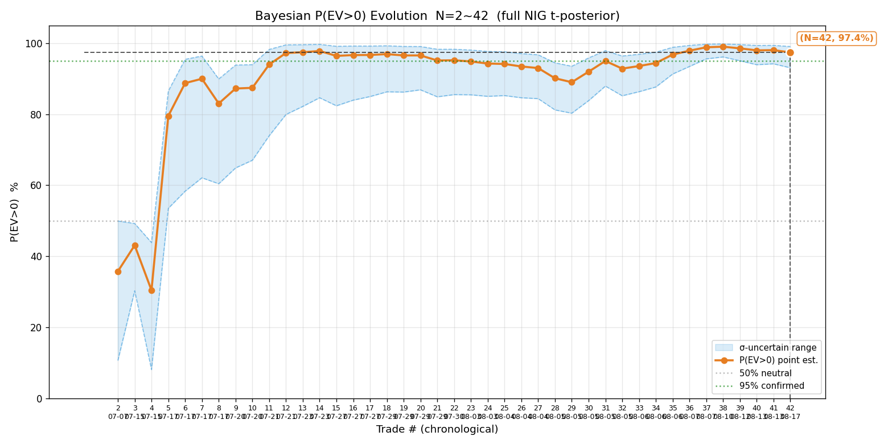
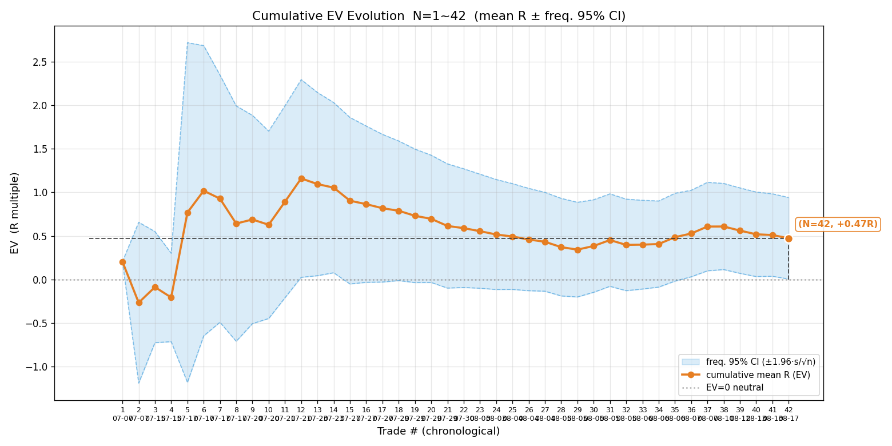
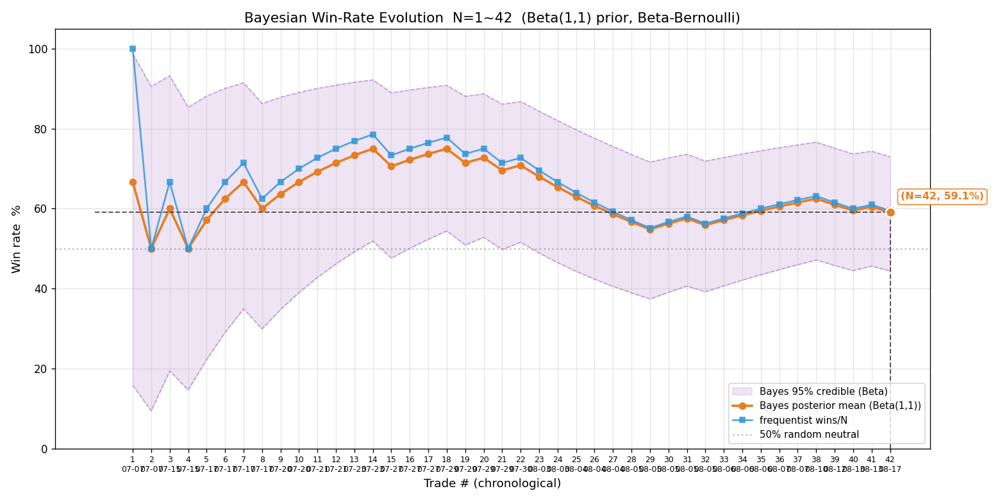
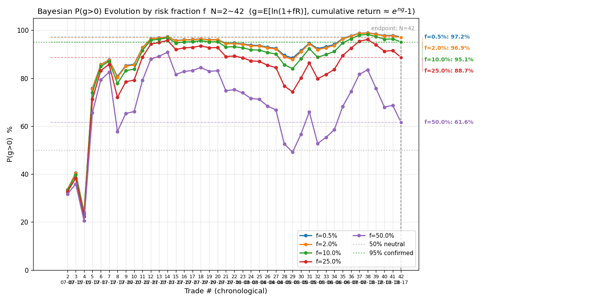
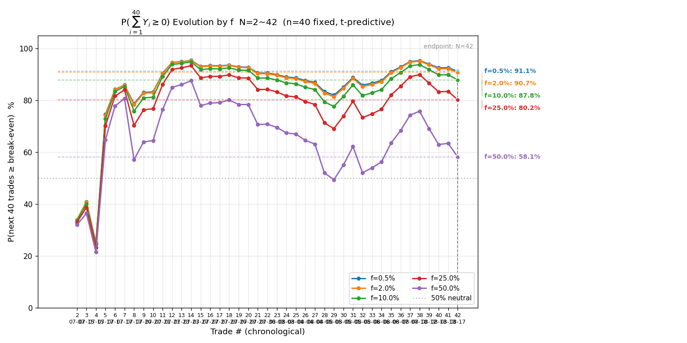
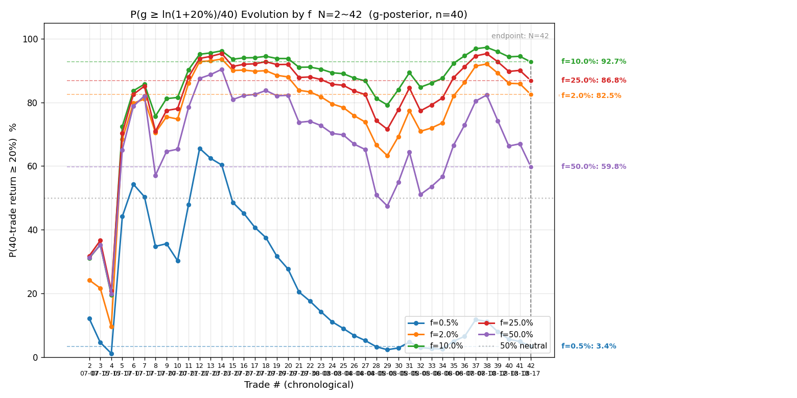
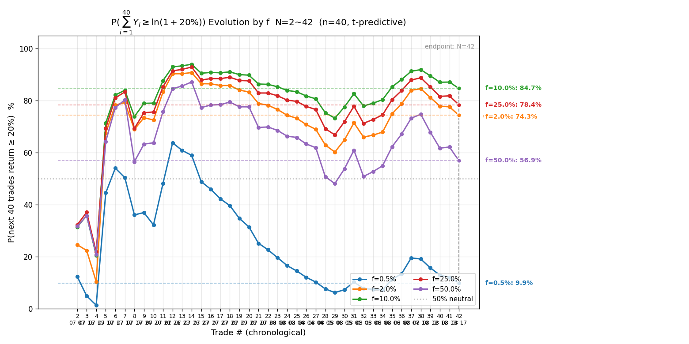

# 港股历史全量复盘 · 2026-08-17（含连败暂停规则专题）

> 触发：用户「重新复盘一下当前所有港股历史交易 + 分析：亏钱效应连续、P(g>0) 持续下跌时，持续几笔交易应暂停交易并重新修整策略」。
> 数据源：遍历 `signals/` + `actions/` 全部 HKT 文件全量对账（2026-08-03 教训纪律）。所有数值 Python 实算。

---

## 一、对账结论与新增样本

逐日核对 `signals/*-HKT-signals.md`（15 个）+ `actions/*-HKT-actions.md`（7 个），与上一版 CSV（08-13，41 笔）逐日比对。08-13 之后仅一笔新交易：

| 日期 | 标的 | 方向 | 开仓 | 平仓 | 量 | max_loss | 落地 R | 备注 |
|---|---|---|---|---|---|---|---|---|
| 08-17 | HK.00100 MINIMAX-W | 多 | 338.4 | 336.2 | 8,940 | 26,820 | **−1.05R** | V 反回踩企稳做多，购买力上限降档 83%；11:12 跌破 335.4 企稳位止损触发（净亏 28,244，其中双边费 8,576 占三成） |

**港股样本量：41 → 42 笔**。上期对账结论（signals/actions 双账户独立、07-21 中芯开仓失败不计样本、07-28 断网作废、08-10 测试单作废）继续成立，不重复。

---

## 二、港股终局统计量（N=42）

| 指标 | 值 | 上期（N=41） |
|---|---|---|
| 胜率 p | **59.5%**（25 胜 / 17 败） | 61.0% |
| 胜赔率 R_W | +1.314R | +1.314R |
| 败赔率 R_L | −0.765R | −0.747R |
| **EV** | **+0.473R** | +0.510R |
| 平均每单 P̄ | +10,005 HKD | +10,938 HKD |
| R 标准差 s | 1.549 | 1.549 |
| **贝叶斯 P(EV>0)** | **97.4%（σ 不确定下 93.1%~99.1%）** | 98.1%（94.2%~99.4%） |
| 频率派 EV 95% CI | **[+0.004, +0.941] 仍全正**（下界贴零） | [+0.036, +0.984] |

**解读**：08-17 一笔 −1.05R 把 EV 从 0.510 拉到 0.473、P(EV>0) 从 98.1% 降到 97.4%、频率派 CI 下界从 +0.036 压到 +0.004——**CI 下界已几乎贴零**。edge 仍偏正但「下界稳定 >95% + N≥50」的铁证条件未达成，维持 f=2% 风控上限。

## 三、过程指标（42 笔全部补齐 raw high/low）

本次把全部 42 笔的持仓期间高低价回拉写进 [2026-08-17-trades-hk-ts.csv](2026-08-17-trades-hk-ts.csv)（下次复盘无需再拉）：

| 子集 | MAE（防守） | MFE（进攻） | 回吐（出场） | 锁利效率 η |
|---|---|---|---|---|
| 盈利单 W（n=25） | −0.40 | +2.22 | 0.94 | **0.52** |
| 亏损单 L（n=17） | −0.90 | +0.62 | 1.38 | — |

与上期（08-13，仅 41 笔带 raw、口径略偏）相比：η 0.49 → 0.52 微升，但**近一半盈利单兑现率不足 40% 的结构未变**——锁利仍是第一优化点（上期 #1 改进方向继续有效）。

## 四、序贯演化图（7 张，N=42）

- **定义读法**：横轴交易序号、纵轴 P(EV>0)%；点估计 + σ 不确定带 + 50% 中性线 + 95% 确认线。
- **关键节点**：N=1~4 在 30~43% 低位（早期美团两笔一胜一败）；N=5 智谱 +4.67R 跳到 79.5%；N=12~14 峰值 97.8%；**N=21~29 连续下探（94.9% → 89.0% 低点，即 08-03~08-05 七连败段）**；N=30~38 反弹并创新高 99.0%（01888/02476/02359 大胜段）；N=39~42 回落（中际旭创、MINIMAX#4、MINIMAX#5 三笔亏单）到终局 97.4%。
- **终局**：97.4% [93~99%]，上期 98.1%——三笔近亏单累计 −3.4R 削掉 0.7pp。
- **含义**：信念曲线呈「探底（N=29）→ 拉升（N=38）→ 再回落（N=42）」的锯齿形，下界从未稳定站上 95%——edge 存在但厚度不足以支撑铁证。

- **定义读法**：纵轴累计 R 均值 + 频率派 95% CI 带 + EV=0 中性线。
- **关键节点**：N=5 均值被智谱拉到 +1.0R 峰值；随后单调消化，N=29 低点 +0.342R（CI [−0.20, +0.89] 跨零）；N=36 CI 下界转正；**N=42 终局均值 +0.473R、CI [+0.004, +0.941]——下界刚好处在零线上**。
- **含义**：均值右偏（中位赢单 +0.52R < 均值，靠大胜拉高）；CI 下界贴零意味着「42 笔的正面证据刚好够把零期望排除掉、但一点余量没有」。

- **关键节点**：N=29 低点频率 55.2%；N=37 峰值 62.2%；N=42 回落到 59.5%，贝叶斯 59.1%、CI [44%, 73%]——**下界 44% 又回到 50% 线下方**（上期 46%）。
- **含义**：胜率维度的证据同样未与抛硬币拉开铁证差距。

- **终局多 f 表**：

| f | ĝ（每笔） | P(g>0) | σ 区间 |
|---|---|---|---|
| 0.5% | +0.233% | 97.2% | 94~99% |
| 2.0% | +0.896% | 96.9% | 93~99% |
| 10.0% | +3.636% | 95.1% | 91~98% |
| 25.0% | +6.007% | 88.7% | 83~93% |
| 50.0% | +2.849% | 61.6% | 59~64% |

- 与上期比各 f 普降 0.5~2.8pp（f=2%：97.7% → 96.9%）。f=10% 的 P(g>0) 已跌破 95% 确认线——**edge 确认前维持 f=2% 更有依据**。

- **终局**：f=0.5%→91.1%、f=2%→90.7%、f=10%→87.8%、f=25%→80.2%、f=50%→58.1%。f=2% 的「未来 40 笔不亏」概率从 92.2% 降到 90.7%。

> ⚠️ 期望口径、丢路径方差、系统性偏高——「40 笔达 20% 概率」以⑦为准，本图仅作参数门限辅助判断。

- **终局**：f=0.5%→9.9%、f=2%→74.3%、f=10%→84.7%（峰值区）、f=25%→78.4%、f=50%→56.9%。

## 五、科学选 f（四步框架，N=42）

ⓐ 两曲线：f=2% 时 P(不亏)=90.7%、P(≥20%)=74.3%；f=10% 时 87.8% / 84.7%。ⓑ 凯利 f*≈p/|R_L|−q/R_W=0.595/0.765−0.405/1.314≈0.50（系统性高估、仅参考）。ⓒ **决策表不变：当前 f=2%**（P(g>0) 下界 93% <95%、胜率 CI 下界 44% 贴 50%、CI 下界贴零——edge 未铁证确认，继续收缩）；edge 确认（N≥50 + 下界稳定 >95%）后再评估释放到 10%。ⓓ 尾部红线：P(∑₄₀Y≥0) 跌破 85% 的临界从 f≈15~20% 收窄到 f≈15%（f=25% 已 80.2%）。

---

# 专题：亏钱效应连续时、几笔该暂停？（本次核心问题）

## 六、历史上的连败段（N=42 实测）

| 连败段 | 笔数 | 合计 | 期间发生了什么 |
|---|---|---|---|
| 08-03 ~ 08-05 | **7 笔** | −3.05R | 七连败：07709 空、09988 多、02359 空、06869 多、09988 空、00981 多、00981 空——连续三个交易日无一笔盈利 |
| 08-12 ~ 08-13 | 2 笔 | −2.37R | 中际旭创 −1.23R、MINIMAX#4 −1.15R |
| 08-17 | 1 笔 | −1.05R | MINIMAX#5（与 08-12~13 隔了 08-13 剑桥小胜 +1 个交易日，算新段） |
| 其余 | 8 段×1 笔 | — | 孤立败单（正常胜率 60% 下的随机亏损） |

**连败分布**：10 个连败段里 8 段是单笔孤立亏损、1 段 2 笔、1 段 7 笔。若把 08-12 → 08-17 视为一个「跨日亏损簇」（中间只隔一笔 +0.17R 小胜和两个非交易日），近三笔实亏 −1.23、−1.15、−1.05R，全部是**亏满或接近亏满的止损单**（|R|>1，滑点 + 平仓费使净亏超过 1R）。

## 七、P(g>0) 持续下跌段检测（f=2% 序贯）

全序列只有一段「连续 ≥3 笔的 P(g>0) 下滑」：

| 段 | P(g>0) 轨迹 | 对应连败 |
|---|---|---|
| #22→#29（8 个采样点、7 连败） | 95.2% → **89.0% 低点**（跌 ~6.7pp） | 08-03~08-05 七连败段 |

也就是说：**历史唯一的「P(g>0) 持续下跌」由连续 7 笔亏损造成**，且那时 P 尚有 89%、远未到「策略失效」的程度（随后 13 笔 69% 胜率、+9.93R，V 型修复）。

当前状态：N=39~42 三笔亏单把 P(g>0) 从 99.0% 拉到 96.9%（f=2%）——是回落、不是持续下跌破位，尚未触发任何合理的暂停线。

## 八、连败后下一笔的表现（状态依赖检验）

| 条件 | n | 下一笔胜率 | 下一笔均值 |
|---|---|---|---|
| 前面 1 笔败 | 16 | 56% | +0.29R |
| 前面连续 2 笔败 | 7 | 29% | −0.10R |
| 前面连续 3 笔败 | 5 | 20% | −0.16R |
| 全局 | 42 | 59.5% | +0.47R |

**连败 ≥2 笔后，下一笔胜率（29%）和均值（−0.10R）都显著差于全局**——样本很小（n=7/5，其中 5 笔里有 4 笔就是七连败段内部），统计上不显著，但方向上支持「连败可能揭示状态变差、而非纯随机」：七连败段里连续硬扛到第 5、6、7 笔，每多扛一笔都在放大伤害。

## 九、规则设计：几笔该暂停？

### 9.1 理论基准（假设逐笔独立、当前 p=0.595）

| 连败 k 笔 | 出现概率 | 平均频率 |
|---|---|---|
| 2 | 16.4% | 每 6 笔一次 |
| 3 | 6.6% | 每 15 笔一次 |
| 4 | 2.7% | 每 37 笔一次 |
| 5 | 1.1% | 每 92 笔一次 |
| 6 | 0.4% | 每 227 笔一次 |

**含义**：在胜率 60% 的正常策略下，3 连败是每 15 笔就遇一次的常态事件——**把暂停线设在 3 连败会把正常回撤也当成危机，频繁停机**（i.i.d. 世界里停机纯粹丢掉正 EV 机会）。

### 9.2 蒙特卡洛对比（bootstrap 2 万路径 × 200 笔，f=2%）

**世界 A（i.i.d.，策略始终有效）**：

| 规则 | 终值中位 | 最大回撤中位 | 触发次数中位 |
|---|---|---|---|
| 无暂停 | 5.98 | 12.2% | 0 |
| 连败3停+冷5 | 4.37 | 11.6% | 7 |
| 连败4停+冷5 | 5.21 | 11.9% | 3 |
| 连败5停+冷5 | 5.66 | 12.1% | 1 |

i.i.d. 世界里所有暂停规则都只降终值、几乎不降回撤——**若策略真的一直有效，暂停是纯减分项**。

**世界 B（状态漂移：每笔 2% 概率进入失效态、持续 ~15 笔，失效期 R 从败单分布抽 90%）**：

| 规则 | 终值中位 | 5% 分位 | 回撤中位 | 终值<0.7 概率 |
|---|---|---|---|---|
| 无暂停 | 2.36 | 0.94 | 27.7% | 1.3% |
| 连败3停+冷5 | 2.61 | 1.30 | 16.1% | 0.1% |
| 连败4停+冷10 | **2.78** | 1.37 | 15.2% | 0.0% |
| 连败5停+冷10 | 2.92 | 1.39 | 16.4% | 0.0% |

状态漂移世界里暂停规则**同时提升终值、大幅压回撤、消灭尾部**——价值全部来自「截断失效态」。

**两个世界合起来读**：暂停规则的本质是对冲「策略失效 / 状态漂移」风险。代价是正常期少赚（世界 A 终值 5.98→5.21，约 −13%），收益是失效期截损（世界 B 回撤 27.7%→15~16%）。规则不在「几笔最优」，而在**误触发成本与漏触发伤害的平衡**。

### 9.3 建议规则（结合本项目实际）

**规则分两级（建议采纳）：**

**第一级 · 降频线：连败 3 笔（当日累计 −3R 或跨日 3 连败）→ 当日停止开新仓**。
- 理由：3 连败在 60% 胜率下 15 笔一次，不算罕见，**但历史唯一一次 3+ 连败（08-03~05）后面 4 笔继续全败**——连败中继续交易的边际伤害实测是放大的（第 4~7 笔合计 −2.4R，若第 3 笔后停、可省 −2.4R 中的大部分）。当日停 = 冷却期到次日，天然满足「冷 5~10 笔」的尺度。
- 07-29 之后本项目实际上执行过类似动作（07-30 后暂停数日），且 08-05 之后用户有「连败后停一停」的实操直觉。

**第二级 · 暂停修整线：P(g>0)（f=2%）跌破 80% 且连续 5 笔无盈利 → 暂停交易、复盘修整策略（不是当日停，是停到复盘出结论）**。
- P(g>0)<80% 的含义：当前证据已不支撑「长期复利增长」信念（历史上 N=2~4 时才低至 30~43%，N≥10 后从未低于 89%）——若在 N≥20 的基础上跌到 80% 以下，意味着**近期样本把整体证据拖到了「可能负期望」区间**，这不是噪音、是状态信号。
- 「连续 5 笔无盈利」作为复合条件，避免单一指标（P 值对一两笔大败单敏感）误触发：5 笔无盈利在 p=0.595 下概率 1.1%（92 笔一次），一旦与 P 跌破 80% 同时出现，基本排除「正常回撤」解释。

**为什么不用 P(EV>0) 而用 P(g>0)**：EV>0 不蕴含复利增长（方差惩罚），g 才是资金曲线的判据；且用户问题里说的「不亏钱的概率 P(g>0)」正是本项目复盘第 4 张演化图的口径。

**当前状态离这两条线多远**：f=2% 下 P(g>0)=96.9%（距 80% 线很远）；最近 5 笔 = +0.63、−1.23、−1.15、+0.17、−1.05（有 2 笔盈利，非 5 连无胜）。**当前不触发任何一级**。但 08-12 以来 5 笔里 4 亏、合计 −2.63R，已接近第一级警戒区（若再来一笔亏且 3 笔连续无盈利 → 触发第一级、当日停开新仓）。

### 9.4 规则与「亏满型止损」的叠加观察

近三笔亏单（−1.23 / −1.15 / −1.05R）全部亏满或超亏（净 |R|>1 来自滑点 + 平仓费），与 08-03~05 七连败中的 −1.30R 同型——**亏满型连败比小额回撤型连败更危险**（每笔伤害都是满额 R）。建议第一级线加一个收紧条款：**若连败 2 笔且都是亏满型（|R|≥0.95），直接按 3 连败处理（当日停）**。

## 十、结论

1. **港股整体仍正期望**：N=42、EV +0.473R、P(EV>0)=97.4%、频率派 CI 全正——但下界贴零（+0.004），铁证条件（N≥50 + 下界稳定 >95%）未达成，f 维持 2%。
2. **近三笔（08-12~08-17）亏 −3.4R 是回落、未破位**：P(g>0) 99.0% → 96.9%，远高于任何合理的暂停线；不构成「策略失效」证据。
3. **历史上唯一一次 P(g>0) 持续下跌（08-03~05 七连败，95%→89%）后来 V 型修复**——但那段的教训是「第 3 笔败后继续硬扛又亏 4 笔」，支持设置降频线。
4. **建议两级规则**：① 连败 3 笔（或 2 笔亏满型）→ 当日停止开新仓；② P(g>0)<80% + 连续 5 笔无盈利 → 暂停修整策略。蒙特卡洛显示：正常期代价约 −13% 终值、失效期把回撤从 28% 压到 15%——对「AI 主观策略无法回测、状态漂移只能事后发现」的本项目，这个保险值得买。
5. 若采纳，建议把两级规则写入 `config.json` 风控参数 + SKILL 硬性护栏（连败计数由每笔平仓记录自动累计）。

## 十一、是否暂停交易的建议（本次复盘结论）

**不需要暂停交易。** 理由与安全边际：

- **距第二级暂停修整线很远**：P(g>0)（f=2%）当前 96.9%，距 80% 线还有约 17pp（历史 N≥10 后最低点 89%，出现在 08-05 七连败段）；最近 5 笔 = +0.63、−1.23、−1.15、+0.17、−1.05，有 2 笔盈利，不满足「连续 5 笔无盈利」。
- **第一级降频线未触发、但已进警戒区**：当前非 3 连败（08-13 剑桥 +0.17R 隔断）；但近 5 笔 4 亏、且近三笔亏单全部亏满型（|R| 1.05~1.23）。**若下一笔再亏、且与 08-17 MINIMAX 构成连败 2 笔且都亏满型 → 触发第一级收紧条款，当日停开新仓**。
- **但要修整一件事再继续**：近三笔亏单同型（回踩企稳做多、开仓后未走起、跌破结构位止损）——右侧入场总则与「企稳」可操作定义已立（2026-08-17），下一笔开仓严格执行「确认事件已发生才进」，这是比暂停更对症的修整。

---

## 附：本次复盘产物

- 报告：[2026-08-17-HKT-review.md](2026-08-17-HKT-review.md)（本文件）
- 数据：[2026-08-17-trades-hk.csv](2026-08-17-trades-hk.csv)（42 笔主样本）/ [2026-08-17-trades-hk-ts.csv](2026-08-17-trades-hk-ts.csv)（42 笔 + 时间戳 + raw high/low 全量持久化，首次全齐）
- 港股 7 图：[bayes](2026-08-17-hk-bayes-evolution.png) / [ev](2026-08-17-hk-ev-evolution.png) / [winrate](2026-08-17-hk-winrate-evolution.png) / [pg](2026-08-17-hk-pg-evolution.png) / [psum40](2026-08-17-hk-psum40-evolution.png) / [pg20](2026-08-17-hk-pg20-evolution.png) / [psum40-20pct](2026-08-17-hk-psum40-20pct-evolution.png)
- 连败分析脚本：`tmp/losing_streak.py`（连败段统计 + P(g>0) 下滑段检测 + 蒙特卡洛）
