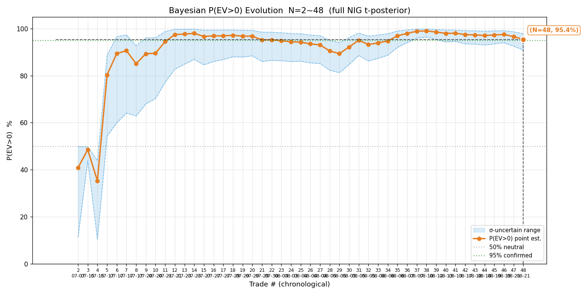
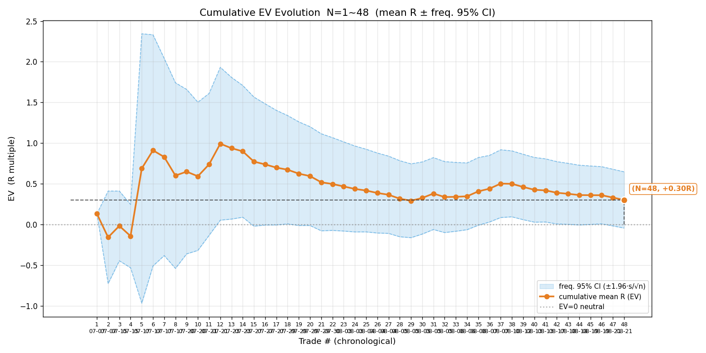
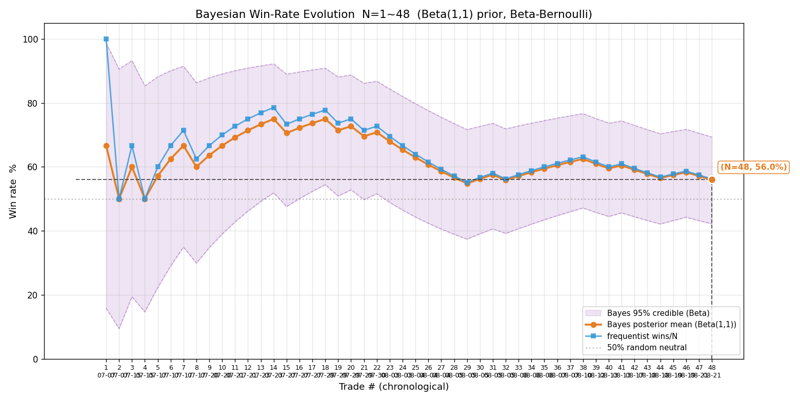
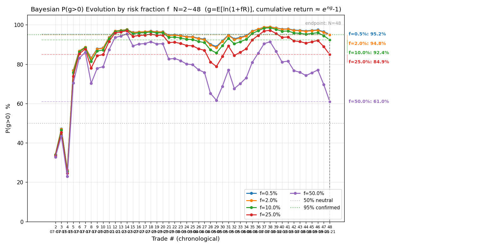
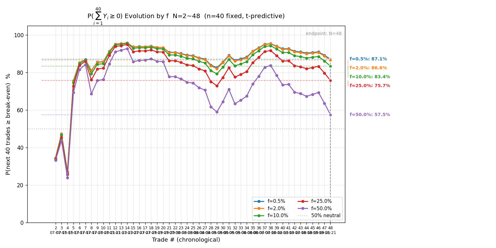
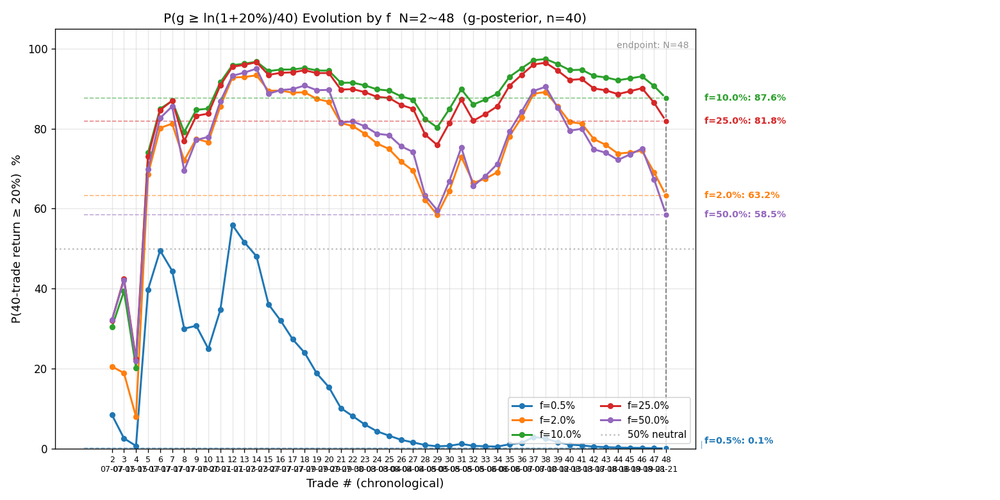
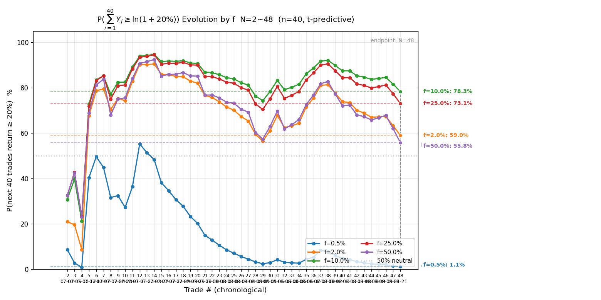

# 港股历史全量复盘 · 2026-08-24（含实盘时代首检）

> 触发：用户「复盘一下所有港股历史交易」。数据源：遍历 `signals/` + `actions/` 全部 HKT 文件全量对账（2026-08-03 教训纪律）。所有数值 Python 实算。
> 本期新增 6 笔全部为**老虎实盘账户（67****91）auto 交易**（08-18 / 08-19 / 08-21），是实盘时代的首次全量入账。

---

## 一、对账结论与新增样本

逐日核对 `signals/*-HKT-signals.md`（17 个）+ `actions/*-HKT-actions.md`（10 个），与上一版 CSV（08-17，42 笔）逐日比对。上期对账结论（signals/actions 各记各目录不重叠、07-21 中芯开仓失败不计样本、07-28 断网作废、08-10 测试单作废）继续成立。新增 6 笔：

| # | 日期 | 标的 | 向 | 开仓 | 平仓 | 量 | max_loss | 落地 R（净） | 备注 |
|---|---|---|---|---|---|---|---|---|---|
| 43 | 08-18 | HK.00700 腾讯控股 | 多 | 442.2 | 443.0 | 300 | 660 | **−0.25R** | 实盘首单；移损 443.0 触发，毛 +240 被双边费 407 吃掉转净亏 |
| 44 | 08-18 | HK.00700 腾讯控股 | 多 | 442.4 | 442.6 | 300 | 720 | **−0.48R** | 同日第二笔；用户 App 移损 442.6 触发，净 −346（费 407 占毛利 +60 的数倍） |
| 45 | 08-19 | HK.01810 小米集团-W | 多 | 27.50 | 27.68 | 5,000 | 1,200 | **+0.40R** | 用户两次 App 移损 27.69 触发，净 +478（App 实测口径） |
| 46 | 08-19 | HK.01810 小米集团-W | 多 | 27.76 | 27.94 | 5,000 | 1,000 | **+0.47R** | 用户移损 27.94 触发，净 +475 |
| 47 | 08-21 | HK.07709 海力士2x | 多 | 40.82 | 40.48 | 3,700 | 1,184 | **−1.19R** | VWAP 回踩企稳入场失败案例，2 分钟即触发止损 |
| 48 | 08-21 | HK.00100 MINIMAX-W | 多 | 337.2 | 330.0 | 360 | 2,592 | **−1.14R** | 追二次上攻实为双顶右肩，止损 330 六测后破位触发 |

**归并说明（08-18 腾讯第二笔）**：actions 里 14:25（−322 手算费 382）与 14:33（−346.2，fee_schedule 复算费 406.2）是**同一平仓事件（order 16 止损 442.6 触发）的两次记录**，取 fee_schedule 复算口径 −346.2 / M=720（开仓附加止损 440.0 的 2.4 止损距；用户 App 上移止损不改开仓基准）。14:17「回补第二笔」开仓记录与 14:04 实为同一笔（order 15），归并、不重复计数。

**港股样本量：42 → 48 笔**（累计净盈亏 +416,185 HKD，模拟 + 实盘混合口径、扣双边费）。

## 二、港股终局统计量（N=48）

| 指标 | 本期（N=48） | 上期（N=42） | 变化 |
|---|---|---|---|
| 胜率 p | **56.2%**（27 胜 / 21 败） | 59.5% | ↓3.3pp |
| 胜赔率 R_W | +1.249R | +1.314R | ↓ |
| 败赔率 R_L | −0.765R | −0.765R | 持平 |
| **EV** | **+0.368R** | +0.473R | **↓0.105R** |
| 平均每单 P̄ | +8,671 HKD | +10,005 HKD | ↓ |
| R 标准差 s | 1.492 | 1.549 | ↓ |
| **贝叶斯 P(EV>0)** | **95.5%（σ 不确定 90.6%~97.8%）** | 97.4%（93.1%~99.1%） | ↓1.9pp |
| 频率派 EV 95% CI | **[−0.054, +0.790] 跨零** | [+0.004, +0.941] 全正 | **下界转负** |

**解读**：6 笔实盘新样本合计 **−2.20R**（净金额 −3,937 HKD），把 EV 从 +0.473 拖到 +0.368、频率派 CI 下界从 +0.004 压到 **−0.054——CI 重新跨零**，回到「不足以判断 EV 正负」状态。这是继 08-05 七连败段（N=29 低点 CI 跨零）后第二次下界跌破零，且本次是**实盘账户直接产生**的样本。

**分布右偏（持续）**：均值 +0.368R vs 中位数 +0.074R——一半交易几乎不赚钱，均值靠少数大胜拉起。剔除 Top3 大胜（+4.67 / +4.11 / +3.53）后 EV 只剩 **+0.119R**、胜率 53.3%——edge = 基础胜率 + 大胜单，大胜单贡献约三分之二的 EV。

## 三、分阶段统计（signal 时代 → 模拟 auto → 实盘时代）

| 阶段 | N | 胜率 | R_W | R_L | EV |
|---|---|---|---|---|---|
| 7 月 signal 时代（07-07~07-30） | 22 | 72.7% | +1.14 | −0.87 | **+0.590** |
| 8/3~8/10 模拟 auto 黄金期 | 16 | 50.0% | +1.81 | −0.54 | **+0.634** |
| 8/12 之后（模拟收尾 + 实盘 6 笔） | 10 | 30.0% | +0.34 | −0.93 | **−0.547** |

**三个阶段清晰退化**：胜率 72.7% → 50.0% → 30.0%。08-12 后 10 笔仅 3 胜，在全局胜率 56.2% 下二项检验 P(X≤3) = 8.9%——**不到 10% 概率的坏运气区间，尚不构成统计显著的「状态失效」，但已连续第三期恶化**（上期已发现 08-12 后 5 笔 4 亏，本期 10 笔 7 亏）。

多空分组：做多 33 笔胜率 60.6%、EV +0.432R；做空 15 笔胜率 46.7%、EV +0.227R——**做空仍是弱项**（且 8/12 后 10 笔全部做多，做空样本停留在 08-12 之前）。

## 四、过程指标（48 笔，raw high/low 全量）

本期把新 6 笔的期间高低价补进 [2026-08-24-trades-hk-ts.csv](2026-08-24-trades-hk-ts.csv)（48 笔全量持久化）。⚠️ 本次发现并修正了历史聚合口径的一个符号错误：做空笔的 MAE 此前未按方向翻转（「盈利单 MAE=−0.15、亏损单 −0.03」实为符号错乱的产物），修正后如下（含 max(−1) 截断保护）：

| 子集 | MAE（防守） | MFE（进攻） | 回吐（出场） | 锁利效率 η |
|---|---|---|---|---|
| 盈利单 W（n=27） | −0.35 | +2.14 | 0.93 | **0.51** |
| 亏损单 L（n=21） | −0.60 | +0.61 | 1.37 | — |

与上期（08-17 口径重算的 17 笔亏损单 MAE=−0.62）相比基本持平；η=0.51 与上期 0.52 持平——**近一半浮盈没锁住的结构依旧**，锁利仍是第一优化点。新 6 笔里有 4 笔 MAE=0（开仓即最高 / 用户移损锁利及时），说明实盘时代**用户的 App 移损**已成为实际锁利主力（AI 移损信号与用户手动移损并存）。

## 五、序贯演化图（7 张，N=48）

### ① 贝叶斯 P(EV>0) 演化

- **定义读法**：横轴交易序号、纵轴 P(EV>0)%；点估计 + σ 不确定带 + 50% 中性线 + 95% 确认线。
- **关键节点**：N=1~4 低位（31.9%~44.9%）；N=5 智谱 +4.67R 跳上 80%；N=12~14 峰值 97.9%；N=21~29 下探（08-03~05 七连败段，低点 89.1%）；N=36~38 再创新高 99.0%（01888/02476/02359 大胜段）；**N=42~48 连续回落（97.4% → 96.9% → 96.6% → 95.5%），四笔一降**——08-17 MINIMAX、08-18 腾讯#2、08-21 两笔亏单把信念从峰值削掉 3.5pp。
- **终局**：95.5% [91~98%]，上期 97.4% [93~99%]。
- **含义**：信念曲线自 08-12 起走「缓慢单边下坡」（98.6% → 95.5%，六笔亏单无一次像样的反弹修复）——与 08-03~05 的「急跌急弹」V 型不同，这次是**阴跌形态**，单笔伤害不大（−0.25R ~ −1.23R）但方向一致。95% 确认线刚被点估计跌破下沿（下界 90.6%），edge 判断进入「方向偏正但厚度存疑」区间。

### ② 累计 EV 演化

- **定义读法**：纵轴累计 R 均值主线 + 频率派 95% CI 不确定带 + EV=0 中性线。
- **关键节点**：N=5 均值 +0.78（智谱拉起）；N=29 低点 +0.343（CI 跨零）；N=36~38 峰值 +0.608（CI [+0.10, +1.10] 最厚）；**N=48 终局 +0.368、CI [−0.05, +0.79]——下界压回零线以下**，为 N≥30 以来首次。
- **终局**：+0.368R，上期 +0.473R——6 笔实盘 −2.20R 平均稀释 0.105R。
- **含义**：均值右偏结构（中位 +0.074R）下，CI 下界对新增亏单敏感——42 笔攒出的「下界贴零」（+0.004）余量，被 6 笔实盘样本一笔抹平转负。**「EV>0」的统计确认状态从上期的临界全正退回未确认**。

### ③ 胜率演化

- **定义读法**：贝叶斯 Beta(1,1) 后验均值主线 + 频率法对照 + 95% 可信带 + 50% 中性线。
- **关键节点**：N=14 峰值 78.6%（频率法）；此后长期消化，N=29 低点 55.2%；N=38 回升 63.2%；**N=42~48 五连降（59.5% → 58.1% → 56.8% → 57.4% → 57.4% → 56.2%），频率法从 60% 一路滑到 56.2%**。
- **终局**：贝叶斯 56.0% [42, 69]，频率 56.2%——两线已高度贴合（样本 48 笔下先验影响 <0.5pp），胜率估计本身已收敛；**问题不在估计精度、在真实胜率确实在下移**。
- **含义**：CI [42%, 69%] 说明「真实胜率 >50%」都还没确认，配合均值右偏——当前策略画像 = 「略高于抛硬币的胜率 + 靠大胜单赚钱」，这类画像的命门是大胜单断供（见第一节剔除 Top3 后 EV 仅 +0.119R）。

### ④ P(g>0) 演化（多 f）

- **定义读法**：纵轴为固定比例下注下对数增长率 g>0 的后验概率，五条线对应 f=0.5%/2%/10%/25%/50%；小 f 区各线重合（线性近似）、大 f 区方差惩罚拉低曲线。
- **关键节点**：f=2% 线与 P(EV>0) 线同步阴跌（08-12 起 98.6% → 94.7%）；f=25% 线从 ~90% 滑到 80.4%；f=50% 线终局 44.6% 已在 50% 下方（2f* 区方差惩罚吞掉全部 edge）。
- **终局表**：

| f | ĝ（/笔） | P(g>0) | σ 不确定区间 |
|---|---|---|---|
| 0.5% | +0.181% | 95.1% | 91~98% |
| **2.0%（现行）** | **+0.691%** | **94.7%** | 91~98% |
| 10% | +2.686% | 91.3% | 87~95% |
| 25% | +3.848% | 80.4% | 75~85% |
| 50% | −1.200% | 44.6% | 44~46% |

- **含义**：现行 f=2% 下 P(g>0)=94.7%、ĝ=+0.69%/笔（40 笔预期累计约 +31%）——长期复利增长信念仍稳，但**σ 区间下界 91% 已跌破 95% 确认线**。f=25% 以上不可用（方差惩罚吃掉增量）。

### ⑤ P(∑₄₀Y≥0) 演化

- **定义读法**：未来 40 笔对数收益和 ≥0 的预测概率（有限 n 预测版），恒有 P(g>0) ≥ P(∑₄₀≥0)，差距 = 短期波动风险。
- **关键节点**：f=2% 线终局 86.3%（对照 P(g>0) 94.7%，差 8.4pp）——即便长期 edge 确认，未来 40 笔仍有约 1/7 概率净亏。
- **终局表**：f=0.5% → 87.0%；f=2% → 86.3%；f=10% → 82.2%；f=25% → 71.8%。
- **含义**：与上期（88% 上下）相比整体下移约 2pp——新增实盘样本让「短期不亏」保证变薄。86% 意味着**每 7 个「40 笔周期」约有一次整体亏损**，属于策略固有波动、非异常。

### ⑥ P(g≥ln1.2/40) 演化（pg20）

- **⚠️ 口径标注（必含）**：本图是**期望口径**——把「40 笔累计 ≥20%」所需 g 折算成门槛（ln1.2/40 ≈ 0.456%/笔），画 P(ĝ ≥ 门槛)。它丢弃路径方差、**系统性偏高**；「40 笔真的达到 20% 的概率」以 ⑦（psum40-20pct）为准。
- **关键节点**：f=2% 线在 71% 附近震荡、终局 71.1%；f=10% 线终局 87.2%（峰值区）；f=0.5% 线终局仅 0.7%（ĝ=0.181%/笔 < 门槛 0.456%/笔，期望口径下几乎不可能达标）。
- **终局表**：f=0.5% → 0.7%；f=2% → 71.1%；f=10% → 87.2%；f=25% → 77.5%。
- **含义**：作为参数门限辅助判断——**f=0.5% 太保守（期望都不达标）、f=2% 勉强跨门槛、f≈8~10% 是期望口径最优区**。与上期格局一致，数值略降。

### ⑦ P(∑₄₀Y≥ln1.2) 演化（psum40-20pct，达 20% 的真实概率）

- **定义读法**：未来 40 笔累计收益率 ≥20% 的预测概率（同 ⑤ 的 t 预测近似、门槛换 ln1.2）——这才是「40 笔达 20%」的真实概率图。
- **关键节点**：f=2% 线终局 64.6%（期望口径 71.1% 被方差打回）；f=10% 线终局 77.9%（全网格峰值）；f=0.5% 仅 4.5%。
- **终局表**：f=0.5% → 4.5%；f=2% → 64.6%；f=10% → 77.9%；f=25% → 69.5%。
- **含义**：现行 f=2% 下「40 笔赚 20%」概率约 2/3——不及期望口径的表象、但仍为主流情形。若追求 78% 峰值需 f≈10%，但那会同时把 P(∑₄₀≥0) 从 86% 拉低到 82%、且 f=10% 远超当前风控授权（2%），不采纳。

## 六、科学选 f（四步框架）

**ⓐ f 细网格两曲线**（约束 = P(∑₄₀≥0)，目标 = P(∑₄₀≥ln1.2)）：

| f | P(不亏) | P(≥20%) |
|---|---|---|
| 0.5% | 87.0% | 7.0% |
| 1.0% | 86.8% | 42.2% |
| **2.0%（现行）** | **86.3%** | **66.8%** |
| 3.0% | 85.9% | 73.5% |
| 5.0% | 84.9% | 77.6% |
| 8.0% | 83.3% | **78.6%（峰值）** |
| 10.0% | 82.2% | 78.3% |
| 15.0% | 79.2% | 76.2% |
| 20.0% | 75.7% | 73.2% |
| 25.0% | 71.8% | 69.7% |

- **「不亏 95%」硬约束当前无解**：全网格 P(∑₄₀≥0) 最高 87.0%（f=0.5%）——48 笔样本下方差太大，任何 f 都给不出 95% 不亏保证。数学最优 f（约束下目标峰值）≈ 8%（78.6%），但因约束本身不满足，按第三步收缩规则处理。

**ⓑ 凯利交叉验证**：f* = p/|R_L| − q/R_W = 0.562/0.765 − 0.438/1.249 = **38.5%**。⚠️ 已知系统性高估（小样本 + 移动止损使 |R_L|<1、且历史 |R_L|=0.765 偏浅），仅参考；保守分数凯利（1/7~1/4 f*）= 5.5%~9.6%——与网格峰值区 8~10% 一致。

**ⓒ 稳健性收缩（按 edge 状态）**：edge 确认条件（N≥50 + P(g>0) 下界>95% + 胜率 CI 下界脱离 50%）**三条全不满足**（N=48、下界 91%、胜率 CI 下界 42%）→ **收缩维持当前风控 f=2%**，不释放到约束优化解 8%。

**ⓓ 尾部红线**：P(∑₄₀≥0) 跌破 95% 的临界 f——全网格已无 f 满足 95%（最高 87%），故尾部红线收紧为「P(∑₄₀≥0) 跌破 85% 的临界」= **f ≤ 4% 左右**（f=5% 时 84.9% 破线）。硬上限维持 config 的 f_max=10%（单笔风险敞口）与现行 risk_fraction=2% 不变。

**ⓒ 结论**：当前阶段 f 维持 2%；edge 三条件达成后（N≥50 + 下界回升 >95%）再议释放。

## 七、亏损归因（08-12 后 10 笔 −5.47R 逐笔）

| 日期 | 标的 | R | 亏损模式 |
|---|---|---|---|
| 08-12 | 03308 中际旭创空 | −1.23 | 水平震荡做空、止损未移区间上沿，放量突破扫损 |
| 08-13 | 00100 MINIMAX#4 多 | −1.15 | 破前高回踩企稳做多（净赔率实际未过 2.4 闸），反弹乏力破支撑 |
| 08-17 | 00100 MINIMAX#5 多 | −1.05 | V 反回踩企稳做多，企稳确认不足（左侧抢跑） |
| 08-18 | 00700 腾讯#1 多 | −0.25 | 形态对、移损对，但 300 股小仓位费用（407）吞噬全部毛利（+240） |
| 08-18 | 00700 腾讯#2 多 | −0.48 | 同价位二次进场；费用再吞（毛 +60、费 407） |
| 08-21 | 07709 海力士2x 多 | −1.19 | VWAP 回踩「企稳」实为 V 反后横盘高位追入，2 分钟即回落（右侧确认不足） |
| 08-21 | 00100 MINIMAX#6 多 | −1.14 | 日内新高附近反复测试不创新高（双顶雏形）当「突破确认」追入 337.2 |

**共性诊断（三类）**：

1. **右侧确认不足类（4 笔：MINIMAX#5、海力士、MINIMAX#6、MINIMAX#4 部分）**——「企稳 / 突破」判定不满足可核验定义（≥2 次测试 + ≥10 分钟 + 确认事件已发生），实质仍是左侧抢跑或顶部追入。08-17 立的「右侧入场总则」与 08-21 立的「入场点候选清单 + 日内新高禁追」规则后仍在 08-21 犯（同日两笔），说明**规定落地滞后于规定立规**——两条新规的工具强制（止盈可达性校验已入脚本）刚就位，执行依赖 AI 自觉的部分还在衰减区。
2. **费用结构类（08-18 腾讯两笔）**——实盘小购买力（300 股上限）× 窄止损（1.0~2.4 止损距）× 高价股（442）三重叠加，双边费 407 HKD 使**任何 <1.4 点的毛利都转亏**。这不是判断错误而是结构不经济：印花税闸（个股止损距 ≥1.67% 股价）管住了税、没管住「费用÷毛利」这层。
3. **做空止损位类（08-12 旭创）**——区间震荡做空止损未随结构移到区间上沿外侧，规则已在 08-12 当天补齐（SKILL 移损条），此后无新样本验证。

**实盘 6 笔小计 −2.20R / −3,937 HKD**：其中判断性亏损 2 笔（−2.33R）、结构性费用亏损 2 笔（−0.73R）、用户移损锁利盈利 2 笔（+0.87R）。实盘时代**用户手动移损是唯一稳定正贡献**。

## 八、是否暂停交易的建议（复盘必含项）

**第一级 · 降频线检查**：当前连败 2 笔（08-21 海力士 −1.19R + MINIMAX −1.14R），**两笔都是亏满型（|R|≥0.95）→ 触发收紧条款「连败 2 笔且都亏满型 = 按 3 连败处理」**。按 2026-08-17 立规：**下一交易日（08-24 周一）应停止开新仓、次日再战**。08-24 已是周一——**本建议落地动作：今日港股不开新仓**（若用户仍要交易，属用户决策权覆盖）。

**第二级 · 暂停修整线检查**：P(g>0)（f=2%）= 94.7% [91~98%]，距 80% 线尚远（历史 N≥10 后最低 89.1%）；最近 5 笔 = −0.48、+0.40、+0.47、−1.19、−1.14，有 2 笔盈利、非「连续 5 笔无盈利」。**第二级不触发——不需要暂停修整策略**。

**综合建议**：**不触发二级暂停，但执行一级降频**——08-24（今日）不开新仓，把 08-21 两笔亏单的「右侧确认不足」教训消化一天；08-25 恢复时严格执行「入场点候选清单」（开仓前列全候选 + 确认条件 + 候选 1 满足即执行）。若 08-25 再亏且与 08-21 两笔构成跨日 3 连败 → 再触发一级、停到 08-26。

**与上期对比**：上期（08-17 复盘）已进「警戒区」，本期**正式触发第一级**——这是两级线设立以来首次实际触发，建议把「当日停止开新仓」也加进工具强制（连败计数由平仓记录自动累计 + open_position 脚本开仓闸，模式同 live_unlock / 时间闸——暂未落地，见 TODO）。

## 九、结论

1. **港股整体仍偏正期望、但确认状态倒退**：N=48、EV +0.368R、P(EV>0)=95.5%，频率派 CI [−0.05, +0.79] 跨零——上期「临界全正」的余量被 6 笔实盘样本（−2.20R）抹掉，回到未确认。均值右偏依旧（中位 +0.074R，剔 Top3 大胜后 EV 仅 +0.119R）。
2. **三阶段退化明确**：signal 时代 EV +0.59R → 模拟 auto +0.63R → 08-12 后 −0.55R。08-12 后 10 笔 3 胜（二项 P=8.9%，未达显著但持续恶化三期）。
3. **实盘时代结构性新课题**：小购买力 × 窄止损 × 高价股 = 费用吞噬毛利（08-18 腾讯两笔费用 407/笔 > 毛利）；用户 App 移损成锁利主力（08-19 小米两笔全靠用户移损落袋 +0.87R）。
4. **一级降频线首次实际触发**：08-21 两笔亏满型连败 → 今日（08-24）不开新仓。二级暂停线远未触发（P(g>0)=94.7% 距 80% 线 15pp）。
5. **f 维持 2%**：edge 三条件（N≥50 / P(g>0) 下界>95% / 胜率 CI 下界>50%）全不满足，科学选 f 收缩规则生效，不释放到网格峰值 8%。

---

## 附：本次复盘产物

- 报告：[2026-08-24-HKT-review.md](2026-08-24-HKT-review.md)（本文件）
- 数据：[2026-08-24-trades-hk.csv](2026-08-24-trades-hk.csv)（48 笔主样本）/ [2026-08-24-trades-hk-ts.csv](2026-08-24-trades-hk-ts.csv)（48 笔 + 时间戳 + raw high/low 全量持久化；含 08-18 腾讯#1 raw_low 口径修正）
- 港股 7 图：[bayes](2026-08-24-hk-bayes-evolution.png) / [ev](2026-08-24-hk-ev-evolution.png) / [winrate](2026-08-24-hk-winrate-evolution.png) / [pg](2026-08-24-hk-pg-evolution.png) / [psum40](2026-08-24-hk-psum40-evolution.png) / [pg20](2026-08-24-hk-pg20-evolution.png) / [psum40-20pct](2026-08-24-hk-psum40-20pct-evolution.png)
