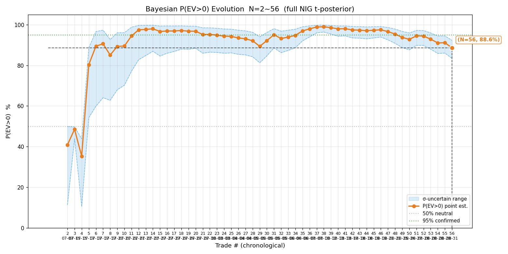
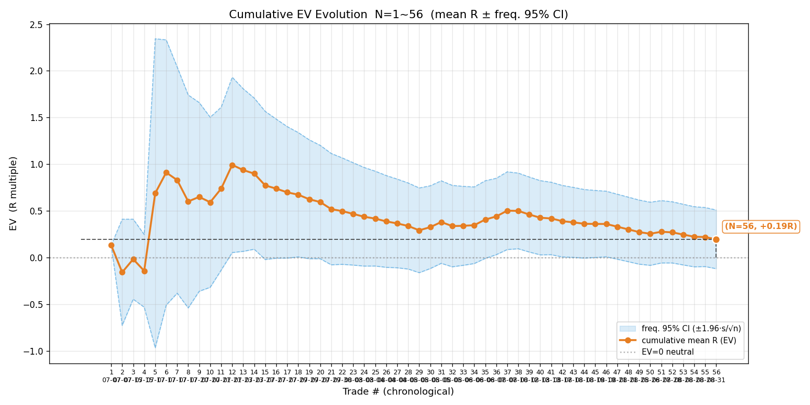
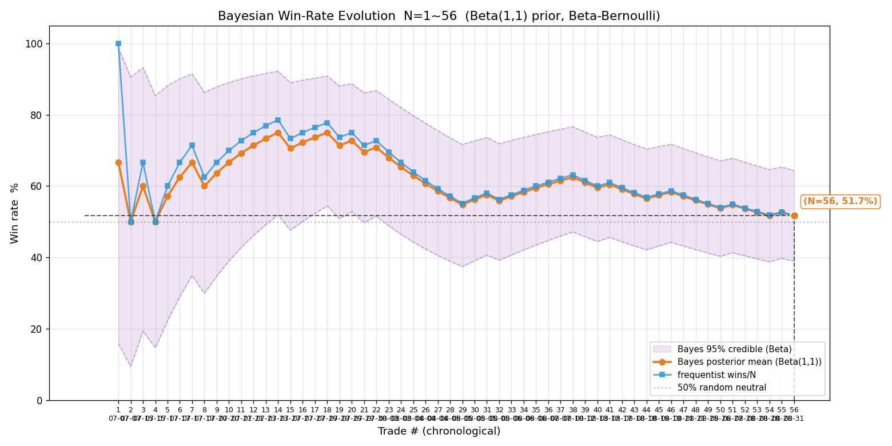
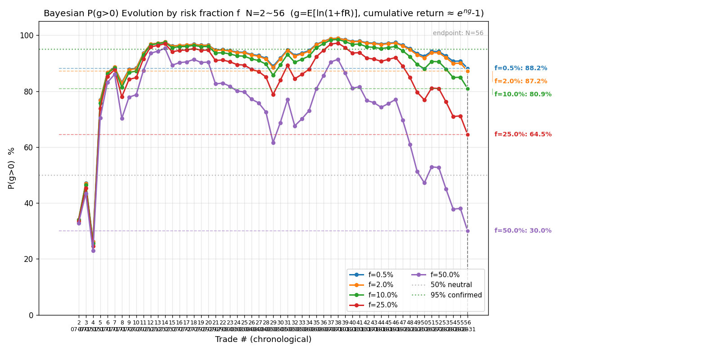
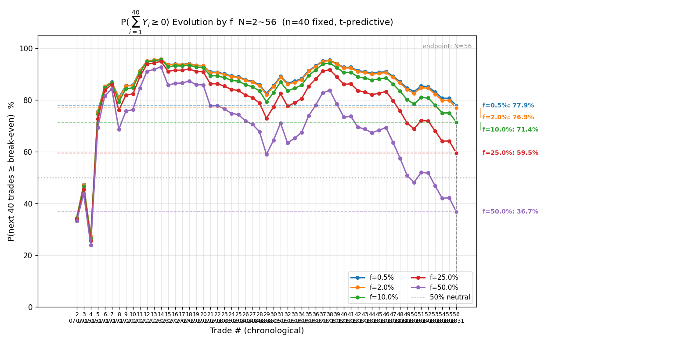
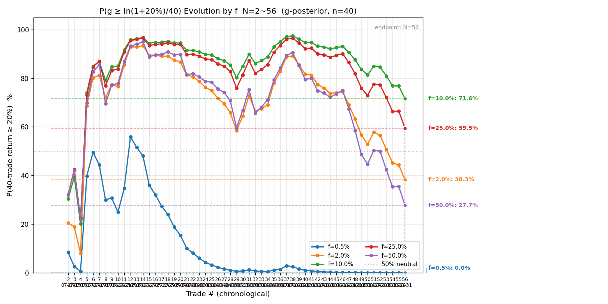
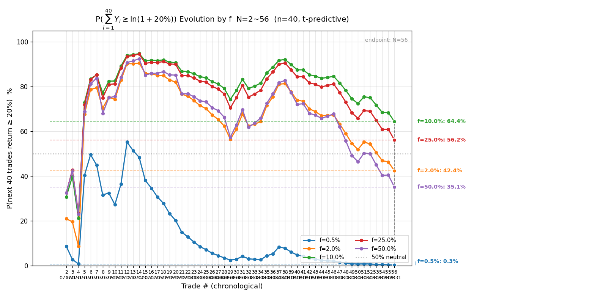

# 港股历史全量复盘 · 2026-08-31（实盘时代第三期：08-25~31 八笔入账 + 01888 平仓补录）

> 触发：用户「复盘一下到目前为止的所有港股交易」。数据源：遍历 `signals/` + `actions/` 全部 HKT 文件全量对账（2026-08-03 教训纪律）。所有数值 Python 实算（review.py + bayes_evolution.py + 分组脚本）。
> 本期新增 8 笔全部为**老虎实盘账户（67****91）auto 交易**（08-25 / 08-26 / 08-27 / 08-28×4 / 08-31）；另含一笔 **01888 平仓补录**（当日 actions 漏记、本次复盘按 K 线证据链补齐，见第一节）。

---

## 一、对账结论、新增样本与 01888 平仓补录

逐日核对 `signals/*-HKT-signals.md` + `actions/*-HKT-actions.md` 与上一版 CSV（08-24，48 笔）。上期对账结论继续成立（signal / auto 各记各目录不重叠、开仓失败与作废批次不计样本）。本期新增 **8 笔真实样本** + **2 笔影子样本**（2026-08-31 用户立：复盘所有港股交易包含影子交易，影子样本单独一组统计，见第九节）。真实样本 8 笔：

| # | 日期 | 标的 | 向 | 开仓 | 平仓 | 量 | max_loss(毛) | 落地 R(净) | 备注 |
|---|---|---|---|---|---|---|---|---|---|
| 49 | 08-25 | HK.07747 三星2x | 多 | 72.34 | 72.17 | 1,900 | 266 | **−1.14R** | 实盘首笔跨境 ETF；止损 72.2 触发、滑点 0.03；购买力降档 3900→1900 |
| 50 | 08-26 | HK.07709 海力士2x | 空 | 39.06 | 39.32 | 2,400 | 1,104 | **−0.60R** | 反抽乏力做空、6 分钟主动认错离场；附加止损腿落成 40.46 超预算 52%、3 分钟后修正 |
| 51 | 08-27 | HK.01888 建滔积层板 | 多 | 43.04 | 44.00* | 1,000 | 440 | **+1.34R** | **平仓补录**（PROFIT 腿 15:34 触发，当日漏记，见下）；本期能一笔回正的存在 |
| 52 | 08-28 | HK.00700 腾讯#1 | 多 | 455.8 | 457.0 | 200 | 800 | **−0.05R** | 移损保本位 457 触发，毛 +240 被费 290 吃掉；mfe +1.00R 未锁到 |
| 53 | 08-28 | HK.09988 阿里#1 | 多 | 113.9 | 113.4 | 1,100 | 550 | **−1.00R** | 右侧企稳四要件过但 9 分钟即回踩击穿企稳区；两警告（stability + 越日高）在案 |
| 54 | 08-28 | HK.00700 腾讯#2 | 多 | 457.8 | 455.6 | 200 | 440 | **−1.00R** | 第四次攻 457 箱顶「真突破」追入、9 分钟回落；mae −2.55R（记录口径） |
| 55 | 08-28 | HK.09988 阿里#2 | 多 | 114.2 | 114.6 | 1,100 | 770 | **+0.05R** | 突破回踩追入，三次移损推到 114.45、午休前主动平锁 +52；费用吃掉 88% 毛利 |
| 56 | 08-31 | HK.02513 智谱 | 空 | 1076.0 | 1087.0 | 100 | 900 | **−1.16R** | 破箱底回抽滞涨做空、反抽第 5 波放量破 1084 直达 1092；2 点滑点 |

**港股样本量：48 → 56 笔**（累计净盈亏 **+412,685 HKD**，模拟 + 实盘混合、扣双边费；本期 8 笔合计 **−3,500 HKD**）。

### 01888 08-27 平仓补录（对账发现 + 证据链）

**问题**：08-27 actions 只有开仓记录（13:42 @43.04，order 44421629358902272），无平仓记录；当日 01888 monitor log 与分析心跳都在 13:47-13:49 中断（多会话切换、盯盘中断），此后 AI 未再跟踪该持仓。

**证据链（富途 1 分钟 K + 机制推演）**：

1. 开仓后当日最低 42.76（14:00 段）> 止损 42.60——**LOSS 腿未触发**；
2. 15:34 分钟 K 首次触及 44.00（该 5 分钟段最高 44.22）——**PROFIT 腿（LMT 卖 @44.00）触发成交**；
3. BRACKETS 机制下止盈腿是真实挂单（LMT），价格触及必成交；按保守口径 44.00 记账（段高 44.22，实际成交价可能更优、R ≥ +1.34）；
4. 实盘当日订单查询因 live 解锁文件 24h 过期不可直查（IP 白名单物理拒），故本记录为 K 线推定口径、已标注。

**净盈亏实算**：毛 +960，双边费 159.4（fee_schedule），净 +801；净 M = 440 + 79.66 + 78.62 = 598.3；**R = +1.338**。已在 [actions/2026-08-27-HKT-actions.md](../actions/2026-08-27-HKT-actions.md) 补平仓记录。

**两面性**：① 好的一面——AI 掉线期间 BRACKETS 双腿自动完成止盈离场，「止损单铁律 / 腿在岗」的设计价值被实证；② 坏的一面——平仓事件无人回查、actions 漏记 4 天（直到本次全量对账才发现），**记录纪律缺口**：盯盘中断恢复后应回查当日持仓状态并补记（改进项见第八节）。

## 二、港股终局统计量（N=56）

| 指标 | 本期（N=56） | 上期（N=48） | 变化 |
|---|---|---|---|
| 胜率 p | **51.8%**（29 胜 / 27 败） | 56.2% | ↓4.4pp |
| 胜赔率 R_W | +0.994R | +1.249R | ↓ |
| 败赔率 R_L | −0.663R | −0.765R | ↑（变浅） |
| **EV** | **+0.195R** | +0.368R | **↓0.173R** |
| 平均每单 P̄ | +7,369 HKD | +8,671 HKD | ↓ |
| R 标准差 s | 1.201 | 1.492 | ↓ |
| **贝叶斯 P(EV>0)** | **88.6%（σ 不确定 83.4%~92.3%）** | 95.5%（90.6%~97.8%） | **↓6.9pp** |
| 频率派 EV 95% CI | **[−0.120, +0.509] 跨零** | [−0.054, +0.790] 跨零 | 下界继续下探 |

**解读**：8 笔新样本合计 **−3.57R**（其中 5 笔亏满型 −1.0R 上下），把 EV 从 +0.368 拖到 +0.195、P(EV>0) 从 95.5% 拖到 **88.6%——跌破 90%**，为 N≥30 以来最低（上一低点 08-05 七连败段 89.1%）。频率派 CI 下界 −0.120，连续第二期跨零且加深。

**分布右偏（持续加剧）**：中位 R 仅 +0.036（vs 均值 +0.195）——一半交易几乎不赚钱。剔除 Top3 大胜（+4.01 / +3.79 / +2.74，全部是 7~8 月 signal / 模拟时代旧样本）后 EV 只剩 **+0.007R**、胜率 49.1%——**实盘时代（08-18 后 14 笔）零大胜单**（最大 +1.34R），edge 的「大胜单」引擎在实盘阶段断供。

## 三、分阶段统计（三段退化已成定局）

| 阶段 | N | 胜率 | R_W | R_L | EV |
|---|---|---|---|---|---|
| 7 月 signal 时代（07-07~07-30） | 22 | 72.7% | +0.95 | −0.70 | **+0.497** |
| 8/3~8/13 模拟 auto 时代 | 19 | 47.4% | +1.29 | −0.54 | **+0.328** |
| 实盘时代（08-17 后 15 笔） | 15 | 26.7% | +0.50 | −0.75 | **−0.417** |

**实盘时代 15 笔仅 4 胜、合计 −6.25R / −7,437 HKD**（08-18 起 14 笔口径 −5.46R）。在全局胜率 51.8% 下，15 笔 ≤4 胜的二项概率 P(X≤4) ≈ 5.5%——**已进入统计显著的坏区间**（上期 10 笔 3 胜 P=8.9% 尚称「不显著」，本期越过 5% 线）。三段退化不再是「运气窗口」，实盘阶段系统性地不赚钱。

多空分组：做多 39 笔胜率 56.4%、EV +0.242R；做空 17 笔胜率 41.2%、EV +0.087R——**做空仍是弱项**（本期 3 笔做空 2 败：07709 −0.60、02513 −1.16；08-25 后做空唯一正贡献缺席）。

## 四、过程指标（56 笔，raw high/low 全量）

| 子集 | MAE（防守） | MFE（进攻） | 回吐（出场） | 锁利效率 η |
|---|---|---|---|---|
| 盈利单 W（n=29） | −0.29 | +1.66 | 0.69 | **0.50** |
| 亏损单 L（n=27） | −0.70 | +0.45 | 1.12 | — |

与上期（W: −0.35/+2.14/0.93/0.51）相比：**MFE 从 +2.14 降到 +1.66**——盈利单期间「行情给的机会」在缩水（实盘小仓位 + 短持仓，大行情吃不满）；η=0.50 持平——**一半浮盈锁不住的结构三期未改善**，仍是第一优化点。亏损单 MFE +0.45（上期 +0.61）：亏损单曾有浮盈可退的占比在下降（更多是开仓即错型）。

## 五、序贯演化图（7 张，N=56）

### ① 贝叶斯 P(EV>0) 演化

- **定义读法**：横轴交易序号、纵轴 P(EV>0)%；点估计 + σ 不确定带 + 50% 中性线 + 95% 确认线。
- **关键节点**：N=5 智谱 +4.67R 跳上 80%；N=12~14 峰值 97.9%；N=21~29 下探（七连败低点 89.1%）；N=36~38 再创高 99.0%；N=42 起**九期连跌**（97.4 → 96.9 → 96.6 → 95.5 → 93.8 → 92.8 → 94.5 → 92.9 → 91.1 → **88.6**）——上期已识别的「阴跌形态」本期加速，跌破 90% 整数关。
- **终局**：88.6% [83~92%]，上期 95.5% [91~98%]。
- **含义**：信念曲线自 08-12 起单边下坡累计 −10.4pp，与 08-03~05 的「急跌急弹」不同、**无一次像样反弹**（08-27 01888 +1.34R 只拉回 1.7pp 即被 08-28 三连亏继续压低）。σ 不确定带下界 83.4% 已离 80% 二级线只剩 3.4pp。

### ② 累计 EV 演化

- **定义读法**：纵轴累计 R 均值主线 + 频率派 95% CI 不确定带 + EV=0 中性线。
- **关键节点**：N=38 峰值 +0.500；此后 **18 笔只涨过 4 笔**，均值 +0.500 → +0.195；CI 从 [+0.09, +0.90]（全正）滑到 [−0.12, +0.51]（下界 −0.12，N≥38 以来首次明显负值区）。
- **终局**：+0.195R，上期 +0.368R。
- **含义**：上期「下界贴零」（−0.054）的余量本期被击穿加深（−0.120）——EV>0 的统计确认状态连续第三期处于「未确认」，且**方向在恶化而非收敛**。

### ③ 胜率演化

- **定义读法**：贝叶斯 Beta(1,1) 后验均值主线 + 频率法对照 + 95% 可信带 + 50% 中性线。
- **关键节点**：N=14 峰值 78.6%（频率法）；N=38 回升 63.2%；**N=42~56 十一期连跌（59.5% → 51.8%）**，频率法首次跌破 52%；后验 CI [39%, 64%]。
- **终局**：贝叶斯 51.7%，频率 51.8%——两线贴合，胜率估计已收敛；**真实胜率确实滑到了抛硬币附近**。
- **含义**：胜率 CI 下界 39%——「真实胜率 >50%」远未确认。配合 R_W < 1（+0.994）：**当前画像 = 胜率贴 50% + 胜赔率不足 1 的组合，EV 数学上只能靠亏不满（R_L=−0.66）撑正**——这个结构对「止损滑点 / 亏满型占比升高」极其脆弱。

### ④ P(g>0) 演化（多 f）

- **定义读法**：纵轴为固定比例下注下对数增长率 g>0 的后验概率，五条线对应 f=0.5%/2%/10%/25%/50%。
- **关键节点**：f=2% 线与 P(EV>0) 同步阴跌，本期跌破 90%（87.2%）；f=10% 线 80.9%；f=25% 线 64.5%；f=50% 线 30.0%。
- **终局表**：

| f | ĝ（/笔） | P(g>0) | σ 不确定区间 |
|---|---|---|---|
| 0.5% | +0.096% | 88.2% | 84~92% |
| **2.0%（现行）** | **+0.361%** | **87.2%** | **82~91%** |
| 10% | +1.304% | 80.9% | 76~85% |
| 25% | +1.285% | 64.5% | 62~67% |
| 50% | −3.560% | 30.0% | 27~33% |

- **含义**：**f=2% 下 P(g>0)=87.2%，距二级暂停线（80%）只剩 7.2pp；σ 区间下界 82% 距 80% 只剩 2pp**——上期该指标尚有 15pp 余量。ĝ=+0.36%/笔（40 笔预期累计约 +15%），比上期 +0.69%/笔腰斩。

### ⑤ P(∑₄₀Y≥0) 演化

- **定义读法**：未来 40 笔对数收益和 ≥0 的预测概率（有限 n 预测版），恒有 P(g>0) ≥ P(∑₄₀≥0)。
- **终局表**：f=0.5% → 77.9%；f=2% → 76.9%；f=10% → 71.4%；f=25% → 59.5%。
- **含义**：上期 86.3%（f=2%）→ 本期 **76.9%，降 9.4pp**——「未来 40 笔不亏」概率从 ~6/7 掉到 ~3/4，**约每 4 个 40 笔周期就有 1 个整体亏损**。短期风险显著抬升。

### ⑥ P(g≥ln1.2/40) 演化（pg20）

- **⚠️ 口径标注（必含）**：本图是**期望口径**——把「40 笔累计 ≥20%」所需 g 折算成门槛（ln1.2/40 ≈ 0.456%/笔），画 P(ĝ ≥ 门槛)。它丢弃路径方差、**系统性偏高**；「40 笔真的达到 20% 的概率」以 ⑦（psum40-20pct）为准。
- **终局表**：f=0.5% → 0.0%；f=2% → 38.3%；f=10% → 71.6%；f=25% → 59.5%。
- **含义**：现行 f=2% 的 ĝ=+0.361%/笔已**低于 0.456% 门槛本身**（期望口径 38.3%，勉强过半靠的是分布右尾）。上期 71.1% → 38.3%，期望口径都在失守——「f=2% 还能达 20% 目标」的假设本期被推翻。

### ⑦ P(∑₄₀Y≥ln1.2) 演化（psum40-20pct，达 20% 的真实概率）

- **定义读法**：未来 40 笔累计收益率 ≥20% 的预测概率——这才是「40 笔达 20%」的真实概率图。
- **终局表**：f=0.5% → 0.3%；f=2% → **42.4%**；f=10% → 64.4%（峰值）；f=25% → 56.2%。
- **含义**：现行 f=2% 下「40 笔赚 20%」概率从上期 64.6% 掉到 **42.4%——不足一半**。若坚持 20% 目标需 f≈10%（64.4%），但那会把 P(∑₄₀≥0) 从 77% 压到 71%、且远超风控授权——在 edge 未确认的当下更不可取。

## 六、科学选 f（四步框架）

**ⓐ f 细网格两曲线**（约束 = P(∑₄₀≥0)，目标 = P(∑₄₀≥ln1.2)）：

| f | P(不亏) | P(≥20%) |
|---|---|---|
| 0.5% | 77.9% | 0.3% |
| 1.0% | 77.6% | 14.0% |
| **2.0%（现行）** | **76.9%** | **42.4%** |
| 3.0% | 76.3% | 53.6% |
| 5.0% | 74.9% | 61.5% |
| 8.0% | 72.9% | 64.3% |
| 10.0% | 71.4% | **64.4%（峰值）** |
| 15.0% | 67.7% | 62.7% |
| 20.0% | 63.7% | 59.7% |
| 25.0% | 59.5% | 56.2% |

- **「不亏 95%」硬约束仍无解且更远**：全网格 P(∑₄₀≥0) 最高 77.9%（上期 87.0%，整体下移 ~9pp）。

**ⓑ 凯利交叉验证**：f* = p/|R_L| − q/R_W = 0.518/0.663 − 0.482/0.994 = **29.6%**（上期 38.5%）。⚠️ 系统性高估（|R_L|<1 + 小样本），仅参考；保守分数凯利（1/7~1/4）= 4.2%~7.4%。

**ⓒ 稳健性收缩（按 edge 状态）**：edge 确认三条件（N≥50 ✓ 达标 + P(g>0) 下界>95% ✗ 82% + 胜率 CI 下界脱离 50% ✗ 39%）——**两条不满足，收缩维持 f=2%**。且本期方向全部恶化，**任何加 f 的讨论都不成立**。

**ⓓ 尾部红线**：P(∑₄₀≥0) 全网格已无 f 达 85%（最高 77.9%）；维持 config 的 f_max=10% 与 risk_fraction=2% 不变。

**ⓒ 结论**：**f 维持 2%，且本期建议认真考虑「降 f 还是降频」**（见第八节）——P(∑₄₀≥0) 76.9% 意味着现 f 下 40 笔周期亏损概率约 1/4，若实盘阶段负 EV 持续，2% 也在加速磨损。

## 七、亏损归因（实盘时代 15 笔 −6.25R 逐笔）

| 日期 | 标的 | R | 亏损模式 |
|---|---|---|---|
| 08-17 | 00100 MINIMAX#5 | −0.80 | V 反回踩企稳做多、企稳确认不足（左侧抢跑） |
| 08-18 | 00700 腾讯#1 | −0.16 | 形态对、移损对，300 股小仓费用吞噬毛利（毛 +240、费 407） |
| 08-18 | 00700 腾讯#2 | −0.31 | 同价位二次进场，费用再吞 |
| 08-21 | 07709 海力士2x | −1.06 | VWAP 回踩「企稳」实为高位追入，2 分钟触发 |
| 08-21 | 00100 MINIMAX#6 | −1.00 | 日内新高反复测试不创新高（双顶雏形）当「突破确认」追入 |
| 08-25 | 07747 三星2x | −1.14 | 跨境 ETF 双底做多、止损 72.2 精确位被插针破（滑点 0.03） |
| 08-26 | 07709 海力士2x 空 | −0.60 | 反抽乏力做空、动能判断错、6 分钟主动认错（本批处置最果断的一笔） |
| 08-28 | 00700 腾讯#3 | −0.05 | 移损保本位被回踩扫掉、mfe +1.00R 没锁到（移损滞后） |
| 08-28 | 09988 阿里#1 | −1.00 | 企稳区下沿 113.4 精确止损；stability 3.6 分 + 越日高双警告在案仍开 |
| 08-28 | 00700 腾讯#4 | −1.00 | 第四次攻箱顶「真突破」9 分钟回落——同日第二笔箱顶追入 |
| 08-31 | 02513 智谱 空 | −1.16 | 破箱底回抽滞涨做空、反抽第 5 波放量破位；主动平仓预案被秒级跳价跳过（止损兜底正确） |

**共性诊断（本期更新为四类）**：

1. **右侧确认不足 / 追突破失败类（6 笔：MINIMAX#5#6、海力士、腾讯#4、阿里#1、07747 部分）**——实盘时代最大失血源。08-17 / 08-21 立的「右侧入场总则」「入场点候选清单」「日内新高禁追」在 08-28 依然失守（同日两笔），且 08-28 阿里#1 是**双警告（stability + 越日高）在案仍开仓**——恰是 08-28 新立的「同位置警告累计两条 = 降一档置信度、不开仓」规则当天未执行（规则当晚才落地、盘中无工具在场）。**判断层的规则迭代速度追不上亏损速度，需要把「警告累计降档」做成脚本硬拦**（T121 同类，见第八节）。
2. **费用结构类（腾讯#1#2#3、阿里#2 共 4 笔净额被费吞噬）**——实盘小购买力（200~1,100 股）× 窄止损 × 高价股三重叠加。08-28 阿里#2 毛利 440 被费 388 吃掉 88%。**印花税闸停用（08-28）后个股窄止损单的费用占比问题在实盘小额单上集中显形**——税闸管的是「税」，现在暴露的是「固定平台费 15/笔 + 佣金 min 15 在小成交额上的占比」。ETF 优先认领闸（08-28 立）在池侧拦了一部分，但已认领个股时无费用占比警告。
3. **移损滞后类（腾讯#3）**——mfe +1.00R（浮盈 240）一分没锁到、保本位离场费后 −0.05R。实盘时代 4 笔 MFE≥1R 的单只有 01888（+1.34 落地）兑现过——**移损响应速度是实盘锁利的直接瓶颈**（模拟时代用户 App 移损是主力，实盘盯盘中 AI 移损信号发出到执行的延迟无统计）。
4. **做空反抽类（07709 空、02513 空）**——两笔做空都在「滞涨 / 乏力」判断后开仓、随即被更强反抽打掉。02513 的主动平仓预案（破 1084 平）被秒级跳价跳过、止损兜底 −1.16R（含 2 点滑点）——执行无过错，**入场时机选择在反抽动能未衰竭处是共同问题**（「反抽乏力」的可核验定义缺失，类比做多的「企稳四要件」）。

## 八、是否暂停交易的建议（复盘必含项）

**第一级 · 降频线检查**：当前连败 1 笔（08-31 02513 −1.16R），**不触发**。但**回溯发现 08-28 当日序列 −0.05 → −1.00 → −1.00 构成当日三连败**（第三笔腾讯#4 败后），按 2026-08-17 立规当日应停止开新仓——**实际 11:22 仍开了阿里#2（+0.05R，恰好小胜）**。一级线至今无工具强制（上期复盘已建议、未落地），本次是**第一次实际漏执行**（上期 08-24 是复盘时点触发、当日已无交易；08-28 是盘中实时触发、AI 未拦）。万幸该笔小胜，但**流程缺陷已实证**。

**第二级 · 暂停修整线检查**：P(g>0)（f=2%）= 87.2% [82~91%]——**点值 87.2% > 80% 线（不触发），但 σ 区间下界 82% 距 80% 线只剩 2pp**；最近 5 笔 = −0.05、−1.00、−1.00、+0.05、−1.16，**有 2 笔盈利、非「连续 5 笔无盈利」——复合条件不满足，第二级不触发**。

**综合建议：触发一级降频（明日 09-01 港股不开新仓）+ 强烈建议主动进入「半修整」状态**。理由：

- 二级线虽未触发，但**触发距离已从上期的 15pp 收窄到 2pp（σ 下界口径）**，且各项指标（P(EV>0) 九连跌、胜率十一连跌、实盘 15 笔 P(X≤4)=5.5% 统计显著差）方向全部恶化——按当前节奏，再一个 4 笔的亏损窗口（如 09-01~09-02 连续两日各 2 笔亏满）就会把 P(g>0) 压破 80%。
- 实盘时代的亏损不是单一 bug（第七节四类归因），是「入场质量 + 费用结构 + 移损滞后」的复合退化——**适合停开新仓 1~2 个交易日，集中做三件事**：① 把「警告累计两条降档」做成 open_position 脚本硬拦（08-28 阿里#1 类）；② 把「一级降频线」做成连败计数 + 开仓闸工具强制（08-28 漏执行类）；③ 补「反抽乏力做空」的可核验定义（02513 类）。
- 若用户选择继续交易，属用户决策权覆盖——建议至少执行一级（明日不开新仓）。

**与上期对比**：上期「触发一级、不触发二级」；本期**一级回溯发现漏执行 + 二级逼近到 2pp**——两级线的「保险」价值在本期兑现了一半（识别出了问题），工具强制缺位让另一半（盘中拦截）落空。

## 九、影子样本统计（单独一组，2026-08-31 起复盘必含）

影子交易 = auto 模式被单持仓互斥闸拦下的机会的纸面记录（2026-08-27 立，决策时刻价近似、无真实滑点）。本期对账收集到 **2 笔完整影子交易**（`review.py --shadow-only` 实算）：

| # | 日期 | 标的 | 向 | 假设开仓 | 纸面平仓 | 量 | max_loss(毛) | 落地 R(净) | 被拦原因 |
|---|---|---|---|---|---|---|---|---|---|
| S1 | 08-28 | HK.03308 中际旭创 | 多 | 1095.0 | 1085.0 | 150 | 1,500 | **−1.000R** | open_exposure_today |
| S2 | 08-31 | HK.03690 美团-W | 空 | 77.6 | 77.95 | 400 | 140 | **−1.000R** | active_open_order |

**影子子集统计**：N=2、胜率 0%、EV −1.000R（两笔都是止损价精确触位离场、净口径下恰 −1.000）。样本量极小（2 笔）、统计上无判读价值，**只记事实**：

- **与真实样本对照（同日）**：08-28 影子 03308（−1.00R）与同日真实的 00700/09988 四笔（−0.05/−1.00/−1.00/+0.05）同亏——被拦没有「躲过」亏损，当日市况对该类入场整体不利；08-31 影子 03690（−1.00R）与同日真实 02513 空（−1.16R）同为做空反抽失败——**两个会话在同一时段对两个不同标的做出了同向亏损判断**，说明 08-31 上午「反抽滞涨做空」的判断框架本身在当日失效（与第七节第 4 类归因一致），不是单标的运气。
- **互斥闸的机会成本视角**：两笔影子都亏 ≠ 「拦对了」——单笔对照无信息量（拦下的也可能是赢的，如被拦当日 01888 +1.34R 类机会），影子样本的价值在**累积**：样本 ≥10 笔后可做「先到 vs 被拦」对照（被拦组的 EV 与真实组有无系统性差异 = 互斥闸是否在系统性丢弃更好的机会）。
- **口径提醒**：影子是决策时刻价近似（无挂单成交环节、无滑点），止损「精确触位」的 −1.000R 在真实执行中通常是 −1.0~−1.2R（滑点）——影子亏损略偏乐观、盈利略偏保守。

**规则同步（2026-08-31 用户立）**：「复盘所有港股交易」默认**包含影子交易**——以后每次复盘影子样本必入账（进 CSV 标 `shadow=1`、单独一组统计），主统计口径仍剔除影子行不变。已同步进 [review-and-evaluation.md](../.claude/skills/trade/references/review-and-evaluation.md)。

## 十、结论

1. **港股全量 EV 转薄、信念指标破位**：N=56、EV +0.195R、P(EV>0)=88.6% 跌破 90%（N≥30 以来最低）、频率派 CI [−0.12, +0.51]。中位 R +0.036、剔 Top3 大胜后 EV≈0——**edge 全靠 7~8 月旧样本的大胜单撑着，实盘时代零大胜**。
2. **三段退化统计确认**：signal +0.50R → 模拟 auto +0.33R → 实盘 −0.42R；实盘 15 笔 4 胜（二项 P≈5.5%，越过显著线）。
3. **01888 08-27 平仓补录**：PROFIT 腿 15:34 自动触发 +1.34R（K 线推定口径）——BRACKETS 双腿在 AI 掉线期间正常履职（设计价值实证）；但平仓漏记 4 天暴露记录纪律缺口，已补录并记改进项。
4. **一级降频线首次漏执行（08-28）**：当日三连败后仍开第 4 笔——规则无工具强制的后果实证，落地优先级提到最高。
5. **f 维持 2%**：edge 三条件两条不满足；P(∑₄₀≥0) 76.9%、「40 笔赚 20%」概率 42.4%——目标与风控的现实差距拉大，待 edge 修复后再议。
6. **锁利效率 η=0.50 三期不动**：实盘移损响应速度（AI 信号 → 执行）无统计、是下一轮过程指标的观测重点。
7. **影子样本 2 笔入账（−2.00R 合计）**：单独口径不进主统计；两笔均与同日真实交易同向同亏，指向当日判断框架失效而非标的运气；累积 ≥10 笔后做「先到 vs 被拦」对照。

---

## 附：本次复盘产物

- 报告：[2026-08-31-HKT-review.md](2026-08-31-HKT-review.md)（本文件）
- 数据：[2026-08-31-trades-hk.csv](2026-08-31-trades-hk.csv)（56 笔真实主样本 + 2 笔影子 `shadow=1`）/ [2026-08-31-trades-hk-ts.csv](2026-08-31-trades-hk-ts.csv)（58 笔 + 时间戳 + raw high/low + shadow 列）
- 港股 7 图：[bayes](2026-08-31-hk-bayes-evolution.png) / [ev](2026-08-31-hk-ev-evolution.png) / [winrate](2026-08-31-hk-winrate-evolution.png) / [pg](2026-08-31-hk-pg-evolution.png) / [psum40](2026-08-31-hk-psum40-evolution.png) / [pg20](2026-08-31-hk-pg20-evolution.png) / [psum40-20pct](2026-08-31-hk-psum40-20pct-evolution.png)
- 补录：[actions/2026-08-27-HKT-actions.md](../actions/2026-08-27-HKT-actions.md) 01888 平仓记录（PROFIT 腿触发推定口径）
- 规则修订：影子样本纳入复盘必含项（`review-and-evaluation.md` 同步）
